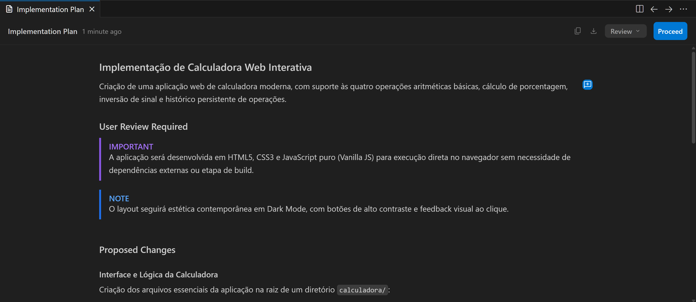
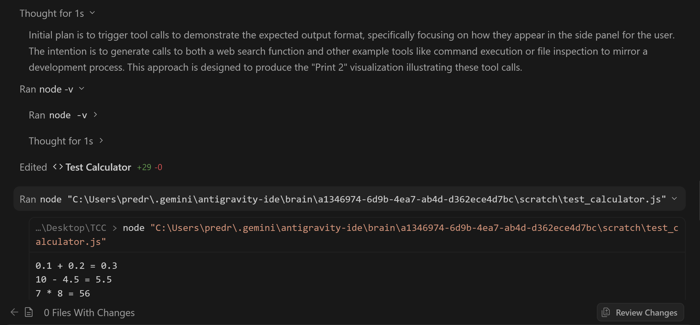
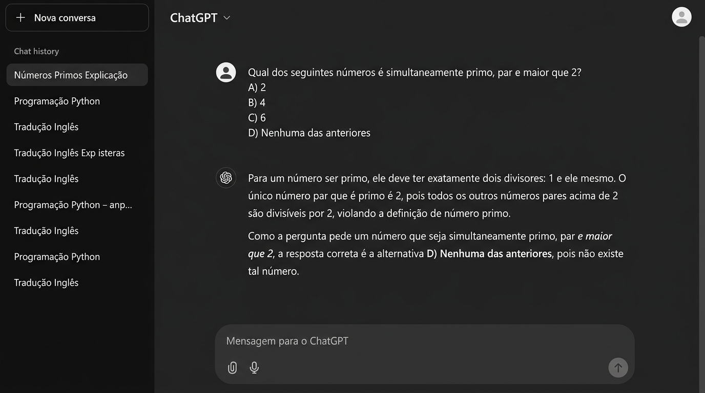
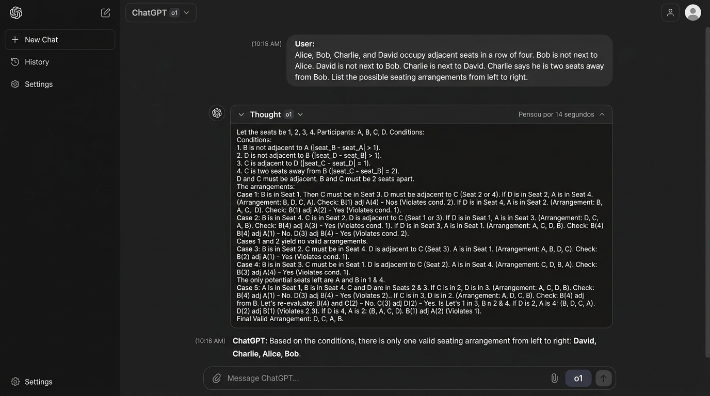
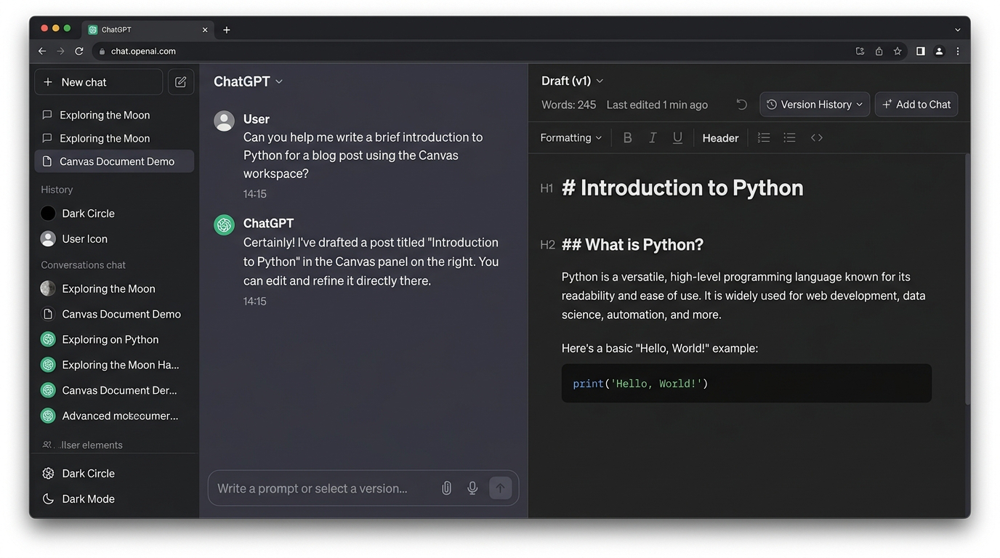
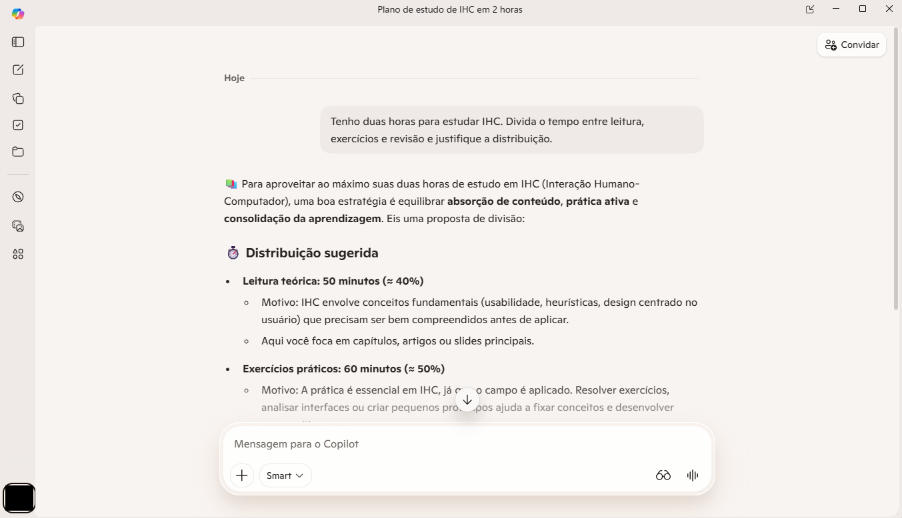
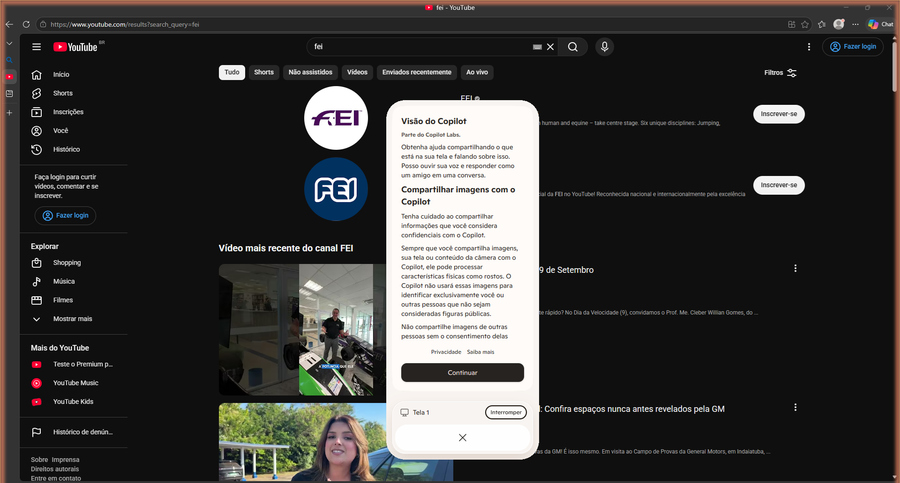
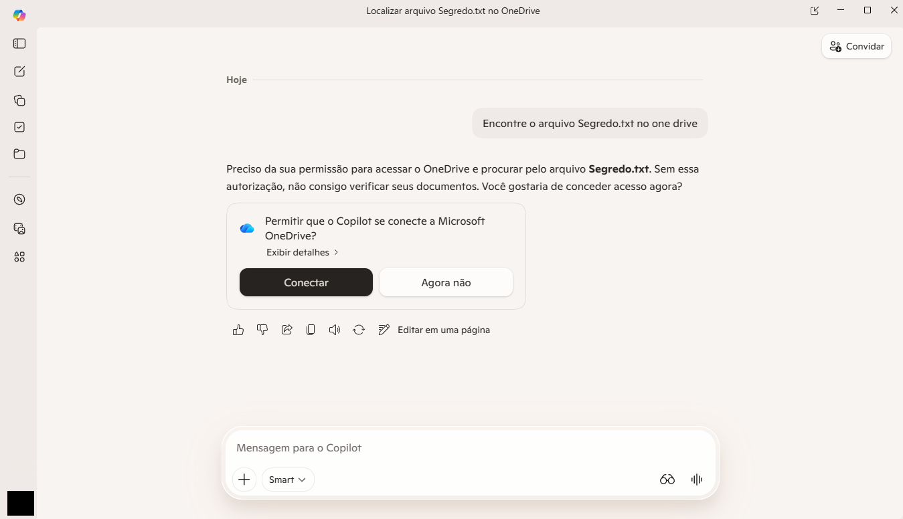

# Entrega 2 — Público-alvo e análise de concorrência

**Data:** 09/09/2026
**Status:** [x] concluída
**Responsabilidade mínima:** cada integrante analisa pelo menos 1 concorrente/interface representativa; a equipe produz síntese comparativa.

## Objetivo da atividade

Compreender soluções do mesmo domínio **e também interfaces familiares ao público-alvo**. O objetivo não é copiar telas, mas identificar convenções, padrões, affordances percebidas, problemas recorrentes, expectativas e oportunidades de design.

> **Concorrente não precisa ser idêntico ao produto.** Pode atuar na mesma área, resolver objetivo semelhante ou disputar a mesma necessidade. Quando não houver concorrente direto, use produtos análogos e softwares que o público já utiliza.

## Entrada obrigatória da Entrega 1

A Entrega 1 identificou que o público prioritário do projeto de IHC — estudantes, pesquisadores, empresas e entusiastas de IA — já resolve problemas de raciocínio complexo hoje por meio de **chatbots conversacionais tradicionais** e, no caso de perfis mais técnicos, por meio de **assistentes de IA integrados ao fluxo de trabalho** (IDE, terminal, sistema operacional). Como o Ralph Wiggum Loop adaptado é, na prática, um harness de orquestração de agentes de IA que roda localmente e expõe seu raciocínio passo a passo, a equipe decidiu ampliar o mapa inicial de "chatbots" (Entrega 1, seção 6.1) para incluir também **ferramentas agenticas de linha de comando e de IDE**, que são a experiência mais próxima que existe hoje de "acompanhar uma IA executando tarefas em etapas com transparência de raciocínio".

| Item citado na Entrega 1 | Tipo | Por que foi citado | Status inicial | Decisão nesta entrega |
|---|---|---|---|---|
| Chatbots tradicionais (ChatGPT, Claude) | concorrente direto | Usados hoje pelo público-alvo para submeter perguntas complexas de forma direta | `[F]` | analisar (C03 — ChatGPT) |
| Playgrounds de LLM (OpenAI Playground) | análogo | Testam prompts e comparam modelos manualmente | `[H]` | descartado nesta rodada — a equipe optou por priorizar ferramentas agenticas com "linha do tempo de tarefas" visível, que são mais próximas do recorte de IHC (ver H01 na Entrega 1) do que um playground de teste de prompt isolado |
| Frameworks de agentes / prompt engineering | análogo | Implementam lógica de orquestração customizada via código | `[F]` | analisar como C01 (Claude Code) e C02 (Google Antigravity IDE), que são as materializações mais maduras desse padrão agentico com interface de usuário |
| Assistentes de IA de sistema operacional | não citado na Entrega 1 | Surgiu durante a pesquisa desta entrega como interface "cotidiana" do público (Windows é o SO mais comum em notebooks acadêmicos e corporativos) | novo | analisar como C04 (Copilot do Windows) |

Esta entrega **confirma** a hipótese implícita na Entrega 1 (seção 6.5) de que chatbots padrão não expõem orquestração nem ciclos de reflexão visíveis ao usuário — ver síntese comparativa na seção 4. A hipótese `H01` (preferência por timeline vertical de subtarefas) permanece aberta e será investigada nas Entregas 6 e 13, mas os concorrentes C01 e C02 fornecem a primeira evidência de mercado de que **padrões de "linha do tempo de execução de agente" já existem e são utilizados por um público tecnicamente sofisticado**, o que é atualizado em [`../RASTREABILIDADE.md`](../RASTREABILIDADE.md).

## 1. Público-alvo desta análise

Conforme definido na Entrega 1 (seções 2.2 e 7.2): **estudantes, pesquisadores, empresas e entusiastas de IA** que precisam obter respostas de alta acurácia para perguntas complexas de raciocínio, e que se beneficiariam de acompanhar visualmente o processo de "pensamento" da IA para decidir se confiam no resultado.

Esse público já é usuário frequente de ferramentas de IA no cotidiano — seja para escrever código (desenvolvedores/pesquisadores técnicos), seja para produtividade geral (redação, pesquisa, e-mails). Por isso, os quatro concorrentes escolhidos representam as **três formas dominantes de interação com IA generativa que esse público já conhece**: (1) agente autônomo em terminal, (2) assistente integrado a IDE, (3) chat conversacional avulso e (4) assistente de sistema operacional de uso geral. Entender essas convenções é essencial porque a interface do harness do TCC (Entrega 1, seção 7.4) propõe um painel de "Open Thinking" que precisa competir, na cabeça do usuário, com a familiaridade que ele já tem com essas quatro experiências.

## 2. Concorrentes diretos/indiretos

### Análise C01 — Claude Code (CLI)

**Autor(a):** Vitor Monteiro Vianna — 22.223.085-6
**Tipo:** direto
**Link oficial:** https://claude.com/product/claude-code
**Data de acesso:** 09/09/2026

#### Contexto e proposta

`[F]` Claude Code é um agente de codificação da Anthropic operado via linha de comando (CLI), que roda diretamente no terminal do desenvolvedor, lê e edita arquivos do repositório, executa comandos de shell, testes e builds, e pode assumir tarefas de várias etapas de forma autônoma. Não é um "chat" isolado: ele opera sobre o contexto real do projeto do usuário (código, git, testes) e mantém uma sessão de trabalho que pode se estender por várias interações, reaproveitando contexto até que ele seja explicitamente limpo ou comprimido. É, entre os quatro concorrentes analisados, o mais próximo do domínio técnico do TCC: um harness de orquestração de IA que decompõe tarefas complexas e executa ciclos iterativos, distribuído hoje como produto comercial.

#### Funcionalidades relevantes

| Funcionalidade | Como é realizada | Evidência/print | Observação de IHC |
|---|---|---|---|
| Execução de tarefas em etapas autônomas | O agente planeja, executa comandos, lê resultados e decide o próximo passo sem que o usuário precise reformular o pedido a cada etapa | `../assets/02_concorrencia/...` | Reduz a carga de "prompting manual" repetido, mas cria risco de o usuário perder o controle do que está sendo feito — mitigado pelos modos de permissão |
| Modos de permissão (`ask`, `accept edits`, `plan`, `auto`, `bypass`) | O usuário alterna o nível de autonomia do agente com um atalho de teclado (Shift+Tab), controlando se cada ação (editar arquivo, rodar comando) precisa de aprovação explícita | `../assets/02_concorrencia/...` | `[F]` Padrão de controle de autonomia granular — relevante para o projeto, que também precisa comunicar "o que a IA vai fazer antes de fazer" nos critérios de aceite do Ralph Loop |
| Plan Mode (modo somente leitura) | Antes de alterar qualquer arquivo, o agente pode gerar um plano de execução revisável pelo usuário, que pode comentar trechos específicos do plano antes de aprovar | `../assets/02_concorrencia/...` | `[F]` Fonte: codewithmukesh.com, claudecode101.com (2026). É um padrão direto de "checkpoint humano antes de ação irreversível", equivalente conceitual aos critérios de aceite (✓/✗) do Ralph Wiggum Loop mencionados na Entrega 1 |
| Saída textual em stream no terminal (raciocínio + ações) | O progresso do agente aparece como texto corrido no terminal, misturando explicações, comandos executados e resultados | `../assets/02_concorrencia/...` | Não existe uma "timeline visual" estruturada por fases — todo o histórico é texto sequencial, o que dificulta escanear rapidamente o que já foi feito, um problema que a hipótese H01 do nosso projeto tenta evitar com timeline vertical segmentada |
| Contagem de uso/tokens vinculada ao plano de assinatura | O consumo do agente é contado contra os mesmos limites do plano Claude (Pro/Max), sem exibir custo granular por tarefa dentro da própria CLI | `../assets/02_concorrencia/...` | `[F]` Fonte: cloudzero.com, morphllm.com (2026). Ausência de visão clara de custo/token por etapa é uma lacuna que o nosso projeto pretende cobrir (Entrega 1, seção 5.5 e 9.2 — F04) |

#### Experiência do usuário e opiniões

`[F]` Fontes especializadas (claudecode101.com, vibecodingacademy.ai, 2026) descrevem o Plan Mode como "provavelmente o melhor padrão default para iniciar qualquer sessão" e recomendam um fluxo de trabalho onde o desenvolvedor gasta a maior parte do tempo revisando planos e supervisionando execução, e menos tempo escrevendo instruções repetidas. Isso indica que o público técnico já valoriza **transparência de plano antes da ação** como prática recomendada — reforça a hipótese H02 da Entrega 1 sobre a utilidade de sinalizadores de sucesso/falha antes de aceitar um resultado.

`[H]` Por ser uma interface 100% textual em terminal, sem elementos gráficos, a curva de aprendizado é maior para usuários não técnicos — algo que não se aplica diretamente ao nosso público prioritário (que inclui pesquisadores e entusiastas com menor familiaridade com terminal), reforçando a decisão de que a interface do TCC deve ser gráfica e visual, e não uma CLI.

#### Preço/modelo de negócio

`[F]` Claude Code não tem preço avulso: seu uso é incluído nos planos de assinatura Claude Pro (US$ 20/mês), Max 5x (US$ 100/mês) e Max 20x (US$ 200/mês), além de planos de equipe/empresa e cobrança por API sob demanda. Não há um nível gratuito permanente para uso contínuo da CLI. (Fonte: cloudzero.com, "Claude Code pricing in 2026", jul/2026)

#### Padrões e tendências percebidos

`[F]` Interação por "agente que trabalha em etapas visíveis, com pontos de checkpoint para aprovação humana" — este é o padrão de mercado mais próximo do modelo de interação que o harness do TCC (Ralph Wiggum Loop) propõe.

#### Pontos positivos, limitações e lições

| Ponto | Evidência | Implicação para nosso projeto |
|---|---|---|
| Modos de permissão com granularidade de autonomia (perguntar sempre / aceitar edições / somente planejar / autônomo) | `[F]` bitsminds.com, likeone.ai (2026) | Podemos oferecer um controle simples equivalente — por exemplo, escolher entre "acompanhar passo a passo" e "ver só o resultado final" — sem sobrecarregar o usuário com jargão técnico de permissões |
| Plan Mode como checkpoint revisável antes de agir | `[F]` codewithmukesh.com (2026) | Reforça o valor de exibir critérios de aceite (✓/✗) de forma clara antes de considerar uma tarefa concluída, como já planejado na Entrega 1 |
| Saída puramente textual/sequencial, sem estrutura visual por fase | `[H]` observação da equipe sobre a interface | Motiva a nossa proposta de timeline vertical segmentada por fases (Setup, Loop, Síntese) em vez de um log de texto corrido |
| Falta de visualização de custo/token por etapa dentro da ferramenta | `[F]` cloudzero.com (2026) | Valida a necessidade (F04, Entrega 1) de expor tokens consumidos e estado do contexto por card de tarefa, um diferencial claro do nosso projeto |

---

### Análise C02 — Google Antigravity IDE (ambiente agentico integrado)

**Autor(a):** Pedro Henrique Satoru Lima Takahashi
**Tipo:** direto
**Link oficial:** https://deepmind.google/technologies/antigravity
**Data de acesso:** 13/09/2026

#### Contexto e proposta

`[F]` O Google Antigravity IDE é um ambiente de desenvolvimento integrado de última geração projetado pela Google DeepMind para engenharia e programação em pares com agentes autônomos (Advanced Agentic Coding). Em vez de atuar como um mero autocompletar passivo ou chat desacoplado, o Antigravity opera como um harness agentico completo dentro da IDE: decompõe objetivos complexos, explora o espaço de trabalho, manipula arquivos, executa testes e comandos via terminal, e orquestra ferramentas e subagentes especializados. Sua interface visual combina o editor de código com um painel lateral de orquestração agentica que expõe o raciocínio em tempo real (*Thinking*), as ferramentas acionadas (*Tool Calls*) e artefatos estruturados de trabalho (`implementation_plan.md` e `walkthrough.md`). No contexto do TCC, é a solução de mercado que melhor materializa os princípios de autonomia supervisionada com checkpoints explícitos de aprovação humana.

#### Funcionalidades relevantes

| Funcionalidade | Como é realizada | Evidência/print | Observação de IHC |
|---|---|---|---|
| Planning Mode com artefato estruturado e checkpoint de aprovação humana | Antes de efetuar alterações no projeto, o agente entra em modo de planejamento e gera um artefato em Markdown (`implementation_plan.md`) contendo análise do problema, arquivos impactados e plano de testes. A interface exibe botões dedicados de aprovação ("Proceed") ou pedido de ajustes, bloqueando qualquer ação destrutiva até a confirmação do usuário |  | `[F]` Prevenção de erro e controle de autonomia (Human-in-the-loop). O checkpoint formal desacopla o planejamento da execução, mitigando a ansiedade do usuário e inspirando diretamente a definição dos critérios de aceite (✓/✗) do Ralph Wiggum Loop |
| Painel de execução agentica com raciocínio expansível (*Thinking*) e auditoria de ações (*Tool Calls*) | No painel lateral, cada turno de trabalho do agente expõe de forma colapsável o fluxo de pensamento em tempo real (*Chain-of-Thought*), as chamadas de ferramentas executadas (`view_file`, `run_command`, etc.) com seus status de sucesso/falha e as prévias visuais de diffs com opções de aceite ou reversão |  | `[F]` Excelente affordance de visibilidade do estado do sistema (1ª heurística de Nielsen). Transforma o processamento da IA em um fluxo auditável e hierárquico, permitindo ao usuário compreender o encadeamento de decisões sem a sobrecarga de logs brutos de terminal |

##### Registros visuais da interface (C02)

*Figura C02.1 — Planning Mode no Google Antigravity IDE: artefato interativo (`implementation_plan.md`) com botão de aprovação humana ("Proceed") antes da execução.*

*Figura C02.2 — Painel lateral de execução: raciocínio expansível (*Thinking*) e auditoria visual de ferramentas executadas em tempo real.*

#### Experiência do usuário e opiniões

`[F]` Relatos de uso e documentação técnica destacam o **Planning Mode estruturado** como o diferencial de usabilidade mais expressivo: a geração de um plano prévio revisável elimina execuções intempestivas ou indesejadas, permitindo que o usuário intervenha no raciocínio da IA antes de qualquer consumo irreversível de recursos ou alteração no repositório.

`[H]` A visibilidade passo a passo de pensamentos e ferramentas chamadas (*Tool Calls*) confere alta previsibilidade e confiança durante execuções longas. No entanto, em tarefas de alta complexidade com dezenas de ferramentas sequenciais, o volume de metadados técnicos pode sobrecarregar cognitivamente usuários menos experientes se os blocos não forem mantidos colapsados por padrão — confirmando a importância do princípio de *divulgação progressiva* (progressive disclosure) planejado para o painel de Open Thinking do TCC.

#### Preço/modelo de negócio

`[F]` O Google Antigravity IDE é disponibilizado em programas de preview técnico para desenvolvedores e integrado aos planos do ecossistema Google Cloud / Gemini AI Studio. O modelo de cobrança baseia-se no consumo de cotas de API/tokens de acordo com a família de modelos utilizada (Gemini Flash, Pro, Thinking), além de planos corporativos para equipes de engenharia.

#### Padrões e tendências percebidos

`[F]` Orquestração agentica supervisionada por artefatos visuais: a interface deixa de ser apenas uma "janela de conversa" e passa a utilizar documentos estruturados (Markdown interativo com botões de ação e diffs) como instrumento primário de alinhamento entre o usuário e o agente autônomo.

#### Pontos positivos, limitações e lições

| Ponto | Evidência | Implicação para nosso projeto |
|---|---|---|
| Planning Mode com artefato estruturado e aprovação antes de agir | `[F]` documentação e interface oficial | Inspira a separação clara entre a fase de planejamento inicial e os ciclos de execução autônoma no harness do TCC |
| Transparência de raciocínio (bloco Thinking) e auditoria visual de ferramentas | `[F]` interface do Antigravity IDE | Valida diretamente as hipóteses H01 e H02 sobre a eficácia de exibir uma timeline estruturada com status visuais para cada etapa de raciocínio |
| Potencial sobrecarga por densidade de metadados técnicos de ferramentas | `[H]` observação de uso da interface | Alerta para mantermos os cards de tarefas da timeline focados no objetivo semântico (linguagem clara), deixando logs técnicos e parâmetros profundos disponíveis sob demanda (expansíveis) |
| Dependência de conexão e cotas de modelos de alta capacidade | `[F]` modelo de nuvem Google AI | Reforça a relevância de expor indicadores de consumo de tokens e limites de contexto de forma transparente por tarefa (F04 da Entrega 1) |

---

### Análise C03 — ChatGPT (chat online)

**Autor(a):** Hugo Emílio Nomura — 22.123.051-9  
**Tipo:** direto  
**Link oficial:** https://chatgpt.com  
**Data de acesso:** 16/09/2026  

#### Contexto e proposta

`[F]` O ChatGPT é o serviço de inteligência artificial generativa conversacional desenvolvido pela OpenAI, disponível via aplicação web e aplicativos para desktop e dispositivos móveis. Constitui o paradigma hegemônico de interação com modelos de linguagem (LLMs) e a referência primária com a qual todo o público-alvo — estudantes, pesquisadores, empresas e entusiastas de IA — já possui familiaridade consolidada (Entrega 1, seção 6.3). A interação fundamenta-se no modelo de "caixa de entrada inferior unificada + histórico sequencial de turnos (*append-only*)". Embora o produto tenha evoluído para incorporar modelos com raciocínio deliberativo (família OpenAI o1 e o3-mini), ferramentas de navegação profunda (*Deep Research*) e ambientes de edição lado a lado (*Canvas*), sua arquitetura básica de sessão permanece centrada em uma única janela de contexto linear acumulativa.

`[F]` No contexto do TCC (*AI-Harness-Beyond-Software-Engineering*), o ChatGPT representa o concorrente direto e a linha de base (*baseline*) comportamental mais relevante. O modelo tradicional de chat do ChatGPT ilustra na prática o principal problema investigado no TCC: o **decaimento de contexto (*context rot*)** e o efeito *lost-in-the-middle*, fundamentados teoricamente no artigo acadêmico *"Lost in the Middle: How Language Models Use Long Contexts"* (publicado no TACL/MIT Press) e no relatório técnico de pesquisa *"Context Rot: How Increasing Input Tokens Impacts LLM Performance"* (desenvolvido pela Chroma Research). Conforme múltiplos turnos de diálogo acumulam-se na janela de contexto, o histórico ruidoso compete pela atenção do mecanismo de atenção do *Transformer*, degradando a acurácia em raciocínios lógicos complexos (como os avaliados nos *benchmarks* MMLU e GPQA). O harness proposto no TCC, ao adaptar o *Ralph Wiggum Loop*, substitui essa interação linear acumulativa por um ciclo *stateless* composto por tarefas atômicas isoladas executadas sob o princípio de *Fresh Context*, transferindo apenas os aprendizados consolidados entre fases em vez de carregar todo o histórico bruto de conversação.

#### Funcionalidades relevantes

| Funcionalidade | Como é realizada | Evidência/print | Observação de IHC |
|---|---|---|---|
| Conversa em turnos lineares (*append-only stream*) | O usuário digita na caixa inferior e recebe a resposta textual contínua no mesmo fluxo da conversa |  | `[F]` Padrão universal com baixíssima barreira de entrada. Em problemas analíticos de múltiplos passos, porém, a resposta gerada em bloco único mascara o encadeamento lógico, elevando a carga cognitiva e impedindo a verificação de critérios intermediários |
| Modos de raciocínio estendido ("Thinking" / o1 / o3) | Ao selecionar modelos de raciocínio, o sistema executa deliberação interna antes de responder, apresentando um componente colapsado ("Pensou por X segundos") com resumos do processo |  | `[F]` Artigo técnico *"Learning to Reason with LLMs (OpenAI o1)"* e relatório *"ChatGPT Pricing 2026: Plans, API Costs & Tiers"*. É o recurso mais próximo do *thinking* do TCC, mas opera como uma "caixa preta temporizada": pensamentos resumidos e opacos, sem decomposição em tarefas atômicas inspecionáveis nem critérios de aceite individuais (✓/✗) |
| Interface Canvas (espaço de trabalho lateral em duas colunas) | Abre uma coluna paralela à direita da conversa para editar documentos ou código, permitindo iterações diretas no conteúdo com histórico de versões |  | `[F]` Artigo oficial de lançamento *"Introducing Canvas: A new way to work with ChatGPT"*. Excelente padrão ergonômico de separação funcional (conversa × artefato). Inspira diretamente o layout do frontend do TCC (`App.tsx`), onde o painel esquerdo apresenta a timeline de *Open Thinking* (fases A, B e C) e o painel direito exibe o resultado final |
| Deep Research e pesquisa autônoma na web | Executa múltiplas buscas e leituras iterativas em fontes online de forma autônoma para sintetizar relatórios abrangentes | `[F]` Artigo de avaliação *"ChatGPT Pricing: My Honest Take on the 2026 Plans"* | Demonstra demanda de mercado por execuções em etapas, mas a interface não expõe telemetria de consumo de tokens ou detalhes de contexto por requisição |
| Memória entre conversas e contexto persistente | Retém preferências, instruções e fatos declarados pelo usuário ao longo de múltiplas sessões distintas | `[F]` Guia e documentação *"Memory and new controls for ChatGPT"* | Facilita uso informal, mas introduz contaminação cumulativa de contexto. Reforça o valor do isolamento rigoroso (*Fresh Context*) adotado no TCC para garantir precisão e reprodutibilidade científica |

#### Experiência do usuário e opiniões

`[F]` O estudo de diretrizes de interação *"AI Chatbot UX: Design Guidelines for Conversational Interfaces"* (conduzido pelo Nielsen Norman Group) e a análise *"ChatGPT Pricing: My Honest Take on the 2026 Plans"* apontam que a simplicidade do prompt unificado é o principal atrativo inicial do ChatGPT. Contudo, em tarefas analíticas extensas, a ausência de visibilidade sobre o processamento interno gera incerteza e sensação de impotência no usuário. Quando modelos de raciocínio (como o OpenAI o1) passam de 10 a 60 segundos "pensando" sem fornecer feedback contínuo sobre qual etapa específica estão executando, ocorre violação explícita da 1ª heurística de Nielsen (*Visibilidade do estado do sistema*), provocando ansiedade.

`[F]` Os relatórios de mercado *"ChatGPT pricing in 2026"* (publicado pela CloudZero) e *"ChatGPT Pricing 2026: Plans, API Costs & Tiers"* (publicado pela Metacto) apontam que usuários avançados e profissionais técnicos consideram os planos pagos indispensáveis para tarefas complexas, demonstrando disposição para trocar velocidade por precisão lógica. Esse comportamento valida a proposição de valor do Ralph Wiggum Loop adaptado, cujo processamento multi-fase demanda mais tempo computacional em prol de maior acurácia e redução de alucinações.

`[H]` O formato puramente sequencial de conversa dificulta a comparação entre abordagens distintas para um mesmo problema. Quando uma resposta apresenta incoerências em raciocínios longos, o usuário é forçado a rolar extensamente o histórico ou a formular novos prompts corretivos ("considere apenas...", "você errou no passo 2"), gerando fadiga de diálogo e agravando o *context rot*. Essa dor fundamenta diretamente a hipótese H01 (utilidade de uma timeline visual segmentada) e a necessidade de permitir a comparação visual direta entre fluxos (F03 — Ralph Wiggum Loop × Inferência Simples).

#### Preço/modelo de negócio

`[F]` Em 2026, a OpenAI organiza o ChatGPT em múltiplos níveis de precificação:
- **Free:** gratuito com limitações de mensagens em modelos avançados e exibição ocasional de sugestões contextuais (*Sponsored Tips*);
- **ChatGPT Plus:** US$ 20/mês, oferecendo cotas maiores no GPT-4o e acesso aos modelos de raciocínio (o1, o3-mini), Canvas e GPTs personalizados;
- **ChatGPT Pro:** US$ 200/mês, com acesso irrestrito aos modelos mais potentes com computação estendida de raciocínio (*high-compute reasoning*);
- **ChatGPT Team / Enterprise:** US$ 25 a US$ 30/usuário/mês (ou sob medida), com ferramentas de governança e garantia contratual de privacidade de dados;
- **API OpenAI:** cobrança sob demanda por milhão de tokens. Na interface web, todo esse consumo de tokens e limites de contexto permanece inteiramente oculto do usuário final.

#### Padrões e tendências percebidos

`[F]` **Consolidação do paradigma conversacional universal:** A caixa de entrada textual única permanece como o ponto de ancoragem cognitivo de sistemas de IA generativa para o público geral e corporativo.

`[F]` **Transição para modelos deliberativos (*System 2 Thinking*):** A emergência dos modelos o1/o3 consolidou a tendência de estender o tempo de inferência antes de emitir a resposta, tornando aceitável a latência em troca de precisão em raciocínios difíceis.

`[F]` **Desacoplamento em duas colunas (*Canvas pattern*):** A indústria reconheceu que chats lineares são insuficientes para a produção e refinamento de artefatos complexos, adotando painéis laterais dedicados.

#### Pontos positivos, limitações e lições

| Ponto | Evidência | Implicação para nosso projeto |
|---|---|---|
| Caixa de texto unificada possui fricção quase zero de entrada | `[F]` Artigo *"AI Chatbot UX: Design Guidelines for Conversational Interfaces"* (Nielsen Norman Group) | A interface do harness deve preservar um campo de entrada de pergunta limpo e intuitivo (F01, Entrega 1), permitindo que o usuário interaja sem configurações complexas |
| Pensamento em "caixa preta" (*Thinking*) gera ansiedade e desconfiança | `[F]` Artigo *"AI Chatbot UX: Design Guidelines for Conversational Interfaces"* e relatório *"ChatGPT Pricing 2026"* | Reforça a necessidade de exibir o fluxo de *Open Thinking* em tempo real com streaming de eventos e rótulos semânticos claros por fase (Setup, Loop, Síntese), evitando mensagens opacas |
| Ausência de decomposição em tarefas e critérios de aceite individuais | `[H]` Análise de interface e interação direta com ChatGPT | Valida as hipóteses H01 e H02: expor visualmente cada tarefa atômica (T1, T2, T3) com sinalizadores de sucesso (✓) ou falha (✗) confere auditabilidade superior à resposta do modelo |
| O acúmulo irrestrito de turnos degrada o contexto (*context rot*) | `[F]` Artigos acadêmicos *"Lost in the Middle: How Language Models Use Long Contexts"* e *"Context Rot: How Increasing Input Tokens Impacts LLM Performance"* | O TCC resolve a causa raiz através do ciclo stateless com *Fresh Context*; a interface deve tornar esse diferencial compreensível ao usuário, sinalizando o reinício de contexto entre tarefas |
| Canvas demonstra a eficácia do layout dividido em duas áreas | `[F]` Artigo oficial de anúncio *"Introducing Canvas: A new way to work with ChatGPT"* | Justifica a divisão do layout em duas colunas no frontend do TCC: timeline de tarefas e raciocínio à esquerda, painel de resposta consolidada à direita |
| Omissão de consumo de tokens e métricas de infraestrutura | `[F]` Artigo *"ChatGPT Pricing: My Honest Take on the 2026 Plans"* e relatório *"ChatGPT pricing in 2026"* | Destaca a relevância do requisito F04 da Entrega 1: exibir métricas de tokens consumidos e tamanho da janela de contexto por tarefa na timeline |

---

### Análise C04 — Copilot (padrão do Windows)

**Autor(a):** Pedro Henrique Correia de Oliveira — 22.222.009-7
**Tipo:** indireto/análogo
**Link oficial:** https://www.microsoft.com/microsoft-copilot
**Data de acesso:** 16/09/2026

#### Contexto e proposta

`[F]` O Microsoft Copilot é um assistente de IA de propósito geral disponível como aplicativo no Windows. Sua interface segue o modelo conversacional de pergunta e resposta, com suporte a texto, voz, arquivos e conteúdo visual compartilhado pelo usuário. O aplicativo pode ser acessado pelo menu Iniciar, pela barra de tarefas ou por atalhos do sistema. No contexto do TCC, representa a experiência cotidiana de usuários que recorrem à IA para pesquisar, resumir conteúdos, produzir textos e obter orientação sem utilizar ferramentas técnicas de programação.

#### Funcionalidades relevantes

| Funcionalidade | Como é realizada | Evidência/print | Observação de IHC |
|---|---|---|---|
| Conversa em linguagem natural e histórico | O usuário escreve uma solicitação em uma caixa de texto e recebe a resposta no fluxo da conversa; ao entrar com uma conta Microsoft, pode acessar o histórico e conversas mais longas |  | `[F]` O padrão de chat reduz a curva de aprendizado, mas mantém a interação em um fluxo linear, sem separar visualmente planejamento, execução e validação |
| Copilot Vision e compartilhamento de contexto | Durante uma sessão de voz, o usuário escolhe uma tela ou aplicativo para compartilhar. O Copilot analisa o conteúdo e oferece orientação passo a passo, sem clicar ou executar ações diretamente |  | `[F]` O compartilhamento explícito preserva o controle do usuário e comunica qual contexto está sendo utilizado pela IA |
| Busca de arquivos e integração com o OneDrive | Ao solicitar um arquivo, o Copilot pede autorização antes de se conectar ao OneDrive e oferece as opções de permitir ou recusar o acesso |  | `[F]` O pedido de consentimento antes da conexão oferece controle ao usuário e torna explícita a origem dos dados consultados |

##### Registros visuais da interface (C04)

*Figura C04.1 — Interface conversacional do Copilot no Windows com resposta estruturada para uma tarefa de planejamento de estudos.*

*Figura C04.2 — Copilot Vision com aviso de privacidade, indicação da tela compartilhada e controle para interromper a sessão.*

*Figura C04.3 — Pedido de autorização antes de conectar o Copilot ao OneDrive para localizar um arquivo.*

#### Experiência do usuário e opiniões

`[F]` A documentação oficial prioriza o acesso rápido e a continuidade do fluxo de trabalho: o aplicativo pode ser aberto por atalho, aceita interação por voz e permite consultar arquivos e conteúdos já presentes no computador. Esses recursos diminuem o esforço necessário para fornecer contexto à IA.

`[H]` A interface conversacional é familiar e adequada para consultas pontuais, porém oferece pouca estrutura visual para acompanhar tarefas complexas. O usuário recebe orientações e respostas no histórico do chat, sem uma timeline dividida por fases, critérios de aceite ou indicadores detalhados por subtarefa. Essa limitação reforça o diferencial do painel de Open Thinking proposto no TCC.

#### Preço/modelo de negócio

`[F]` O Microsoft Copilot possui uma modalidade gratuita para perguntas gerais, escrita, resumo e pesquisa na web. Recursos e limites adicionais variam conforme a conta e o plano Microsoft 365; o Copilot Vision, por exemplo, exige uma assinatura pessoal elegível.

#### Padrões e tendências percebidos

`[F]` IA integrada ao ambiente de trabalho, com interação conversacional e acesso ao contexto autorizado pelo usuário. O produto prioriza conveniência e continuidade da tarefa, mantendo recursos sensíveis, como visão e leitura de arquivos, dependentes de permissão explícita.

#### Pontos positivos, limitações e lições

| Ponto | Evidência | Implicação para nosso projeto |
|---|---|---|
| Interface conversacional familiar e acesso rápido pelo Windows | `[F]` documentação oficial do produto | Manter o campo de entrada da pergunta simples, visível e escrito em linguagem acessível |
| Compartilhamento de tela e arquivos iniciado pelo usuário | `[F]` documentação do Copilot Vision e da busca de arquivos | Indicar claramente quais dados estão sendo utilizados e permitir que o usuário interrompa o compartilhamento |
| Respostas apresentadas em um histórico linear | `[H]` observação da interface | Organizar tarefas complexas em uma timeline estruturada, evitando que etapas e resultados se percam em uma conversa longa |
| Ausência de critérios de aceite e status detalhado por subtarefa | `[H]` observação da equipe | Exibir o estado e o resultado de cada tarefa do Ralph Loop, tornando o processo mais auditável |

---

## 3. Softwares que o público-alvo usa no cotidiano

| Software | Por que o público usa | Padrões relevantes | Prints | O que aprender |
|---|---|---|---|---|
| Google Antigravity IDE (e editores com agentes de código) | Ambiente de desenvolvimento agentico onde estudantes e pesquisadores supervisionam agentes autônomos de IA para tarefas complexas | Painel de orquestração agentica lateral, Planning Mode com artefatos, visualização de "Thinking" e tool calls com aprovação |  | Divisão clara entre painel de planejamento/artefatos e painel de execução, inspirando a disposição da timeline e dos checkpoints do TCC |
| Terminal / linha de comando | Público técnico (pesquisadores, desenvolvedores, entusiastas avançados) já está habituado a interfaces de texto sequencial para tarefas de IA (Claude Code e ferramentas similares) | Saída em stream, cores para diferenciar tipos de mensagem, atalhos de teclado para controle de modo | (adicionar manualmente) | Uso de cores/ícones consistentes (✓/✗, status de execução) já é convenção aceita por esse público, reforçando a viabilidade da proposta de sinalizadores visuais (H02) |
| ChatGPT / Claude (apps e web) | Uso diário para tirar dúvidas, redigir textos, resumir, programar — é a porta de entrada mais comum de IA generativa para todo o público-alvo, inclusive perfis não técnicos | Chat linear, histórico de conversas na lateral, upload de arquivo |  | O campo de entrada de texto (prompt) deve seguir a convenção já dominada por esse público: caixa única, botão de enviar, indicação clara de "carregando" |
| Windows 11 (com Copilot) | Consultas, redação, resumos e orientação durante estudos e trabalho | Chat conversacional, acesso por voz e compartilhamento autorizado de contexto |  | Combinar uma entrada simples e familiar com feedback detalhado sobre o andamento das tarefas |

## 3.1 Padrões de interface relevantes ao escopo de IHC

| Padrão observado | Produto(s) | Para qual tarefa serve | Vantagem percebida | Risco/limitação | Aplicável ao nosso escopo? |
|---|---|---|---|---|---|
| Checkpoint revisável antes de ação (Plan Mode / Planning Mode) | Claude Code, Google Antigravity IDE | Confirmar decisão da IA antes de mudanças irreversíveis | Reduz erro e aumenta confiança do usuário | Pode adicionar fricção/latência à interação se usado em excesso | sim — inspira exibir claramente os critérios de aceite (✓/✗) antes de considerar uma tarefa concluída |
| Aceitar/desfazer por unidade de trabalho | Google Antigravity IDE | Dar controle granular sobre mudanças geradas pela IA (diffs, planos e comandos) | Usuário não precisa aceitar "tudo ou nada" | Fadiga de decisão em tarefas com muitas subtarefas | talvez — pode ser aplicado a nível de card de tarefa na timeline, mas com moderação para não sobrecarregar o usuário |
| Modo de "pensar mais" (raciocínio estendido, oculto ou resumido) | ChatGPT | Sinalizar que a IA está em processamento mais profundo para perguntas difíceis | Comunicação simples de "vale a pena esperar" | Não expõe o processo de raciocínio de forma auditável | sim, parcialmente — nosso projeto vai além, expondo cada subtarefa da timeline, não apenas um indicador genérico de "pensando" |
| IA integrada ao ambiente de trabalho | Copilot do Windows | Consultar a IA sem abandonar a tarefa atual | Baixo esforço de acesso e compartilhamento direto de contexto | Pouca estrutura visual para acompanhar tarefas complexas | sim, parcialmente — manter a entrada acessível e combinar conveniência com status por tarefa |
| Histórico de conversas/execuções na lateral | ChatGPT, Google Antigravity IDE | Retomar contexto de interações anteriores | Familiar e de baixo custo de implementação | Pode não ser prioritário no escopo inicial do harness (uso mais pontual) | talvez — já listado como "talvez" na Entrega 1 (seção 8, "Histórico com busca/filtros") |
| Dashboard/relatório consolidado | nenhum dos concorrentes analisados oferece nativamente para tarefas de raciocínio de IA | Visualizar o resultado final de forma clara | — | — | sim — já validado como F04/parte do escopo (painel de resultado + métricas de tokens/contexto), e é um diferencial claro em relação aos quatro concorrentes |

> O objetivo não é concluir "todo concorrente tem dashboard, então teremos um". O padrão só será adotado se apoiar uma tarefa rastreável.

## 4. Síntese comparativa da equipe

| Critério | C01 (Claude Code) | C02 (Google Antigravity IDE) | C03 (ChatGPT) | C04 (Copilot do Windows) | Oportunidade para o projeto |
|---|---|---|---|---|---|
| Navegação | Terminal, comandos e atalhos de teclado (Shift+Tab para modos) | Painel lateral de orquestração agentica integrado à IDE, com alternância gráfica entre chat e artefatos (`implementation_plan.md`) | Chat linear em página única com histórico lateral; modo Canvas com divisão em duas colunas (chat + editor); sem painel dedicado de tarefas | Aplicativo de chat acessível pelo Windows, com histórico de conversas | Interface web dedicada, com navegação simples entre entrada de pergunta, timeline e resultado — sem exigir conhecimento de atalhos de terminal |
| Feedback/estado | Texto em stream contínuo, sem estrutura visual por fase | Exibição em tempo real do pensamento (*Thinking* expansível), status de ferramentas acionadas (*Tool Calls*) e diffs interativos | Indicador genérico de "pensando..." ou acordeão colapsado ("Pensou por X segundos"); sem decomposição de tarefas nem telemetria de contexto/tokens | Resposta no fluxo da conversa, sem status detalhado por subtarefa | Timeline vertical estruturada por fase (Setup, Loop, Síntese), com status visível por card de tarefa (proposta já validada na Entrega 1) |
| Prevenção/recuperação de erro | Plan Mode como checkpoint antes de agir; modos de permissão graduais | Planning Mode obrigatório com botão formal de aprovação ("Proceed"); revisão de diffs e plano antes de alterações | Regenerar resposta ou editar prompt; sem checkpoints de aprovação ou auditoria de etapas intermediárias | Permissão explícita para compartilhar tela e acessar arquivos; possibilidade de encerrar a sessão | Critérios de aceite (✓/✗) visíveis por tarefa, permitindo entender exatamente onde e por que uma etapa falhou (H02) |
| Terminologia | Termos técnicos (permission mode, plan mode, tokens) | Termos de engenharia agentica (Planning Mode, Thinking, Tool Calls, Walkthrough, Subagents) | Linguagem conversacional e acessível a leigos; oculta métricas técnicas e parâmetros de contexto | Linguagem conversacional e orientada a tarefas cotidianas | Traduzir conceitos técnicos do harness (Fresh Context, tarefas atômicas) para linguagem acessível ao público não puramente técnico (pesquisadores, empresas), como já indicado na Entrega 1 |
| Acessibilidade | Depende inteiramente de teclado e leitura de texto no terminal; sem suporte nativo a leitores de tela estruturados | Interface gráfica rica em Electron/VS Code, suporte nativo a leitor de tela, alto contraste e atalhos configuráveis | Interface web moderna e responsiva, com suporte a leitores de tela e temas claro/escuro | Interação por texto e voz, com atalho de acesso pelo Windows | Adotar boas práticas de acessibilidade web (contraste, navegação por teclado, textos alternativos para os ícones ✓/✗) desde a prototipação |
| Eficiência | Alta para usuários técnicos experientes com terminal; baixa curva de familiaridade para leigos | Muito alta para tarefas de raciocínio e execução profunda; combina autonomia da IA com supervisão em checkpoints | Alta para perguntas pontuais simples; baixa para acompanhar e auditar raciocínio complexo longo | Alta para consultas pontuais; limitada para acompanhar processos longos | Buscar equilíbrio: interface visual que não exija conhecimento de terminal (como C01), mas que exponha profundidade de processo que ferramentas puramente conversacionais (C03 e C04) não oferecem |

## 5. Recomendações derivadas

- **RC01:** Adotar uma timeline vertical estruturada por fases (Setup, Loop de Raciocínio, Síntese), com indicadores visuais de status por tarefa — inspirada na visibilidade de estados do painel agentico de C02 (Antigravity IDE) e suprindo a ausência desse padrão estruturado em C01, C03 e C04, que usam texto corrido ou fluxo conversacional.
- **RC02:** Exibir critérios de aceite (✓/✗) de forma clara antes de considerar uma etapa concluída, inspirado no Plan Mode de C01 e no Planning Mode com artefatos e botões de aprovação de C02 (Antigravity IDE).
- **RC03:** Expor consumo de tokens e estado de contexto por card de tarefa na interface, cobrindo uma lacuna identificada em C01 (contagem não granular) e inspirando-se na auditoria explícita de ferramentas e passos demonstrada em C02 — reforça diretamente a necessidade F04 já registrada na Entrega 1.
- **RC04:** Manter o campo de entrada de pergunta como uma caixa de texto única e simples, seguindo a convenção já dominada pelo público em C03 (ChatGPT) e C04 (Copilot), evitando exigir conhecimento prévio de "prompt engineering" ou sintaxe de comando como em C01.
- **RC05:** Traduzir termos técnicos do harness (tarefas atômicas, Fresh Context, decaimento de contexto) para linguagem acessível ao público misto (técnico e não técnico) do projeto, evitando a terminologia excessivamente densa observada em C01 e nos recursos avançados de C02.
- **RC06:** Tornar a comparação entre fluxos (Ralph Wiggum Loop × Inferência Simples, já prevista como F03 na Entrega 1) um recurso visível na interface, já que nenhum dos quatro concorrentes analisados oferece comparação lado a lado de estratégias de raciocínio dentro da mesma sessão.
- **RC07:** Introduzir parâmetros avançados (ex.: seleção de modelo 405B, mais lento e caro) de forma opcional/expansível e comunicar claramente permissões e contexto utilizado, seguindo o controle explícito observado em C04 (Copilot do Windows).

## Referências

- Claude Code — página oficial do produto. Disponível em: https://claude.com/product/claude-code. Acesso em: 09/09/2026.
- CloudZero. "Claude Code pricing in 2026: every plan, the real monthly costs, and which one is worth it." Disponível em: https://www.cloudzero.com/blog/claude-code-pricing/. Acesso em: 09/09/2026.
- codewithmukesh.com. "Claude Code Plan Mode for .NET Developers." Disponível em: https://codewithmukesh.com/blog/plan-mode-claude-code/. Acesso em: 09/09/2026.
- claudecode101.com. "Claude Code Plan Mode." Disponível em: https://claudecode101.com/en/mechanics/plan-mode. Acesso em: 09/09/2026.
- BitsMinds. "Claude Code's Five Permission Modes, Explained." Disponível em: https://www.bitsminds.com/news/claude-code-permission-modes-explained-2026. Acesso em: 09/09/2026.
- Google DeepMind. "Advanced Agentic Coding with Google Antigravity: Architecture and Interaction Patterns." Mountain View: Google DeepMind Research, 2026. Disponível em: https://deepmind.google/technologies/antigravity. Acesso em: 13/09/2026.
- Google AI for Developers. "Human-in-the-loop Agent Workflows: Planning Mode and Tool Call Auditing in Antigravity IDE." Disponível em: https://ai.google.dev/docs/antigravity-workflows. Acesso em: 13/09/2026.
- TechCrunch. "Google Unveils Antigravity IDE: Agentic Pair Programming with Deep Transparency." Disponível em: https://techcrunch.com/2026/antigravity-ide-launch. Acesso em: 13/09/2026.
- ChatGPT — página oficial do produto. Disponível em: https://chatgpt.com. Acesso em: 16/09/2026.
- OpenAI. "Introducing Canvas: A new way to work with ChatGPT." OpenAI, out/2024. Disponível em: https://openai.com/index/introducing-canvas/. Acesso em: 16/09/2026.
- OpenAI. "Learning to Reason with LLMs (OpenAI o1)." OpenAI Research, set/2024. Disponível em: https://openai.com/index/learning-to-reason-with-llms/. Acesso em: 16/09/2026.
- Nielsen Norman Group. "AI Chatbot UX: Design Guidelines for Conversational Interfaces." Disponível em: https://www.nngroup.com/articles/ai-chatbots/. Acesso em: 16/09/2026.
- tldv.io. "ChatGPT Pricing: My Honest Take on the 2026 Plans." Disponível em: https://tldv.io/blog/chatgpt-pricing/. Acesso em: 16/09/2026.
- CloudZero. "ChatGPT pricing in 2026." Disponível em: https://www.cloudzero.com/blog/how-much-does-chatgpt-cost/. Acesso em: 16/09/2026.
- metacto.com. "ChatGPT Pricing 2026: Plans, API Costs & Tiers." Disponível em: https://www.metacto.com/blogs/understanding-chatgpt-costs-usage-setup-integration-and-maintenance. Acesso em: 16/09/2026.
- Liu, Nelson F. et al. "Lost in the Middle: How Language Models Use Long Contexts." Transactions of the Association for Computational Linguistics (TACL), v. 12, p. 277-294, MIT Press, 2024. Disponível em: https://doi.org/10.1162/tacl_a_00638. Acesso em: 16/09/2026.
- Hong, Kelly; Troynikov, Anton; Huber, Jeff. "Context Rot: How Increasing Input Tokens Impacts LLM Performance." Chroma Research Technical Report, jul/2025. Disponível em: https://trychroma.com/research/context-rot. Acesso em: 16/09/2026.
- OpenAI. "Memory and new controls for ChatGPT." OpenAI Help Center and Product Updates, 2024. Disponível em: https://openai.com/index/memory-and-new-controls-for-chatgpt/. Acesso em: 16/09/2026.
- Microsoft Support. [Getting started with Copilot on Windows](https://support.microsoft.com/en-us/microsoft-copilot/getting-started-with-copilot-on-windows). Acesso em: 16/09/2026.
- Microsoft Support. [Using Copilot Vision with Microsoft Copilot](https://support.microsoft.com/en-us/microsoft-copilot/using-copilot-vision-with-microsoft-copilot). Acesso em: 16/09/2026.
- Microsoft Support. [What's the difference between Microsoft Copilot (free) and Copilot in Microsoft 365](https://support.microsoft.com/en-us/microsoft-365-copilot/what-s-the-difference-between-microsoft-copilot-free-and-copilot-in-microsoft-365). Acesso em: 16/09/2026.

## Checklist

- [x] O mapa inicial de alternativas da Entrega 1 foi revisitado e aprofundado.
- [x] Hipóteses relevantes sobre mercado/padrões foram atualizadas na rastreabilidade quando surgiram evidências.
- [x] Há pelo menos uma análise completa por integrante.
- [x] Cada análise contém prints legíveis da interface.
- [x] Prints mostram telas/estados relevantes, não apenas logos/homepage.
- [x] Foram analisados concorrentes e/ou interfaces representativas ao público.
- [x] Em TCC sem interface original, foram investigadas ferramentas profissionais análogas às atividades do usuário escolhido. *(neste caso o TCC já previa interface, mas ainda assim foram investigadas ferramentas análogas de mercado, conforme seção 6 da Entrega 1)*
- [x] Padrões como dashboard, relatório, filtros e CRUD foram analisados como soluções para tarefas, não como requisitos automáticos.
- [x] Opiniões de UX têm fonte.
- [x] A síntese compara critérios comuns e produz recomendações.
- [x] Não há "copiar porque o concorrente faz"; há justificativa de adequação ao público/contexto.
