# Entrega 2 — Público-alvo e análise de concorrência

**Data:** 09/09/2026
**Status:** [x] concluída
**Responsabilidade mínima:** cada integrante analisa pelo menos 1 concorrente/interface representativa; a equipe produz síntese comparativa.

## Objetivo da atividade

Compreender soluções do mesmo domínio **e também interfaces familiares ao público-alvo**. O objetivo não é copiar telas, mas identificar convenções, padrões, affordances percebidas, problemas recorrentes, expectativas e oportunidades de design.

> **Concorrente não precisa ser idêntico ao produto.** Pode atuar na mesma área, resolver objetivo semelhante ou disputar a mesma necessidade. Quando não houver concorrente direto, use produtos análogos e softwares que o público já utiliza.

## Entrada obrigatória da Entrega 1

A Entrega 1 identificou que o público prioritário do projeto de IHC — estudantes, pesquisadores, empresas e entusiastas de IA — já resolve problemas de raciocínio complexo hoje por meio de **chatbots conversacionais tradicionais** e, no caso de perfis mais técnicos, por meio de **assistentes de IA integrados ao fluxo de trabalho** (IDE, terminal, sistema operacional). Como o Ralph Wiggum Loop adaptado é, na prática, um harness de orquestração de agentes de IA que roda localmente e expõe seu raciocínio passo a passo, a equipe decidiu ampliar o mapa inicial de "chatbots" (Entrega 1, seção 6.1) para incluir também **ferramentas agenticas de linha de comando e de IDE**, que são a experiência mais próxima que existe hoje de "acompanhar uma IA executando tarefas em etapas com transparência de raciocínio".

| Item citado na Entrega 1 | Tipo | Por que foi citado | Status inicial | Decisão nesta entrega |
|---|---|---|---|---|
| Chatbots tradicionais (ChatGPT, Claude) | concorrente direto | Usados hoje pelo público-alvo para submeter perguntas complexas de forma direta | `[F]` | analisar (C03 — ChatGPT) |
| Playgrounds de LLM (OpenAI Playground) | análogo | Testam prompts e comparam modelos manualmente | `[H]` | descartado nesta rodada — o OpenAI Playground é uma ferramenta análoga voltada primariamente ao teste pontual de prompts e hiperparâmetros (prompt engineering) em chamadas isoladas. Como o recorte de interação priorizado demandava investigar o encadeamento de etapas de trabalho e a supervisão contínua de tarefas (em chats, IDEs ou CLIs), optou-se por focar em ambientes onde o usuário acompanha um fluxo completo de resolução |
| Frameworks de agentes / prompt engineering | análogo | Implementam lógica de orquestração customizada via código | `[F]` | analisar como C01 (Claude Code) e C02 (Google Antigravity IDE), que são as materializações mais maduras desse padrão agentico com interface de usuário |
| Assistentes de IA de sistema operacional | não citado na Entrega 1 | Surgiu durante a pesquisa desta entrega como interface "cotidiana" do público (Windows é o SO mais comum em notebooks acadêmicos e corporativos) | novo | analisar como C04 (Copilot do Windows) |

Esta entrega investiga a presença de padrões de interação em soluções de mercado, identificando que interfaces de chat de consumo tendem a omitir orquestração ou ciclos intermediários de reflexão no fluxo principal (seção 4). A hipótese `H01` (preferência por timeline vertical de subtarefas dividida em Setup/Loop/Síntese) permanece aberta para investigação empírica nas Entregas 6 e 13. Os produtos C01 e C02 fornecem inspiração conceitual e demonstram a viabilidade técnica de mecanismos de supervisão em etapas para usuários especializados, mas não comprovam preferência dos usuários do nosso projeto, conforme delimitado em [`../RASTREABILIDADE.md`](../RASTREABILIDADE.md).

## 1. Público-alvo desta análise

Conforme definido na Entrega 1 (seções 2.2 e 7.2), o público potencial abrange **estudantes, pesquisadores, empresas e entusiastas de IA** que submetem perguntas analíticas complexas e se beneficiariam de acompanhar o raciocínio da IA para avaliar a confiabilidade do resultado.

Contudo, para fins de IHC, é fundamental reconhecer a heterogeneidade desse grupo:
- **Pesquisadores técnicos e desenvolvedores (entusiastas avançados):** possuem familiaridade com ferramentas de linha de comando (CLI), editores de código e métricas técnicas de API, tolerando maior densidade de informação em troca de controle e reprodutibilidade;
- **Estudantes de graduação, pesquisadores de outras áreas (ciências humanas, biológicas, saúde) e gestores corporativos:** utilizam predominantemente interfaces gráficas e conversacionais (navegador web ou suítes de escritório), têm baixa ou nula familiaridade com ambientes de terminal e demandam linguagem acessível, feedback visual intuitivo e baixa carga cognitiva.

Assim, os quatro concorrentes e análogos selecionados representam **quatro formas distintas de interação com IA generativa presentes no cotidiano desse público**: (1) agente autônomo em terminal (C01), (2) assistente integrado a IDE (C02), (3) chat conversacional avulso (C03) e (4) assistente de sistema operacional de uso geral (C04). O objetivo da análise não é transpor padrões técnicos de programadores para usuários gerais, mas identificar convenções funcionais (como a caixa simples de texto) e limites de usabilidade (como a sobrecarga de logs brutos) para dosar adequadamente a interface gráfica do projeto.

## 2. Concorrentes diretos/indiretos

### Análise C01 — Claude Code (CLI)

**Autor(a):** Vitor Monteiro Vianna — 22.223.085-6
**Tipo:** direto
**Link oficial:** https://claude.com/product/claude-code
**Data de acesso:** 09/09/2026

#### Contexto e proposta

`[F]` Claude Code é um agente de codificação da Anthropic operado via linha de comando (CLI), que roda diretamente no terminal do desenvolvedor, lê e edita arquivos do repositório, executa comandos de shell, testes e builds, e pode assumir tarefas de várias etapas de forma autônoma. Não é um "chat" isolado: ele opera sobre o contexto real do projeto do usuário (código, git, testes) e mantém uma sessão de trabalho que pode se estender por várias interações, reaproveitando contexto até que ele seja explicitamente limpo ou comprimido. É, entre os quatro concorrentes analisados, o mais próximo do domínio técnico do TCC: um harness de orquestração de IA que decompõe tarefas complexas e executa ciclos iterativos, distribuído hoje como produto comercial.

#### Funcionalidades relevantes

| Funcionalidade | Como é realizada | Evidência/print | Observação de IHC |
|---|---|---|---|
| Execução de tarefas em etapas autônomas | O agente planeja, executa comandos, lê resultados e decide o próximo passo sem que o usuário precise reformular o pedido a cada etapa | 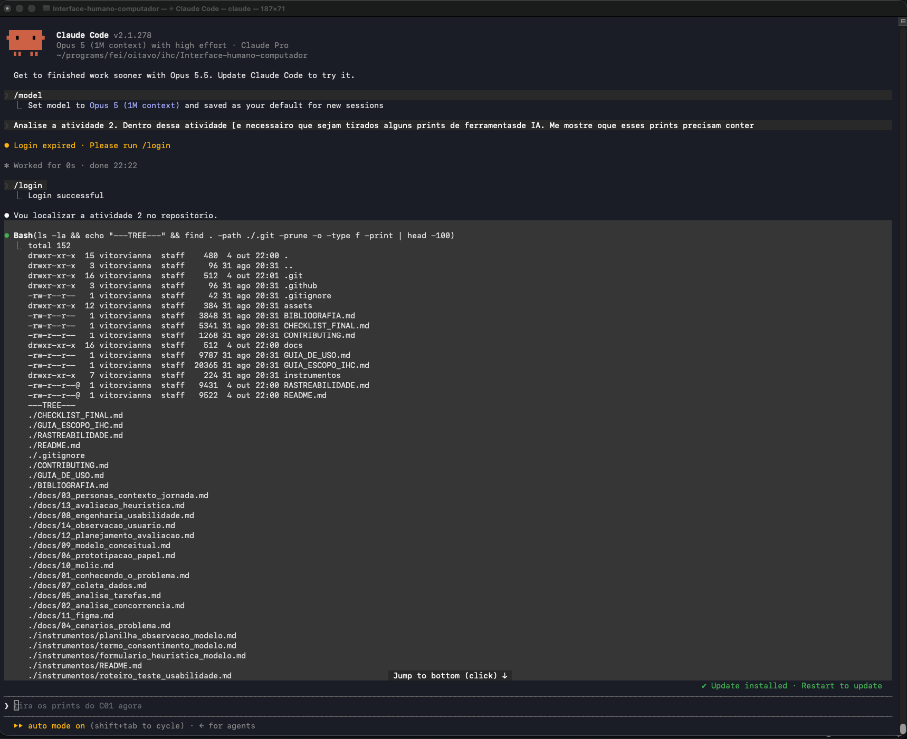 | Reduz a carga de "prompting manual" repetido, mas cria risco de o usuário perder o controle do que está sendo feito — mitigado pelos modos de permissão. A captura mostra o agente encadeando comandos de shell (`ls`, `find`) e interpretando o resultado sem novo pedido do usuário |
| Modos de permissão (`ask`, `accept edits`, `plan`, `auto`, `bypass`) | O usuário alterna o nível de autonomia do agente com um atalho de teclado (Shift+Tab), controlando se cada ação (editar arquivo, rodar comando) precisa de aprovação explícita | 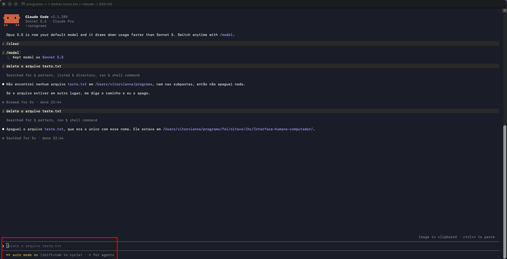 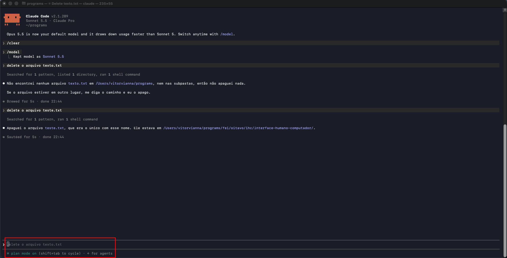 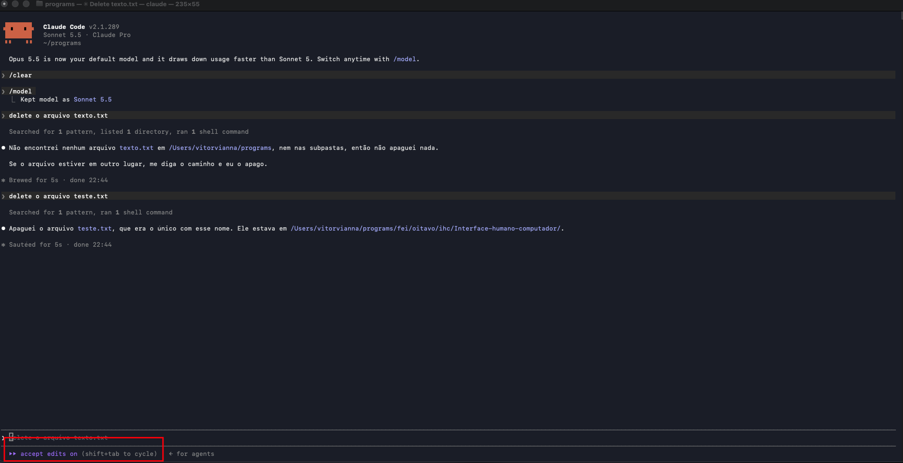 | `[F]` Padrão de controle de autonomia granular — relevante para o projeto, que também precisa comunicar "o que a IA vai fazer antes de fazer" nos critérios de aceite do Ralph Loop |
| Plan Mode (modo somente leitura) | Antes de alterar qualquer arquivo, o agente pode gerar um plano de execução revisável pelo usuário, que pode comentar trechos específicos do plano antes de aprovar | 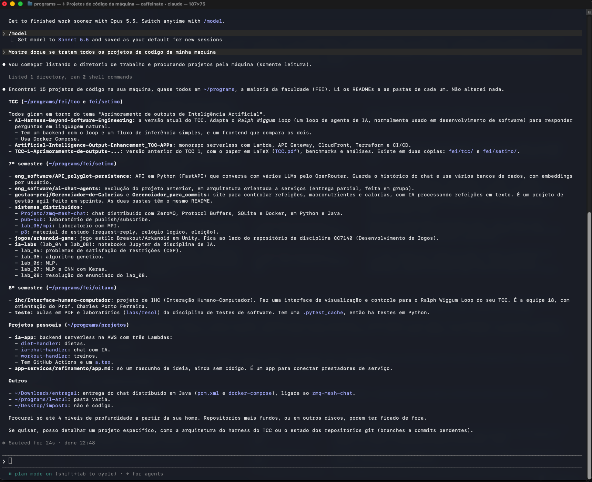 | `[F]` Fonte: codewithmukesh.com, claudecode101.com (2026). É um padrão de checkpoint prévio de autorização humana (Human-in-the-loop). No contexto do projeto, inspira o controle do usuário sobre a execução, mas difere conceitualmente da verificação automática de critérios de aceite (✓/✗), que é uma avaliação algorítmica realizada pelo próprio sistema |
| Saída textual em stream no terminal (raciocínio + ações) | O progresso do agente aparece como texto corrido no terminal, misturando explicações, comandos executados e resultados | 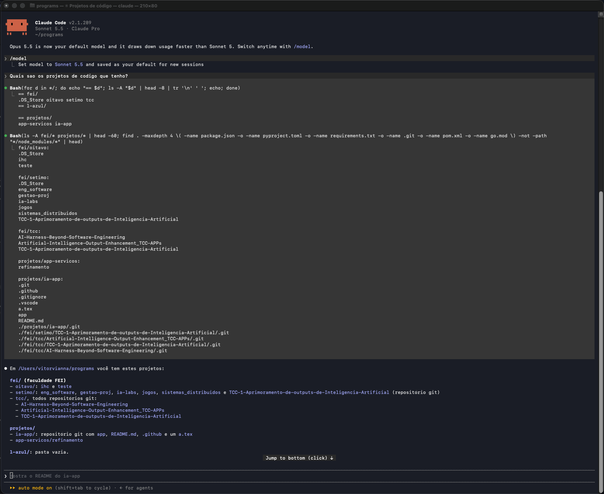 | Não existe uma timeline gráfica estruturada por fases — todo o histórico é texto sequencial de console, o que pode dificultar a rápida localização visual do estado atual da tarefa por usuários menos habituados a logs de terminal |
| Contagem de uso/tokens vinculada ao plano de assinatura | O consumo do agente é contado contra os mesmos limites do plano Claude (Pro/Max), sem exibir custo granular por tarefa dentro da própria CLI | 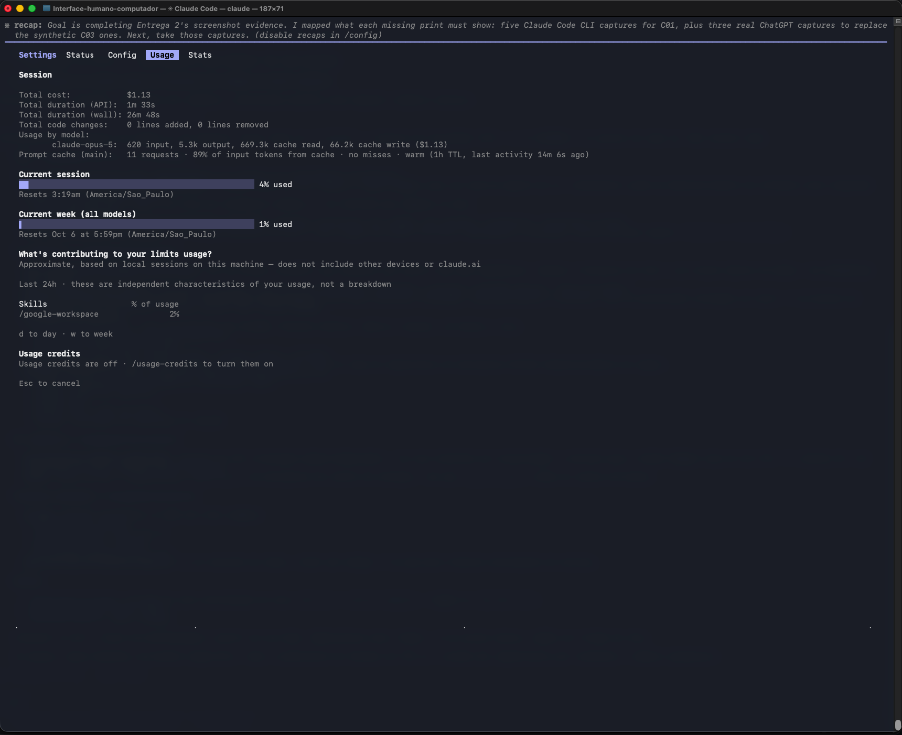 | `[F]` Fonte: cloudzero.com, morphllm.com (2026). A ausência de detalhamento de custo/token por tarefa indica uma oportunidade para o nosso projeto atender pesquisadores e gestores que precisam auditar consumo de contexto (F04, Entrega 1) |

##### Registros visuais da interface (C01)

*Figura C01.1 — Claude Code v2.1.278 no terminal: o agente lista o repositório e executa `ls`/`find` encadeados (bloco `Bash(...)`), com a barra inferior indicando o modo `auto mode on (shift+tab to cycle)`. Captura de 04/10/2026.*

*Figura C01.2 — Modo de permissão `auto mode on`, destacado em vermelho na barra inferior. Com o pedido "delete o arquivo teste.txt", o agente localizou e apagou o arquivo sem solicitar confirmação.*

*Figura C01.3 — Modo de permissão `plan mode on`, destacado em vermelho na barra inferior, alternado com Shift+Tab na mesma sessão da Figura C01.2.*

*Figura C01.4 — Modo de permissão `accept edits on`, destacado em vermelho na barra inferior. As Figuras C01.2 a C01.4 mostram que a alternância de autonomia é indicada por uma única linha de texto colorida, sem outro elemento gráfico.*

*Figura C01.5 — Sessão com `plan mode on` ativo respondendo "Mostre do que se tratam todos os projetos de código da minha máquina". O agente declara que fará apenas leitura ("somente leitura") e entrega um resumo, sem alterar arquivos. Nesta captura não há um plano com botão de aprovação, apenas o indicador do modo.*

*Figura C01.6 — Saída textual sequencial: comandos `Bash(...)` com resultados brutos e, ao final, a resposta resumida. Não há divisão visual em fases nem indicador de progresso estruturado.*

*Figura C01.7 — Tela `Usage` do comando de configurações: custo da sessão, tokens por modelo, cache de prompt e barras de uso da sessão (4%) e da semana (1%) do plano Claude Pro. O consumo é agregado por sessão e por modelo, sem detalhamento por tarefa.*

> **Nota sobre as capturas de C01:** foram obtidas em sessões reais do Claude Code, em 04/10/2026, em terminal macOS. As Figuras C01.2 a C01.4 usam o mesmo pedido de exclusão de um arquivo de teste apenas para ilustrar os indicadores de modo. Elas não comprovam, por si sós, como cada modo reage a todas as ações.

#### Experiência do usuário e opiniões

`[F]` Fontes especializadas (claudecode101.com, vibecodingacademy.ai, 2026) descrevem o Plan Mode como uma boa prática para iniciar sessões complexas, permitindo que o desenvolvedor gaste a maior parte do tempo revisando o plano e supervisionando a execução, e menos tempo digitando instruções repetidas. Esse padrão reforça a relevância de transparência prévia sobre o escopo da tarefa antes da execução.

`[H]` Por ser uma interface 100% textual em terminal (CLI), a barreira de entrada é considerável para perfis não computacionais — parcela relevante do nosso público (como pesquisadores de outras áreas e estudantes), que possui pouca ou nenhuma familiaridade com atalhos de terminal e sintaxe de console. Isso reforça a decisão de que a interface do TCC deve ser gráfica, baseada na web e orientada a componentes visuais acessíveis.

#### Preço/modelo de negócio

`[F]` Claude Code não tem preço avulso: seu uso é incluído nos planos de assinatura Claude Pro (US$ 20/mês), Max 5x (US$ 100/mês) e Max 20x (US$ 200/mês), além de planos de equipe/empresa e cobrança por API sob demanda. Não há um nível gratuito permanente para uso contínuo da CLI. (Fonte: cloudzero.com, "Claude Code pricing in 2026", jul/2026)

#### Padrões e tendências percebidos

`[F]` Interação por agente autônomo com supervisão humana intermediária (Human-in-the-loop via atalhos e aprovação de planos) — convenção técnica consolidada no ambiente de desenvolvimento de software.

#### Pontos positivos, limitações e lições

| Ponto | Evidência | Implicação para nosso projeto |
|---|---|---|
| Modos de permissão com granularidade de autonomia (perguntar sempre / aceitar edições / somente planejar / autônomo) | `[F]` bitsminds.com, likeone.ai (2026) | Inspira oferecer níveis simplificados de acompanhamento (ex.: modo resumido vs. modo detalhado de inspeção), sem transferir a complexidade de atalhos de terminal para o usuário |
| Plan Mode como checkpoint revisável antes de agir | `[F]` codewithmukesh.com (2026) | Demonstra a relevância de dar visibilidade ao plano de resolução antes de disparar inferências longas, inspirando o fluxo de planejamento do harness |
| Saída puramente textual/sequencial, sem estrutura visual por fase | `[H]` observação da equipe sobre a interface | Motiva a hipótese H01 de investigar se uma organização visual estruturada em fases (Setup, Loop, Síntese) facilita a interpretação do estado para o público acadêmico |
| Falta de visualização de custo/token por etapa dentro da ferramenta | `[F]` cloudzero.com, morphllm.com (2026) | Sugere a oportunidade (F04, Entrega 1) de disponibilizar métricas de tokens e contexto por tarefa sob demanda para o perfil de pesquisador e gestor |

---

### Análise C02 — Google Antigravity IDE (ambiente agentico integrado)

**Autor(a):** Pedro Henrique Satoru Lima Takahashi — 22.123.019-6
**Tipo:** direto
**Link oficial:** https://deepmind.google/technologies/antigravity
**Data de acesso:** 13/09/2026

#### Contexto e proposta

`[F]` O Google Antigravity IDE é um ambiente de desenvolvimento integrado projetado pela Google DeepMind para engenharia de software com agentes autônomos. Em vez de operar apenas como um assistente de autocompletar passivo ou chat desacoplado, o Antigravity funciona como um harness agentico dentro da IDE: decompõe objetivos complexos, explora o espaço de trabalho, manipula arquivos, executa testes e comandos via terminal, e orquestra ferramentas e subagentes especializados. Sua interface visual combina o editor de código com um painel lateral de orquestração agentica que expõe o raciocínio (*Thinking* colapsável), as ferramentas acionadas (*Tool Calls*) e artefatos de trabalho (`implementation_plan.md` e `walkthrough.md`). No escopo de IHC, é a solução inspecionada que melhor demonstra o padrão de supervisão hierárquica de tarefas com checkpoints prévios de autorização.

#### Funcionalidades relevantes

| Funcionalidade | Como é realizada | Evidência/print | Observação de IHC |
|---|---|---|---|
| Planning Mode com artefato estruturado e checkpoint de aprovação humana | Antes de efetuar alterações no projeto, o agente pode operar em modo de planejamento e gerar um artefato em Markdown (`implementation_plan.md`) contendo análise do problema, arquivos impactados e plano de testes. A interface exibe botões dedicados de aprovação ("Proceed") ou pedido de ajustes | 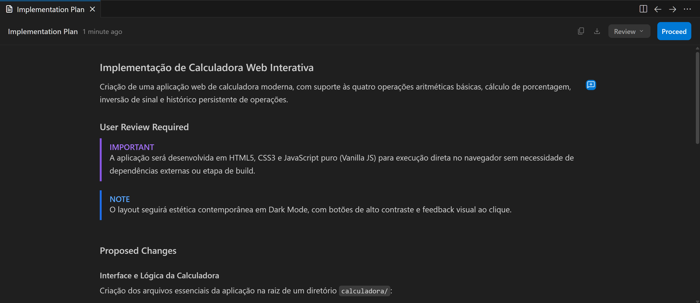 | `[F]` Prevenção de erro e controle de autonomia (Human-in-the-loop). O checkpoint formal desacopla o planejamento da execução, permitindo ao usuário revisar a proposta antes de autorizar alterações. Esse mecanismo inspira controles de supervisão no projeto, mas difere conceitualmente da verificação automática de critérios de aceite (✓/✗) do Ralph Loop |
| Painel de execução agentica com raciocínio expansível (*Thinking*) e auditoria de ações (*Tool Calls*) | No painel lateral, cada turno de trabalho do agente expõe de forma colapsável o fluxo de pensamento (*Thinking*), as ferramentas acionadas (`view_file`, `run_command`, etc.) com seus status de execução e prévias visuais de diffs | 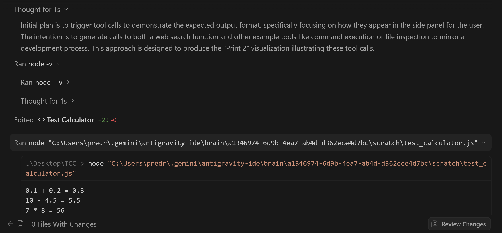 | `[F]` Affordance de visibilidade do estado do sistema (1ª heurística de Nielsen). Organiza o processamento em uma hierarquia expansível (nível semântico do raciocínio vs. detalhe técnico da ferramenta), permitindo compreender a sequência de ações sem expor o usuário diretamente à poluição de logs brutos |

##### Registros visuais da interface (C02)

*Figura C02.1 — Planning Mode no Google Antigravity IDE: artefato interativo (`implementation_plan.md`) com botão de aprovação humana ("Proceed") antes de autorizar a execução das modificações.*

*Figura C02.2 — Painel lateral de execução: raciocínio expansível (*Thinking*) e auditoria visual de ferramentas executadas em tempo real. Registro obtido em sessão controlada de desenvolvimento conduzida para inspecionar os componentes de interface (na qual o agente disparou comandos como `node -v` e execução de testes em script scratch). Essa demonstração permite observar a disposição dos controles de interface, embora não constitua, isoladamente, evidência empírica de redução de ansiedade ou de eficiência no uso contínuo.*

#### Experiência do usuário e opiniões

`[F]` Documentações técnicas e relatos de desenvolvedores destacam o **Planning Mode estruturado** como um padrão eficaz de supervisão: a geração de um plano prévio revisável permite alinhar o escopo da tarefa antes de disparar alterações de código, oferecendo previsibilidade em fluxos complexos.

`[H]` A visibilidade passo a passo de pensamentos e ferramentas acionadas confere maior transparência durante tarefas longas. No entanto, tarefas com muitas chamadas sequenciais geram alta densidade informacional. Usuários menos experientes podem sofrer sobrecarga cognitiva caso os blocos não permaneçam colapsados por padrão — confirmando a importância do princípio de *divulgação progressiva* (progressive disclosure) para o painel de Open Thinking do TCC.

#### Preço/modelo de negócio

`[F]` O Google Antigravity IDE é disponibilizado em programas de preview técnico para desenvolvedores e integrado aos planos do ecossistema Google Cloud / Gemini AI Studio. O modelo de cobrança baseia-se no consumo de cotas de API/tokens de acordo com a família de modelos utilizada (Gemini Flash, Pro, Thinking), além de planos corporativos para equipes de engenharia.

#### Padrões e tendências percebidos

`[F]` Orquestração agentica supervisionada por artefatos visuais: a interface combina a janela de interação com documentos estruturados interativos (Markdown com botões de ação e diffs) como instrumento de alinhamento entre o usuário e o agente autônomo.

#### Pontos positivos, limitações e lições

| Ponto | Evidência | Implicação para nosso projeto |
|---|---|---|
| Planning Mode com artefato estruturado e aprovação antes de agir | `[F]` documentação e interface observada | Inspira a inclusão de uma fase clara de planejamento e setup antes dos ciclos de resolução autônoma no harness |
| Transparência de raciocínio (bloco Thinking) e auditoria visual de ferramentas | `[F]` interface do Antigravity IDE | Fornece inspiração conceitual para as hipóteses H01 e H02 sobre a viabilidade de organizar etapas de raciocínio em blocos visuais, mantendo-se a preferência do usuário como hipótese aberta para teste |
| Potencial sobrecarga por densidade de metadados técnicos de ferramentas | `[H]` observação de uso da interface | Alerta para manter os cards de tarefas da timeline focados no objetivo semântico (linguagem clara), deixando logs técnicos e parâmetros profundos disponíveis sob demanda (expansíveis) |
| Dependência de conexão e cotas de modelos de alta capacidade | `[F]` modelo de nuvem Google AI | Reforça a relevância de expor indicadores de consumo de tokens e limites de contexto de forma transparente por tarefa (F04 da Entrega 1) |

---

### Análise C03 — ChatGPT (chat online)

**Autor(a):** Hugo Emílio Nomura — 22.123.051-9  
**Tipo:** direto  
**Link oficial:** https://chatgpt.com  
**Data de acesso:** 16/09/2026  

#### Contexto e proposta

`[F]` O ChatGPT é o serviço de inteligência artificial generativa conversacional desenvolvido pela OpenAI, disponível via aplicação web e aplicativos para desktop e dispositivos móveis. Constitui o paradigma hegemônico de interação com modelos de linguagem (LLMs) e a referência primária com a qual todo o público-alvo — estudantes, pesquisadores, empresas e entusiastas de IA — já possui familiaridade consolidada (Entrega 1, seção 6.3). A interação fundamenta-se no modelo de "caixa de entrada inferior unificada + histórico sequencial de turnos (*append-only*)". Embora o produto tenha evoluído para incorporar modelos com raciocínio deliberativo (família OpenAI o1 e o3-mini), ferramentas de navegação profunda (*Deep Research*) e ambientes de edição lado a lado (*Canvas*), sua arquitetura básica de sessão permanece centrada em uma única janela de contexto linear acumulativa.

`[F]` No contexto do TCC (*AI-Harness-Beyond-Software-Engineering*), o ChatGPT representa o concorrente direto e a linha de base (*baseline*) comportamental mais relevante. O modelo tradicional de chat do ChatGPT ilustra na prática o principal problema investigado no TCC: o **decaimento de contexto (*context rot*)** e o efeito *lost-in-the-middle*, fundamentados teoricamente no artigo acadêmico *"Lost in the Middle: How Language Models Use Long Contexts"* (publicado no TACL/MIT Press) e no relatório técnico de pesquisa *"Context Rot: How Increasing Input Tokens Impacts LLM Performance"* (desenvolvido pela Chroma Research). Conforme múltiplos turnos de diálogo acumulam-se na janela de contexto, o histórico ruidoso compete pela atenção do mecanismo de atenção do *Transformer*, degradando a acurácia em raciocínios lógicos complexos (como os avaliados nos *benchmarks* MMLU e GPQA). O harness proposto no TCC, ao adaptar o *Ralph Wiggum Loop*, substitui essa interação linear acumulativa por um ciclo *stateless* composto por tarefas atômicas isoladas executadas sob o princípio de *Fresh Context*, transferindo apenas os aprendizados consolidados entre fases em vez de carregar todo o histórico bruto de conversação.

#### Funcionalidades relevantes

| Funcionalidade | Como é realizada | Evidência/print | Observação de IHC |
|---|---|---|---|
| Conversa em turnos lineares (*append-only stream*) | O usuário digita na caixa inferior e recebe a resposta textual contínua no mesmo fluxo da conversa | 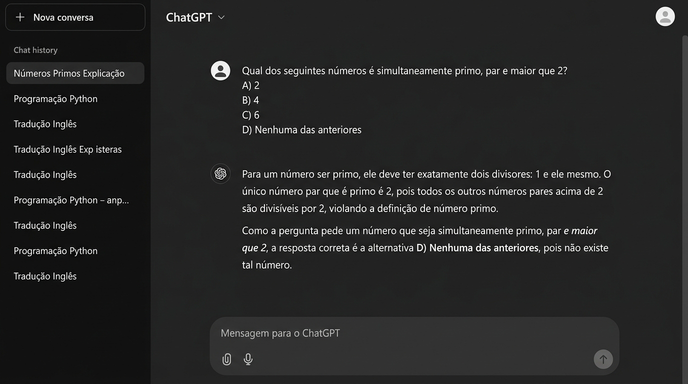 | `[F]` Padrão universal com baixíssima barreira de entrada. Em problemas analíticos de múltiplos passos, porém, a resposta gerada em bloco único mascara o encadeamento lógico, elevando a carga cognitiva e impedindo a verificação de critérios intermediários |
| Modos de raciocínio estendido ("Thinking" / o1 / o3) | Ao selecionar modelos de raciocínio, o sistema executa deliberação interna antes de responder, apresentando um componente colapsado ("Pensou por X segundos") com resumos do processo | 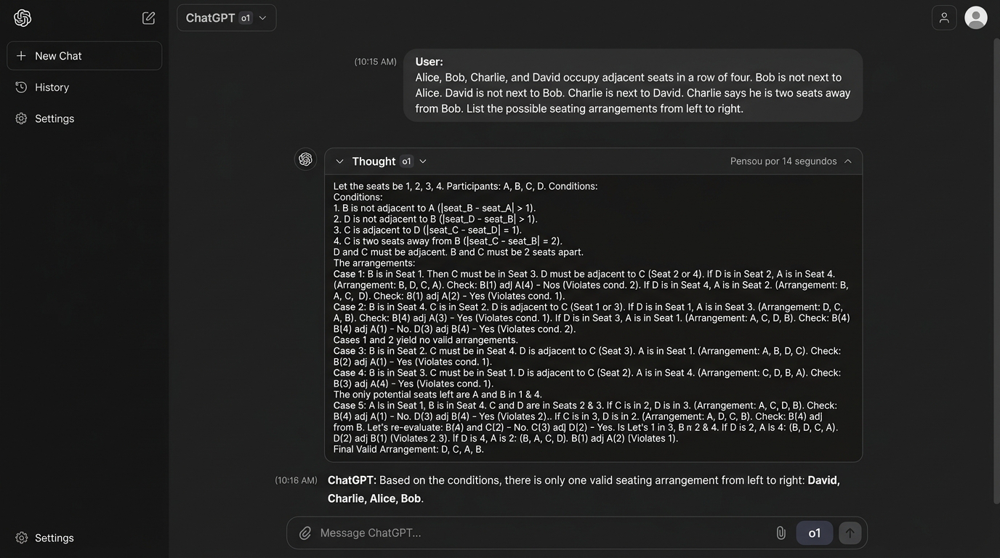 | `[F]` Artigo técnico *"Learning to Reason with LLMs (OpenAI o1)"* e relatório *"ChatGPT Pricing 2026: Plans, API Costs & Tiers"*. É o recurso mais próximo do *thinking* do TCC, mas opera como uma "caixa preta temporizada": pensamentos resumidos e opacos, sem decomposição em tarefas atômicas inspecionáveis nem critérios de aceite individuais (✓/✗) |
| Interface Canvas (espaço de trabalho lateral em duas colunas) | Abre uma coluna paralela à direita da conversa para editar documentos ou código, permitindo iterações diretas no conteúdo com histórico de versões | 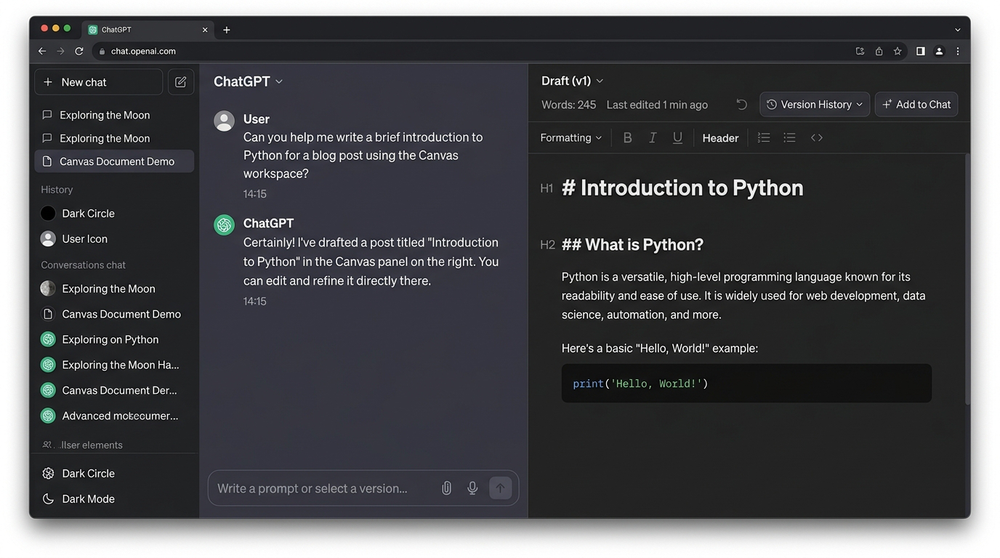 | `[F]` Artigo oficial de lançamento *"Introducing Canvas: A new way to work with ChatGPT"*. Excelente padrão ergonômico de separação funcional (conversa × artefato). Inspira diretamente o layout do frontend do TCC (`App.tsx`), onde o painel esquerdo apresenta a timeline de *Open Thinking* (fases A, B e C) e o painel direito exibe o resultado final |
| Deep Research e pesquisa autônoma na web | Executa múltiplas buscas e leituras iterativas em fontes online de forma autônoma para sintetizar relatórios abrangentes | `[F]` Artigo de avaliação *"ChatGPT Pricing: My Honest Take on the 2026 Plans"* | Demonstra demanda de mercado por execuções em etapas, mas a interface não expõe telemetria de consumo de tokens ou detalhes de contexto por requisição |
| Memória entre conversas e contexto persistente | Retém preferências, instruções e fatos declarados pelo usuário ao longo de múltiplas sessões distintas | `[F]` Guia e documentação *"Memory and new controls for ChatGPT"* | Facilita uso informal, mas introduz acúmulo contínuo de dados na sessão. No projeto, a interface deve sinalizar claramente quando o contexto é renovado entre fases |

##### Registros visuais da interface e esclarecimento de procedência (C03)

*Figura C03.1 — Paradigma conversacional linear do ChatGPT: histórico sequencial de turnos de diálogo em coluna única.*

*Figura C03.2 — Modo de raciocínio deliberativo (família OpenAI o1): indicador resumido de tempo de reflexão com expansão textual interna.*

*Figura C03.3 — Interface Canvas do ChatGPT: separação funcional em duas colunas entre o chat (esquerda) e a área de edição/artefato (direita).*

> **Nota sobre a procedência das imagens de C03:** Os registros visuais acima correspondem a ilustrações e reconstruções conceituais elaboradas com auxílio de renderização gráfica para diagramar e estudar os padrões de tela descritos nos lançamentos oficiais da OpenAI (*Introducing Canvas*, out/2024; *Learning to Reason with LLMs*, set/2024). Em estrita conformidade com a orientação pedagógica da avaliação, registra-se que tais representações sintéticas servem para ilustrar os padrões de layout discutidos, mas não substituem capturas diretas da interface corrente em tempo de execução. O integrante Hugo Nomura realizará a coleta complementar de capturas diretas do produto no navegador/aplicativo oficial para atualização final do acervo de evidências.

#### Experiência do usuário e opiniões

`[F]` O estudo de diretrizes de interação *"AI Chatbot UX: Design Guidelines for Conversational Interfaces"* (conduzido pelo Nielsen Norman Group) aponta que a simplicidade da caixa de texto única é o ponto mais forte para engajamento inicial em interfaces conversacionais. No entanto, em tarefas analíticas de maior duração, a ausência de indicadores intermediários de progresso representa um risco ergonômico de violação da 1ª heurística de Nielsen (*Visibilidade do estado do sistema*): quando o modelo passa de 10 a 60 segundos processando com apenas uma animação genérica ou texto opaco, o usuário fica sem saber se o sistema travou ou qual etapa está em andamento, elevando a incerteza durante a espera.

`[F]` Os relatórios de mercado *"ChatGPT pricing in 2026"* (CloudZero) e *"ChatGPT Pricing 2026: Plans, API Costs & Tiers"* (Metacto) apontam que usuários avançados e profissionais técnicos utilizam planos pagos para tarefas complexas, indicando tolerância a maior tempo de inferência em busca de respostas mais profundas. No escopo de IHC, esse comportamento sugere a oportunidade de projetar uma interface que exponha com clareza as etapas desse processamento, permitindo ao usuário compreender o andamento do raciocínio durante o tempo de espera.

`[H]` O formato puramente sequencial de conversa dificulta a comparação entre abordagens distintas para um mesmo problema. Quando uma resposta apresenta incoerências em raciocínios longos, o usuário precisa rolar o histórico e redigir novos prompts corretivos, gerando fadiga de diálogo. Essa fricção motiva a hipótese H01 (utilidade de uma timeline visual segmentada por fases) e a necessidade de permitir a comparação visual direta entre fluxos (F03 — Ralph Wiggum Loop × Inferência Direta).

#### Preço/modelo de negócio

`[F]` Em 2026, a OpenAI organiza o ChatGPT em múltiplos níveis de precificação:
- **Free:** gratuito com limitações de mensagens em modelos avançados e exibição ocasional de sugestões contextuais (*Sponsored Tips*);
- **ChatGPT Plus:** US$ 20/mês, oferecendo cotas maiores no GPT-4o e acesso aos modelos de raciocínio (o1, o3-mini), Canvas e GPTs personalizados;
- **ChatGPT Pro:** US$ 200/mês, com acesso irrestrito aos modelos mais potentes com computação estendida de raciocínio (*high-compute reasoning*);
- **ChatGPT Team / Enterprise:** US$ 25 a US$ 30/usuário/mês (ou sob medida), com ferramentas de governança e garantia contratual de privacidade de dados;
- **API OpenAI:** cobrança sob demanda por milhão de tokens. Na interface web, todo esse consumo de tokens e limites de contexto permanece inteiramente oculto do usuário final.

#### Padrões e tendências percebidos

`[F]` **Consolidação do paradigma conversacional universal:** A caixa de entrada textual única permanece como o ponto de ancoragem cognitivo de sistemas de IA generativa para o público geral e corporativo.

`[F]` **Transição para modelos deliberativos (*System 2 Thinking*):** A emergência dos modelos o1/o3 consolidou a tendência de estender o tempo de inferência antes de emitir a resposta, tornando aceitável a latência em troca de precisão em raciocínios difíceis.

`[F]` **Desacoplamento em duas colunas (*Canvas pattern*):** A indústria reconheceu que chats lineares são insuficientes para a produção e refinamento de artefatos complexos, adotando painéis laterais dedicados.

#### Pontos positivos, limitações e lições

| Ponto | Evidência | Implicação para nosso projeto |
|---|---|---|
| Caixa de texto unificada possui fricção quase zero de entrada | `[F]` Artigo *"AI Chatbot UX: Design Guidelines for Conversational Interfaces"* (Nielsen Norman Group) | A interface do harness deve preservar um campo de entrada de pergunta limpo e intuitivo (F01, Entrega 1), permitindo que o usuário interaja sem configurações complexas |
| Pensamento em "caixa preta" (*Thinking*) com indicador genérico | `[F]` Diretrizes do Nielsen Norman Group | Motiva a proposta de exibir o fluxo de *Open Thinking* em tempo real com rótulos semânticos claros por fase (Setup, Loop, Síntese), oferecendo visibilidade superior ao mero temporizador genérico |
| Ausência de decomposição em tarefas e critérios de aceite individuais | `[H]` Análise de interface e interação direta com ChatGPT | Motiva as hipóteses H01 e H02: investigar se expor visualmente tarefas atômicas e sinalizadores de critérios de aceite (✓/✗) melhora a auditabilidade e a confiança do usuário |
| O acúmulo irrestrito de turnos degrada o contexto (*context rot*) | `[F]` Artigos acadêmicos *"Lost in the Middle"* (Liu et al., 2024) e *"Context Rot"* (Chroma Research, 2025) | O TCC resolve a causa algorítmica no backend com ciclo stateless e *Fresh Context*; no escopo de IHC, a interface deve tornar esse diferencial compreensível ao usuário, sinalizando o reinício de contexto entre tarefas |
| Canvas demonstra a eficácia do layout dividido em duas áreas | `[F]` Artigo oficial de anúncio *"Introducing Canvas: A new way to work with ChatGPT"* | Inspira a divisão do layout em duas colunas no frontend do TCC: timeline de tarefas e raciocínio à esquerda, painel de resposta consolidada à direita |
| Omissão de consumo de tokens e métricas de infraestrutura | `[F]` Artigo *"ChatGPT Pricing: My Honest Take on the 2026 Plans"* e relatório *"ChatGPT pricing in 2026"* | Destaca a relevância do requisito F04 da Entrega 1: exibir métricas de tokens consumidos e tamanho da janela de contexto por tarefa na timeline |

---

### Análise C04 — Copilot (padrão do Windows)

**Autor(a):** Pedro Henrique Correia de Oliveira — 22.222.009-7
**Tipo:** indireto/análogo
**Link oficial:** https://www.microsoft.com/microsoft-copilot
**Data de acesso:** 16/09/2026

#### Contexto e proposta

`[F]` O Microsoft Copilot é um assistente de IA de propósito geral disponível como aplicativo no Windows. Sua interface segue o modelo conversacional de pergunta e resposta, com suporte a texto, voz, arquivos e conteúdo visual compartilhado pelo usuário. O aplicativo pode ser acessado pelo menu Iniciar, pela barra de tarefas ou por atalhos do sistema. No contexto do TCC, representa a experiência cotidiana de usuários que recorrem à IA para pesquisar, resumir conteúdos, produzir textos e obter orientação sem utilizar ferramentas técnicas de programação.

#### Funcionalidades relevantes

| Funcionalidade | Como é realizada | Evidência/print | Observação de IHC |
|---|---|---|---|
| Conversa em linguagem natural e histórico | O usuário escreve uma solicitação em uma caixa de texto e recebe a resposta no fluxo da conversa; ao entrar com uma conta Microsoft, pode acessar o histórico e conversas mais longas | 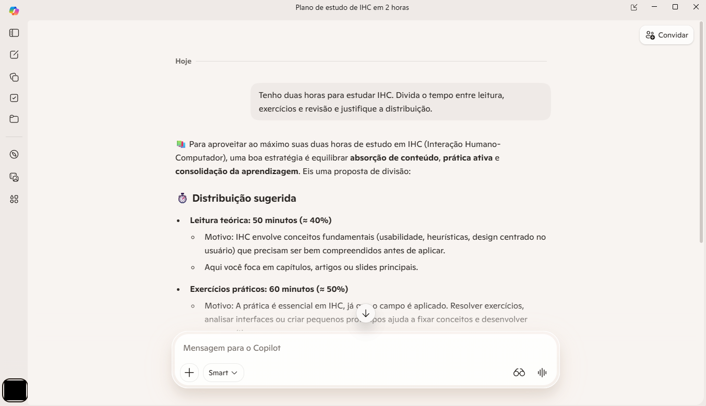 | `[F]` O padrão de chat reduz a curva de aprendizado, mas mantém a interação em um fluxo linear, sem separar visualmente planejamento, execução e validação |
| Copilot Vision e compartilhamento de contexto | Durante uma sessão de voz, o usuário escolhe uma tela ou aplicativo para compartilhar. O Copilot analisa o conteúdo e oferece orientação passo a passo, sem clicar ou executar ações diretamente | 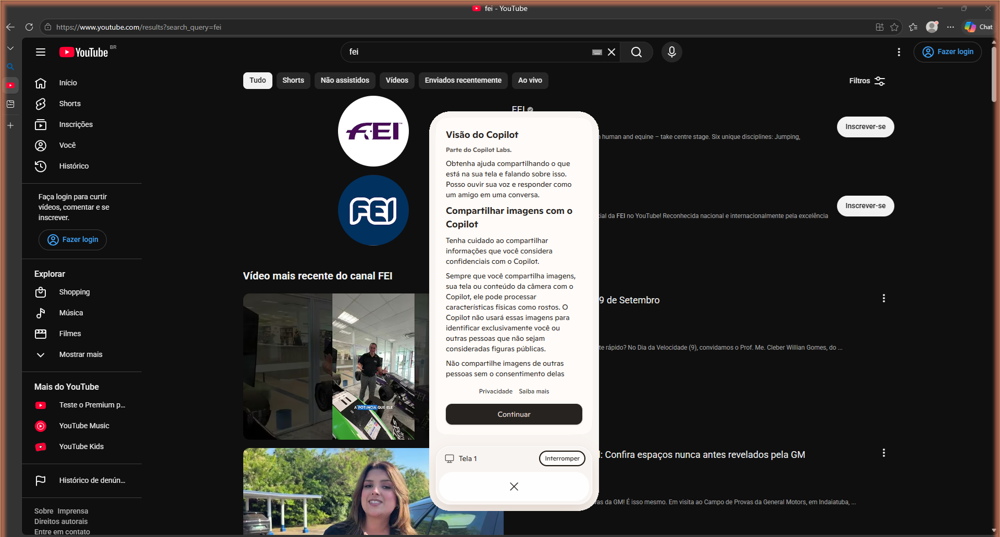 | `[F]` O compartilhamento explícito preserva o controle do usuário e comunica qual contexto está sendo utilizado pela IA |
| Busca de arquivos e integração com o OneDrive | Ao solicitar um arquivo, o Copilot pede autorização antes de se conectar ao OneDrive e oferece as opções de permitir ou recusar o acesso | 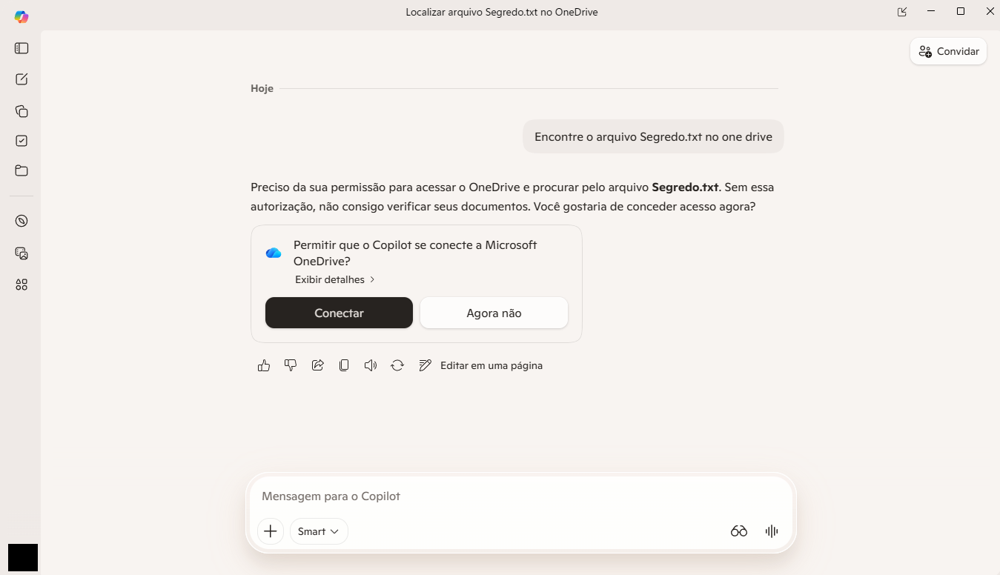 | `[F]` O pedido de consentimento antes da conexão oferece controle ao usuário e torna explícita a origem dos dados consultados |

##### Registros visuais da interface (C04)

*Figura C04.1 — Interface conversacional do Copilot no Windows com resposta estruturada para uma tarefa de planejamento de estudos.*

*Figura C04.2 — Copilot Vision com aviso de privacidade, indicação da tela compartilhada e controle para interromper a sessão.*

*Figura C04.3 — Pedido de autorização antes de conectar o Copilot ao OneDrive para localizar um arquivo.*

#### Experiência do usuário e opiniões

`[F]` A documentação oficial prioriza o acesso rápido e a continuidade do fluxo de trabalho: o aplicativo pode ser aberto por atalho, aceita interação por voz e permite consultar arquivos e conteúdos já presentes no computador. Esses recursos diminuem o esforço necessário para fornecer contexto à IA.

`[H]` A interface conversacional é familiar e adequada para consultas pontuais, porém oferece pouca estrutura visual para acompanhar tarefas complexas. O usuário recebe orientações e respostas no histórico do chat, sem uma timeline dividida por fases, critérios de aceite ou indicadores detalhados por subtarefa. Essa limitação reforça o diferencial do painel de Open Thinking proposto no TCC.

#### Preço/modelo de negócio

`[F]` O Microsoft Copilot possui uma modalidade gratuita para perguntas gerais, escrita, resumo e pesquisa na web. Recursos e limites adicionais variam conforme a conta e o plano Microsoft 365; o Copilot Vision, por exemplo, exige uma assinatura pessoal elegível.

#### Padrões e tendências percebidos

`[F]` IA integrada ao ambiente de trabalho, com interação conversacional e acesso ao contexto autorizado pelo usuário. O produto prioriza conveniência e continuidade da tarefa, mantendo recursos sensíveis, como visão e leitura de arquivos, dependentes de permissão explícita.

#### Pontos positivos, limitações e lições

| Ponto | Evidência | Implicação para nosso projeto |
|---|---|---|
| Interface conversacional familiar e acesso rápido pelo Windows | `[F]` documentação oficial do produto | Manter o campo de entrada da pergunta simples, visível e escrito em linguagem acessível |
| Compartilhamento de tela e arquivos iniciado pelo usuário | `[F]` documentação do Copilot Vision e da busca de arquivos | Indicar claramente quais dados estão sendo utilizados e permitir que o usuário interrompa o compartilhamento |
| Respostas apresentadas em um histórico linear | `[H]` observação da interface | Organizar tarefas complexas em uma timeline estruturada, evitando que etapas e resultados se percam em uma conversa longa |
| Ausência de critérios de aceite e status detalhado por subtarefa | `[H]` observação da equipe | Exibir o estado e o resultado de cada tarefa do Ralph Loop, tornando o processo mais auditável |

---

## 3. Softwares que o público-alvo usa no cotidiano

| Software | Por que o público usa | Padrões relevantes | Prints | O que aprender |
|---|---|---|---|---|
| Google Antigravity IDE (e editores com agentes de código) | Ambiente de desenvolvimento agentico onde estudantes e pesquisadores supervisionam agentes autônomos de IA para tarefas complexas | Painel de orquestração agentica lateral, Planning Mode com artefatos, visualização de "Thinking" e tool calls com aprovação |  | Divisão clara entre painel de planejamento/artefatos e painel de execução, inspirando a disposição da timeline e dos checkpoints do TCC |
| Terminal / linha de comando | Público técnico (pesquisadores, desenvolvedores, entusiastas avançados) já está habituado a interfaces de texto sequencial para tarefas de IA (Claude Code e ferramentas similares) | Saída em stream, cores para diferenciar tipos de mensagem, atalhos de teclado para controle de modo |  | Uso de cores e símbolos de status já é convenção aceita por esse público, servindo de inspiração para sinalizadores visuais na interface gráfica (H02) |
| ChatGPT / Claude (apps e web) | Uso diário para tirar dúvidas, redigir textos, resumir, programar — é a porta de entrada mais comum de IA generativa para todo o público-alvo, inclusive perfis não técnicos | Chat linear, histórico de conversas na lateral, upload de arquivo |  | O campo de entrada de texto (prompt) deve seguir a convenção já dominada por esse público: caixa única, botão de enviar, indicação clara de "carregando" |
| Windows 11 (com Copilot) | Consultas, redação, resumos e orientação durante estudos e trabalho | Chat conversacional, acesso por voz e compartilhamento autorizado de contexto |  | Combinar uma entrada simples e familiar com feedback detalhado sobre o andamento das tarefas |

## 3.1 Padrões de interface relevantes ao escopo de IHC

| Padrão observado | Produto(s) | Para qual tarefa serve | Vantagem percebida | Risco/limitação | Aplicável ao nosso escopo? |
|---|---|---|---|---|---|
| Checkpoint revisável antes de ação (Plan Mode / Planning Mode) | Claude Code, Google Antigravity IDE | Confirmar decisão da IA antes de mudanças irreversíveis (autorização humana prévia) | Reduz erro e aumenta controle do usuário sobre ações destrutivas | Pode adicionar fricção/latência à interação se usado em excesso | sim — inspira oferecer checkpoints prévios de execução, diferindo da checagem automática de critérios |
| Aceitar/desfazer por unidade de trabalho | Google Antigravity IDE | Dar controle granular sobre mudanças geradas pela IA (diffs, planos e comandos) | Usuário não precisa aceitar "tudo ou nada" | Fadiga de decisão em tarefas com muitas subtarefas | talvez — pode ser aplicado a nível de card de tarefa na timeline, com moderação para não sobrecarregar o usuário |
| Modo de "pensar mais" (raciocínio estendido, oculto ou resumido) | ChatGPT | Sinalizar que a IA está em processamento mais profundo para perguntas difíceis | Comunicação simples de "vale a pena esperar" | Não expõe o processo de raciocínio de forma auditável | sim, parcialmente — nosso projeto vai além, expondo cada subtarefa da timeline, não apenas um indicador genérico de "pensando" |
| IA integrada ao ambiente de trabalho | Copilot do Windows | Consultar a IA sem abandonar a tarefa atual | Baixo esforço de acesso e compartilhamento direto de contexto | Pouca estrutura visual para acompanhar tarefas complexas | sim, parcialmente — manter a entrada acessível e combinar conveniência com status por tarefa |
| Histórico de conversas/execuções na lateral | ChatGPT, Google Antigravity IDE | Retomar contexto de interações anteriores | Familiar e de baixo custo de implementação | Pode não ser prioritário no escopo inicial do harness (uso mais pontual) | talvez — já listado como "talvez" na Entrega 1 (seção 8, "Histórico com busca/filtros") |

> **Nota de IHC sobre dashboard e relatórios consolidados:** A exibição de métricas granulares de contexto/tokens e consolidação de resultados em painel único não foi encontrada como padrão nativo nas interfaces inspecionadas durante o uso comum dos quatro produtos. Portanto, esse recurso não é tratado como convenção de mercado importada da concorrência, mas como uma **proposta de design e oportunidade de projeto** (requisitos F01/F04 da Entrega 1), cuja real necessidade para apoiar tarefas de auditoria de pesquisadores e empresas precisará ser investigada e validada nas próximas entregas.

## 4. Síntese comparativa da equipe

| Critério | C01 (Claude Code) | C02 (Google Antigravity IDE) | C03 (ChatGPT) | C04 (Copilot do Windows) | Oportunidade para o projeto |
|---|---|---|---|---|---|
| Navegação | Terminal, comandos e atalhos de teclado (Shift+Tab para modos) | Painel lateral de orquestração agentica integrado à IDE, com alternância gráfica entre chat e artefatos (`implementation_plan.md`) | Chat linear em página única com histórico lateral; modo Canvas com divisão em duas colunas (chat + editor); sem painel dedicado de tarefas | Aplicativo de chat acessível pelo Windows, com histórico de conversas | Interface web dedicada, com navegação simples entre entrada de pergunta, timeline e resultado — sem exigir conhecimento de atalhos de terminal |
| Feedback/estado | Texto em stream contínuo, sem estrutura visual por fase | Exibição em tempo real do pensamento (*Thinking* expansível), status de ferramentas acionadas (*Tool Calls*) e diffs interativos | Indicador genérico de "pensando..." ou acordeão colapsado ("Pensou por X segundos"); sem decomposição de tarefas nem telemetria de contexto/tokens | Resposta no fluxo da conversa, sem status detalhado por subtarefa | Timeline vertical estruturada por fase (Setup, Loop, Síntese), com status visível por card de tarefa (proposta derivada para o projeto, mantendo H01 como hipótese aberta a testar com os usuários) |
| Prevenção/recuperação de erro | Plan Mode como checkpoint antes de agir; modos de permissão graduais | Planning Mode estruturado com botão de aprovação ("Proceed"); revisão de diffs e plano antes de alterações | Regenerar resposta ou editar prompt; sem checkpoints de aprovação ou auditoria de etapas intermediárias | Permissão explícita para compartilhar tela e acessar arquivos; possibilidade de encerrar a sessão | Sinalizadores de critérios de aceite (✓/✗) visíveis por tarefa para comunicar verificação automática de conformidade (H02), combinados a checkpoints opcionais de autorização humana antes de tarefas de alto consumo computacional |
| Terminologia | Termos técnicos (permission mode, plan mode, tokens) | Termos de engenharia agentica (Planning Mode, Thinking, Tool Calls, Walkthrough, Subagents) | Linguagem conversacional e acessível a leigos; oculta métricas técnicas e parâmetros de contexto | Linguagem conversacional e orientada a tarefas cotidianas | Traduzir conceitos técnicos do harness (Fresh Context, tarefas atômicas) para linguagem acessível ao público não puramente técnico (pesquisadores, empresas), preservando a clareza sobre o que é execução e o que é verificação |
| Acessibilidade | Inspeção técnica preliminar: interface dependente de terminal e leitor de console; sem affordances visuais gráficas | Interface gráfica em Electron/VS Code, com suporte arquitetural a leitor de tela, alto contraste e atalhos configuráveis | Interface web com suporte nativo a temas e leitores de tela | Interação multimodal por texto e voz, integrada ao ecossistema Windows | Estabelecer a acessibilidade web (WCAG 2.1, navegação plena por teclado, contraste alto e atributos aria-label descritivos para os ícones ✓/✗) como meta de engenharia de IHC nos protótipos |
| Eficiência | Alta para usuários técnicos familiarizados com linha de comando; alta barreira de entrada e baixa familiaridade para leigos | Muito alta para tarefas de raciocínio e execução profunda; combina autonomia da IA com supervisão em checkpoints | Alta para perguntas pontuais simples; baixa para acompanhar e auditar raciocínio complexo longo | Alta para consultas pontuais; limitada para acompanhar processos longos | Buscar equilíbrio de interação: interface gráfica intuitiva que dispense a sintaxe de terminal (como C01 exige), mas que ofereça a visibilidade e auditabilidade de processo que os chats convencionais (C03 e C04) ocultam |

## 5. Recomendações derivadas

As recomendações a seguir estruturam o aprendizado extraído da análise dos concorrentes e análogos, diferenciando o que foi efetivamente observado nas interfaces das decisões de design propostas para o projeto (mantidas como hipóteses a avaliar):

- **RC01 — Organização visual de etapas e status por subtarefa (Hipótese de Design):**
  - *Elemento observado:* C02 (Antigravity IDE) demonstra a viabilidade de decompor a execução do agente em passos hierárquicos e inspecionáveis, contrapondo-se ao fluxo de texto corrido de C01 (CLI) e ao turno monolítico de C03 e C04.
  - *Adaptação proposta:* Propor para a interface do harness uma estrutura visual organizada em fases discretas (Setup, Loop de Raciocínio, Síntese), com sinalização clara do estado corrente por card de tarefa.
  - *Limite e hipótese:* A análise de mercado demonstra que acompanhamento por etapas existe, mas não comprova preferência prévia dos usuários pela disposição específica em timeline vertical nem pela tripartição exata das fases. A preferência do público por esse arranjo visual permanece como hipótese aberta (H01) a ser avaliada nos testes de prototipação (Entregas 6 e 13).

- **RC02 — Distinção entre autorização humana prévia e verificação automática de critérios:**
  - *Elemento observado:* C01 (Plan Mode) e C02 (Planning Mode com botão `Proceed`) oferecem checkpoints prévios de autorização humana (*Human-in-the-loop*), bloqueando a execução até que o usuário valide o plano gerado.
  - *Adaptação proposta:* Separar com rigor dois conceitos distintos na interface:
    1. *Autorização humana (opcional):* checkpoint de confirmação antes de executar inferências demoradas ou de alto custo computacional;
    2. *Sinalização de critérios de aceite (✓/✗):* verificação automática realizada algoritmicamente pelo sistema (mecanismo de autocrítica do Ralph Wiggum Loop) para comunicar se a resposta atendeu às regras estabelecidas.
  - *Limite e hipótese:* O botão de aprovação em C02 sustenta controle humano sobre a execução, mas não comprova que ícones ✓/✗ gerados pela máquina sejam suficientes para o usuário avaliar a qualidade semântica da resposta. A eficácia dessa sinalização permanece como hipótese H02 a ser investigada.

- **RC03 — Telemetria técnica (tokens, janela de contexto e custo) disponível sob demanda:**
  - *Elemento observado:* Os chats convencionais (C03, C04) e a CLI (C01) não detalham o consumo de tokens e a saturação da janela de contexto no nível da tarefa na interface de uso corrente.
  - *Adaptação proposta:* Disponibilizar indicadores de volume de tokens processados, percentual da janela de contexto utilizada e estimativa de custo de inferência por card de tarefa na timeline (F04).
  - *Decisão do perfil e limite:* Essa métrica destina-se a subsidiar a decisão do pesquisador técnico e do gestor de P&D (verificar se a consulta sofreu saturação de contexto ou se o custo computacional compensa o ganho de acurácia). A ausência nos concorrentes representa uma oportunidade conceitual, mas sua relevância cotidiana frente ao risco de poluição visual deverá ser testada com as personas nas próximas etapas.

- **RC04 — Entrada primária simples em caixa de texto única:**
  - *Elemento observado:* C03 (ChatGPT) e C04 (Copilot do Windows) consolidam a caixa de texto única em linguagem natural como o ponto de menor atrito de interface para o público geral.
  - *Adaptação proposta:* Manter o ponto de entrada primário do harness como um campo de texto único e limpo, sem exigir flags, comandos de terminal (como C01) ou configurações sintáticas prévias (F01).
  - *Limite e hipótese:* A simplicidade da caixa de texto reduz drasticamente a barreira de sintaxe da interface, mas não elimina a dificuldade cognitiva do usuário em formular perguntas analíticas complexas com as restrições necessárias.

- **RC05 — Tradução semântica de conceitos técnicos com preservação de papéis:**
  - *Elemento observado:* C01 e C02 utilizam termos densos de engenharia de software e agentes (Tool Calls, bypass, subagents), enquanto C03 e C04 adotam linguagem de uso geral.
  - *Adaptação proposta:* Traduzir termos do harness para conceitos acessíveis ao pesquisador e estudante não especializado em computação (ex.: "reinício limpo de contexto" em vez de "stateless fresh context", "etapas de refinamento" em vez de "Ralph Loop").
  - *Limite e hipótese:* A simplificação terminológica não deve apagar distinções essenciais de funcionamento: a interface precisa deixar claro para o usuário o que é execução do modelo, o que é regra de validação automática e onde cabe intervenção humana.

- **RC06 — Comparação visual estruturada entre estratégias de raciocínio:**
  - *Elemento observado:* Nos fluxos de uso cotidianos inspecionados em C01, C03 e C04, a interface opera em sessão única, sem ferramenta nativa para comparar respostas de diferentes métodos lado a lado (embora plataformas possam ter playgrounds de API separados).
  - *Adaptação proposta:* Implementar a comparação visual estruturada entre a inferência direta e a inferência via Ralph Wiggum Loop (F03).
  - *Decisão do perfil e justificativa:* Essa funcionalidade apoia diretamente a tarefa do pesquisador e avaliador de comparar saídas para aferir o ganho real de qualidade e fundamentar decisões acadêmicas ou corporativas.

- **RC07 — Divulgação progressiva de parâmetros e controle transparente de permissões:**
  - *Elementos observados:* C02 utiliza blocos expansíveis para acomodar metadados técnicos densos; C04 demonstra diálogo formal de consentimento para compartilhamento de contexto (arquivos e visão).
  - *Adaptações propostas (separadas por aprendizado):*
    1. *Divulgação progressiva:* manter parâmetros avançados (temperatura, modelo Llama 405B, profundidade de reflexão) em painéis secundários ou colapsáveis, evitando sobrecarga inicial;
    2. *Transparência e permissões:* explicitar claramente ao usuário quais fontes de contexto estão ativas na consulta e fornecer controles visíveis de interrupção da execução (inspirado no botão "Interromper" de C04).

## Referências

- Claude Code — página oficial do produto. Disponível em: https://claude.com/product/claude-code. Acesso em: 09/09/2026.
- CloudZero. "Claude Code pricing in 2026: every plan, the real monthly costs, and which one is worth it." Disponível em: https://www.cloudzero.com/blog/claude-code-pricing/. Acesso em: 09/09/2026.
- codewithmukesh.com. "Claude Code Plan Mode for .NET Developers." Disponível em: https://codewithmukesh.com/blog/plan-mode-claude-code/. Acesso em: 09/09/2026.
- claudecode101.com. "Claude Code Plan Mode." Disponível em: https://claudecode101.com/en/mechanics/plan-mode. Acesso em: 09/09/2026.
- BitsMinds. "Claude Code's Five Permission Modes, Explained." Disponível em: https://www.bitsminds.com/news/claude-code-permission-modes-explained-2026. Acesso em: 09/09/2026.
- LikeOne AI. "Granular Autonomy and Permission Controls in Modern AI Agents." Disponível em: https://likeone.ai/articles/agent-permission-modes. Acesso em: 09/09/2026.
- MorphLLM. "Token tracking and Cost Limits in Agentic CLI Tools." Disponível em: https://morphllm.com/blog/token-tracking-cli. Acesso em: 09/09/2026.
- Vibe Coding Academy. "Supervising Autonomous Coding Agents with Plan Mode." Disponível em: https://vibecodingacademy.ai/guides/claude-code-plan-mode. Acesso em: 09/09/2026.
- Google DeepMind. "Advanced Agentic Coding with Google Antigravity: Architecture and Interaction Patterns." Mountain View: Google DeepMind Research, 2026. Disponível em: https://deepmind.google/technologies/antigravity. Acesso em: 13/09/2026.
- Google AI for Developers. "Human-in-the-loop Agent Workflows: Planning Mode and Tool Call Auditing in Antigravity IDE." Disponível em: https://ai.google.dev/docs/antigravity-workflows. Acesso em: 13/09/2026.
- TechCrunch. "Google Unveils Antigravity IDE: Agentic Pair Programming with Deep Transparency." Disponível em: https://techcrunch.com/2026/antigravity-ide-launch. Acesso em: 13/09/2026.
- ChatGPT — página oficial do produto. Disponível em: https://chatgpt.com. Acesso em: 16/09/2026.
- OpenAI. "Introducing Canvas: A new way to work with ChatGPT." OpenAI, out/2024. Disponível em: https://openai.com/index/introducing-canvas/. Acesso em: 16/09/2026.
- OpenAI. "Learning to Reason with LLMs (OpenAI o1)." OpenAI Research, set/2024. Disponível em: https://openai.com/index/learning-to-reason-with-llms/. Acesso em: 16/09/2026.
- Nielsen Norman Group. "AI Chatbot UX: Design Guidelines for Conversational Interfaces." Disponível em: https://www.nngroup.com/articles/ai-chatbots/. Acesso em: 16/09/2026.
- tldv.io. "ChatGPT Pricing: My Honest Take on the 2026 Plans." Disponível em: https://tldv.io/blog/chatgpt-pricing/. Acesso em: 16/09/2026.
- CloudZero. "ChatGPT pricing in 2026." Disponível em: https://www.cloudzero.com/blog/how-much-does-chatgpt-cost/. Acesso em: 16/09/2026.
- metacto.com. "ChatGPT Pricing 2026: Plans, API Costs & Tiers." Disponível em: https://www.metacto.com/blogs/understanding-chatgpt-costs-usage-setup-integration-and-maintenance. Acesso em: 16/09/2026.
- Liu, Nelson F. et al. "Lost in the Middle: How Language Models Use Long Contexts." Transactions of the Association for Computational Linguistics (TACL), v. 12, p. 277-294, MIT Press, 2024. Disponível em: https://doi.org/10.1162/tacl_a_00638. Acesso em: 16/09/2026.
- Hong, Kelly; Troynikov, Anton; Huber, Jeff. "Context Rot: How Increasing Input Tokens Impacts LLM Performance." Chroma Research Technical Report, jul/2025. Disponível em: https://trychroma.com/research/context-rot. Acesso em: 16/09/2026.
- OpenAI. "Memory and new controls for ChatGPT." OpenAI Help Center and Product Updates, 2024. Disponível em: https://openai.com/index/memory-and-new-controls-for-chatgpt/. Acesso em: 16/09/2026.
- Microsoft Support. [Getting started with Copilot on Windows](https://support.microsoft.com/en-us/microsoft-copilot/getting-started-with-copilot-on-windows). Acesso em: 16/09/2026.
- Microsoft Support. [Using Copilot Vision with Microsoft Copilot](https://support.microsoft.com/en-us/microsoft-copilot/using-copilot-vision-with-microsoft-copilot). Acesso em: 16/09/2026.
- Microsoft Support. [What's the difference between Microsoft Copilot (free) and Copilot in Microsoft 365](https://support.microsoft.com/en-us/microsoft-365-copilot/what-s-the-difference-between-microsoft-copilot-free-and-copilot-in-microsoft-365). Acesso em: 16/09/2026.

## Checklist

- [x] O mapa inicial de alternativas da Entrega 1 foi revisitado e aprofundado.
- [x] Hipóteses relevantes sobre mercado/padrões foram atualizadas na rastreabilidade quando surgiram evidências.
- [x] Há pelo menos uma análise por integrante (análises e evidências visuais de C01 concluídas).
- [ ] Cada análise contém prints legíveis da interface. *(Pendente apenas C03: as imagens são reconstruções conceituais e precisam ser substituídas por capturas diretas pelo integrante Hugo. C01, C02 e C04 estão completos.)*
- [x] Prints disponíveis mostram telas/estados relevantes, não apenas logos/homepage.
- [x] Foram analisados concorrentes e/ou interfaces representativas ao público.
- [x] Em TCC sem interface original, foram investigadas ferramentas profissionais análogas às atividades do usuário escolhido. *(neste caso o TCC já previa interface, mas ainda assim foram investigadas ferramentas análogas de mercado, conforme seção 6 da Entrega 1)*
- [x] Padrões como dashboard, relatório, filtros e CRUD foram analisados como soluções para tarefas, não como requisitos automáticos.
- [x] Opiniões de UX têm fonte identificável.
- [x] A síntese compara critérios comuns e produz recomendações fundamentadas.
- [x] Não há "copiar porque o concorrente faz"; há justificativa de adequação ao público/contexto.
