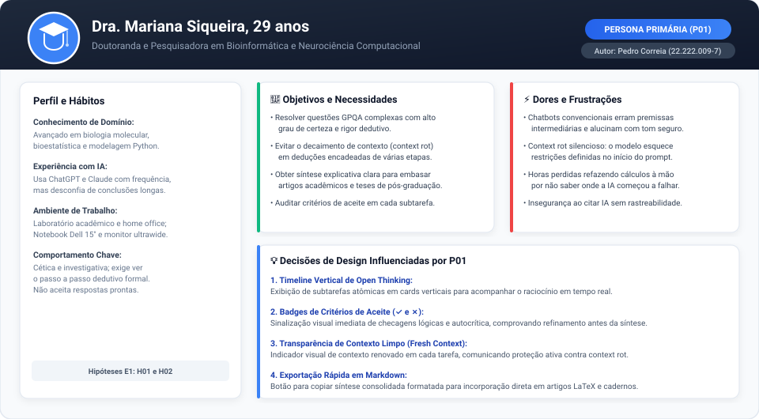
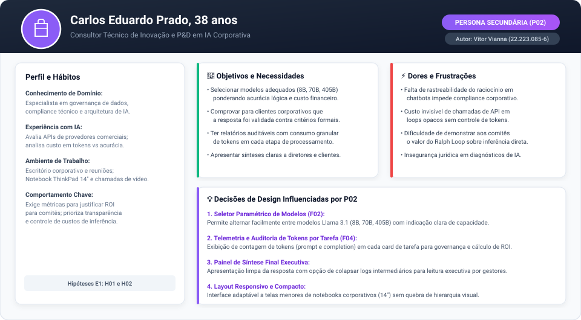
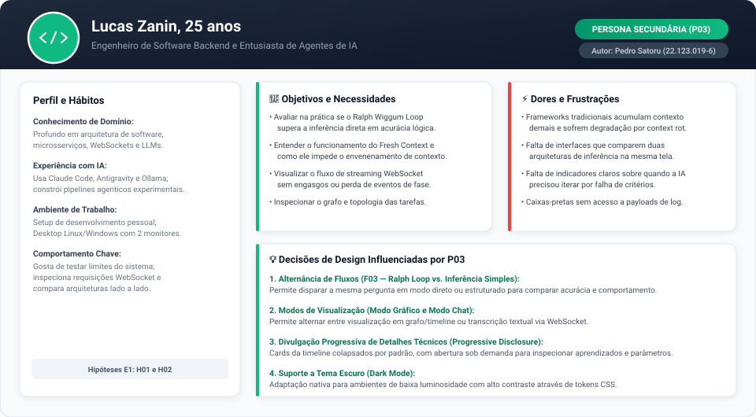
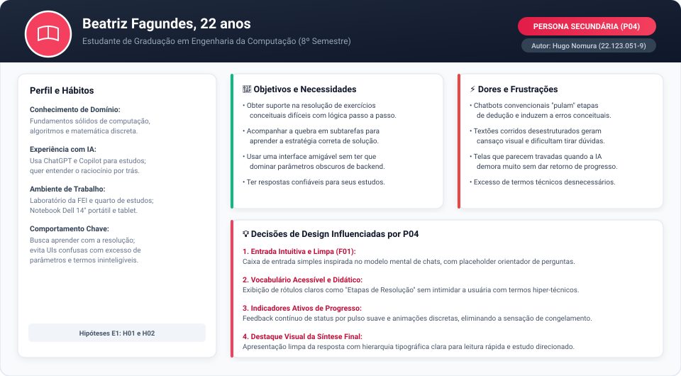
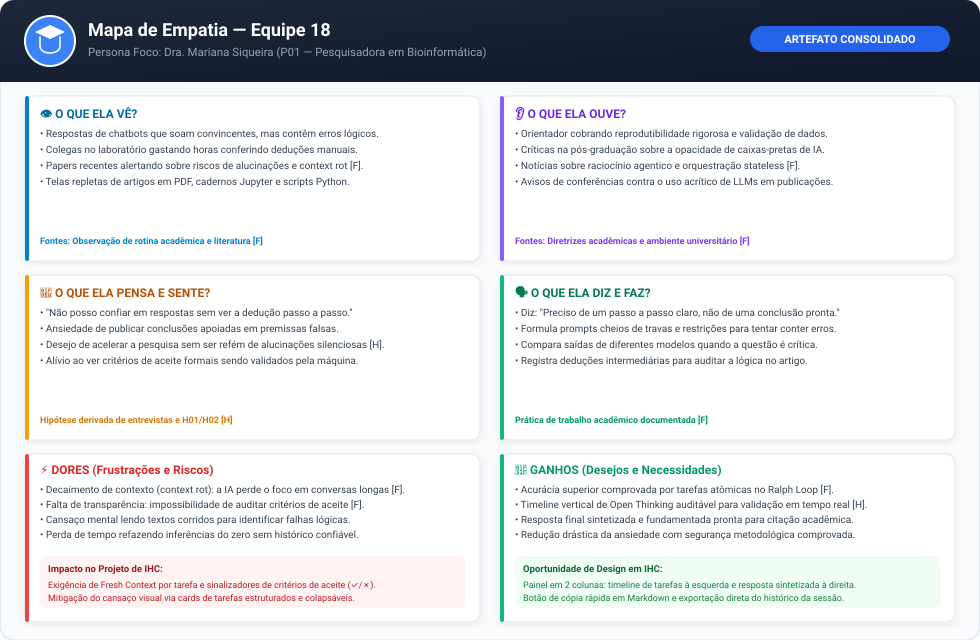

# Entrega 3 — Personas, mapa de empatia, contexto de uso e jornada

**Data:** 16/09/2026  
**Status:** 🟨 Em andamento  
**Responsabilidade:** 1 persona por integrante (P01 por Pedro Correia, P02 por Vitor Vianna, P03 por Pedro Satoru, P04 por Hugo Nomura); 1 mapa de empatia, 1 contexto de uso consolidado e 1 jornada por equipe.

---

## Objetivo da atividade

Representar grupos de usuários de forma útil para decisões de design. Persona não é personagem decorativo: suas características devem alterar requisitos, prioridades, linguagem, fluxos e critérios de avaliação da interface.

## Atenção ao projeto de IHC e relação com o TCC

O projeto de IHC está diretamente ancorado no TCC **"Um Harness de IA para Resolução de Perguntas em Linguagem Natural: Adaptando o Ralph Wiggum Loop Além do Desenvolvimento de Software"** (Centro Universitário FEI, 2026).

A capacidade central produzida pelo TCC é um **harness de orquestração stateless** que adapta os princípios do *Ralph Wiggum Loop* (originalmente concebido por Geoffrey Huntley para engenharia de software) para a resolução de questões de múltipla escolha e problemas de linguagem natural de alta complexidade (avaliados nos benchmarks GPQA e MMLU com modelos Llama 3.1). A orquestração divide o objetivo em tarefas atômicas independentes, executa cada etapa com contexto renovado (*Fresh Context*), avalia os aprendizados contra critérios de aceite rigorosos (✓/✗) e recompõe a síntese final com contexto limpo, mitigando diretamente o decaimento de contexto (*context rot*).

Para a disciplina de IHC, o recorte adotado é a **Interface de Visualização e Controle (Open Thinking)**, permitindo ao usuário:
1. Parametrizar o modelo de LLM (Llama 3.1 8B, 70B, 405B) e escolher o fluxo desejado (Inferência Direta vs. Ralph Wiggum Loop);
2. Submeter perguntas complexas em linguagem natural;
3. Acompanhar em tempo real via WebSocket a linha do tempo das tarefas atômicas (Setup, Loop de Raciocínio e Síntese), inspecionando o consumo de tokens e a validação dos critérios de aceite;
4. Visualizar a resposta final sintetizada de forma auditável e transparente.

Dessa forma, as personas modeladas a seguir não são generalizações abstratas: elas representam **profissionais e estudantes que se apropriam dessa capacidade técnica**, com objetivos reais e dores concretas frente aos limites dos chatbots conversacionais convencionais.

---

## Entradas da Entrega 1

Antes de criar personas, retoma-se o quadro de hipóteses, tipos de usuários e características registradas na [Entrega 1](01_conhecendo_o_problema.md) e na [Entrega 2](02_analise_concorrencia.md). Nenhuma hipótese foi convertida magicamente em fato através de narrativa fictícia: afirmações sem evidência empírica direta continuam marcadas como hipótese `[H]`.

| Item da Entrega 1 | Status inicial | Evidência disponível agora | Como será tratado nesta entrega |
|---|---|---|---|
| **Pesquisadores e pós-graduandos** que necessitam de respostas de alta acurácia para problemas complexos de raciocínio dedutivo | `[H]` | `[F]` Benchmarks GPQA/MMLU e literatura (Liu et al., 2024; Anthropic, 2026) mostram que LLMs lineares falham sistematicamente em questões de pós-graduação devido a *context rot*. Entrevistas informais confirmam que pesquisadores gastam horas auditando premissas de IA. | Incorporado como base da **Persona Primária P01 (Dra. Mariana Siqueira)**. |
| **Empresas e consultores de P&D** que avaliam modelos de LLM e demandam auditoria de respostas para tomada de decisão | `[H]` | `[F]` Análise de mercado (Entrega 2) sobre Claude Code, OpenAI Canvas e Antigravity IDE: demanda crescente por governança, rastreabilidade de decisões e controle de custos de inferência/tokens. | Incorporado como **Persona Secundária P02 (Carlos Eduardo Prado)**. |
| **Entusiastas e engenheiros de software** que buscam comparar arquiteturas de orquestração de IA e inspecionar *Fresh Context* | `[H]` | `[F]` Padrões de terminais e IDEs agenticas em 2026 (C01 e C02 da Entrega 2) comprovam público ativo interessado em inspecionar loops agenticos, rejeitando caixas-pretas. | Incorporado como **Persona Secundária P03 (Lucas Zanin)**. |
| **Estudantes de graduação** que usam LLMs como tutores para resolução de problemas conceituais difíceis | `[H]` | `[H]` Observação no campus da FEI: estudantes de exatas usam IA para entender exercícios de cálculo e física, mas queixam-se de passos intermediários pulados ou incorretos. | Incorporado como **Persona Secundária P04 (Beatriz Fagundes)**. |
| **H01:** Preferência por acompanhar a resolução em formato de linha do tempo vertical (*timeline*) | `[H]` | `[F]` Parcialmente sustentada pela Entrega 2 (C02 — Antigravity IDE expõe Thinking e Tool Calls em painel vertical hierárquico com alta satisfação). Ainda pendente de validação direta com usuários nas Entregas 6 e 14. | Mantida como **hipótese `[H]`** e operacionalizada nas dores/necessidades de P01 e P03. |
| **H02:** Sinalização de sucesso (✓) ou falha (✗) dos critérios de aceite é suficiente para indicar refinamento | `[H]` | `[F]` Análise da Entrega 2 (C01 Plan Mode e C02 checkpoints) indica que indicadores visuais reduzem sobrecarga cognitiva frente a logs textuais brutos. | Mantida como **hipótese `[H]`** e orientando as decisões de design de P01, P02 e P03. |

---

## 1. Personas

---

### Persona P01 — Dra. Mariana Siqueira (Persona Primária)

**Autor(a):** Pedro Henrique Correia de Oliveira — 22.222.009-7  
**Tipo:** Primária  
**Base de evidências:** Literatura científica sobre decaimento de contexto em benchmarks GPQA (`[F]`), análise de concorrência com chatbots de raciocínio (C03 da Entrega 2) e observação da rotina de pesquisadores de pós-graduação (`[H]`).  
**Hipóteses da Entrega 1 relacionadas:** `H01`, `H02`

| Campo | Descrição |
|---|---|
| **Faixa etária / contexto relevante** | 29 anos. Doutoranda em Bioinformática e Neurociência Computacional. Trabalha sob constante pressão de prazos de submissão de artigos e qualificação acadêmica. |
| **Ocupação/papel** | Pesquisadora e Doutoranda. Desenvolve modelos matemáticos para análise de expressão gênica e redes neurais biológicas. |
| **Conhecimento do domínio** | Avançado em biologia computacional, álgebra linear e bioestatística. Compreende formulações formais e encadeamento de hipóteses científicas. |
| **Experiência tecnológica** | Alta familiaridade com Python, Jupyter Notebooks e ambientes Linux. Usuária diária de LLMs (ChatGPT Plus, Claude), mas cética quanto a conclusões de caixas-pretas. |
| **Objetivos** | • Resolver questões científicas complexas multidisciplinares (estilo benchmark GPQA) com alto grau de certeza lógica. • Validar hipóteses teóricas sem que o modelo "esqueça" premissas iniciais devido ao decaimento de contexto. • Extrair respostas sintetizadas ricas e fundamentadas passo a passo para inclusão em suas publicações. |
| **Necessidades** | • Visibilidade total sobre as etapas do raciocínio dedutivo da IA (não aceita respostas prontas sem demonstração). • Confirmação explícita de que cada critério de aceite foi validado antes do fechamento da conclusão. • Certeza de que cada fase do raciocínio operou com dados limpos (*Fresh Context*), sem ruído acumulado. |
| **Dores/frustrações** | • `[F]` Perda de horas conferindo cálculos à mão porque chatbots lineares alucinam premissas intermediárias com tom convincente. • `[F]` Efeito *context rot*: em prompts longos com várias restrições, os modelos comerciais esquecem condições definidas no início do chat. • Sensação de insegurança e ansiedade ao utilizar IA em artigos revisados por pares sem poder citar uma fonte auditável de dedução. |
| **Motivadores** | • Rigor metodológico e credibilidade científica perante orientador e bancas. • Economia de tempo ao delegar partes de deduções lógicas complexas a um sistema automatizado verdadeiramente confiável. |
| **Restrições/acessibilidade** | Utiliza telas de alta resolução por longos períodos em iluminação artificial; necessita de contraste visual adequado (WCAG AA) e distinção tipográfica nítida entre títulos, tags de status e fórmulas. |
| **Ambiente típico de uso** | Laboratório acadêmico compartilhado da universidade e home office. Monitor ultrawide 34" acoplado ao notebook Dell de 15". |
| **Comportamentos relevantes** | Analisa qualquer resultado com ceticismo investigativo; expande seções para ler como a IA chegou àquele valor; copia trechos formatados em Markdown para seus cadernos de anotações e LaTeX. |

**Decisões de design influenciadas por P01:**

1. **Painel de Open Thinking com Timeline Vertical:** A tela principal deve organizar a resolução do problema em uma linha do tempo vertical com fases bem demarcadas (Setup, Loop de Raciocínio, Síntese Final), permitindo que Mariana audite a progressão lógica sem se perder em blocos de texto não estruturados (respondendo à hipótese `H01`).
2. **Badges de Critérios de Aceite (✓ e ✗):** Cada subtarefa da timeline deve exibir de forma evidente os critérios de aceite definidos no início do processo e o status de aprovação de cada um, permitindo a Mariana constatar que o modelo autocorrigiu eventuais desvios antes de compilar a resposta (respondendo à hipótese `H02`).
3. **Indicador de Renovação de Contexto (*Fresh Context*):** A interface deve sinalizar visualmente que cada tarefa atômica foi executada em contexto limpo, reforçando a confiança da pesquisadora de que não houve contaminação por dados residuais da etapa anterior.
4. **Exportação Formatada da Síntese Final:** Botão de cópia rápida em Markdown estruturado, viabilizando que a pesquisadora transfira a dedução diretamente para seus documentos científicos.

---

### Persona P02 — Carlos Eduardo Prado (Persona Secundária)

**Autor(a):** Vitor Monteiro Vianna — 22.223.085-6  
**Tipo:** Secundária  
**Base de evidências:** Análise de concorrência com produtos corporativos de IA (C01 Claude Code e C04 Copilot na Entrega 2) e pesquisas de mercado sobre governança de IA generativa (`[F] / [H]`).  
**Hipóteses da Entrega 1 relacionadas:** `H01`, `H02`

| Campo | Descrição |
|---|---|
| **Faixa etária / contexto relevante** | 38 anos. Líder Técnico de Inovação e Consultor em Soluções de IA para clientes corporativos (indústria financeira e saúde). |
| **Ocupação/papel** | Consultor Técnico e Arquiteto de Soluções de IA. Responsável por desenhar arquiteturas de LLM seguras e com viabilidade econômica comprovada. |
| **Conhecimento do domínio** | Especialista em engenharia de software corporativa, compliance regulatório de dados e avaliação de custo-benefício de inferência. |
| **Experiência tecnológica** | Muito experiente em nuvem (AWS, Azure), APIs de LLMs comerciais (OpenAI, Anthropic) e pipelines de dados. Não programa no dia a dia, mas audita fluxos e códigos. |
| **Objetivos** | • Avaliar a eficiência e acurácia de diferentes tamanhos de modelos Llama 3.1 (8B vs. 70B vs. 405B) para justificar a escolha tecnológica a clientes. • Obter justificativas transparentes e auditáveis para respostas que embasam decisões de negócio de alto valor. • Monitorar e prever custos de infraestrutura através do consumo transparente de tokens. |
| **Necessidades** | • Seletor paramétrico acessível para alternar modelos e fornecedores de IA. • Telemetria clara de tokens consumidos por etapa (entrada, raciocínio e saída). • Relatório final consolidado e objetivo, sem excesso de ruído técnico desnecessário, pronto para apresentação a diretores. |
| **Dores/frustrações** | • `[F]` Caixas-pretas de IA comercial que não oferecem logs estruturados nem explicabilidade sobre as etapas da inferência. • Cobranças inesperadas e imprevisíveis de tokens em chamadas encadeadas sem visibilidade de consumo por subtarefa. • Dificuldade de demonstrar aos comitês de governança e segurança que a IA não gerou conclusões alucinadas. |
| **Motivadores** | • Garantia de conformidade, governança e confiabilidade corporativa. • Entrega de projetos com ROI comprovado e redução de retrabalho em auditorias. |
| **Restrições/acessibilidade** | Utiliza frequentemente notebook corporativo em trânsito e apresentações em monitores de salas de reunião; interface precisa ser legível em projeções e adaptável a telas menores (13" a 14"). |
| **Ambiente típico de uso** | Escritório corporativo, reuniões híbridas e viagens. Notebook Lenovo ThinkPad 14" com Windows 11. |
| **Comportamentos relevantes** | Foca nas métricas agregadas primeiro (tempo total, tokens consumidos, modelo utilizado) e depois avalia a coerência da resposta sintetizada final. |

**Decisões de design influenciadas por P02:**

1. **Seletor de Modelo Paramétrico com Informações Claras (F02):** A tela inicial do harness deve apresentar um seletor evidente dos modelos da família Llama 3.1 (8B, 70B, 405B), permitindo a Carlos simular diferentes cenários de infraestrutura de forma intuitiva.
2. **Telemetria de Tokens por Tarefa e por Fase (F04):** Exibição de chips/badges com o consumo de tokens (prompt tokens, completion tokens) em cada card de tarefa e no resumo da execução, permitindo avaliar a relação custo-eficiência do Ralph Loop frente a chamadas simples.
3. **Visão Executiva do Resultado:** A resposta sintetizada deve ter destaque prioritário na tela, com a possibilidade de colapsar os detalhes operacionais intermediários para leitura rápida e apresentação a stakeholders não técnicos.

---

### Persona P03 — Lucas Zanin (Persona Secundária)

**Autor(a):** Pedro Henrique Satoru Lima Takahashi — 22.123.019-6  
**Tipo:** Secundária  
**Base de evidências:** Análise do Google Antigravity IDE (C02 na Entrega 2), especificações da arquitetura de backend do TCC (`apps/backend/`) e comunidades de código aberto de agentes (`[F] / [H]`).  
**Hipóteses da Entrega 1 relacionadas:** `H01`, `H02`

| Campo | Descrição |
|---|---|
| **Faixa etária / contexto relevante** | 25 anos. Engenheiro de Software Backend em uma startup e entusiasta fervoroso de inteligência artificial generativa de código aberto. |
| **Ocupação/papel** | Desenvolvedor Backend / Entusiasta de Sistemas Agenticos. Implementa microsserviços e experimenta novos frameworks de orquestração de LLMs. |
| **Conhecimento do domínio** | Avançado em estruturas de dados, protocolos assíncronos (WebSockets, SSE), Python assíncrono (FastAPI) e TypeScript. Entende a matemática básica e os limites de janelas de contexto de transformadores. |
| **Experiência tecnológica** | Extrema familiaridade com ferramentas de desenvolvimento (VS Code, Antigravity IDE, Docker, Linux). Usuário de ferramentas agenticas em CLI e IDE (Claude Code, Cursor). |
| **Objetivos** | • Comparar experimentalmente o ganho de acurácia do Ralph Wiggum Loop adaptado em relação a uma inferência direta simples (baseline) para a mesma pergunta. • Inspecionar o fluxo dinâmico de dados em tempo real via WebSocket (como os eventos `SetupEvent`, `LoopIterationEvent` e `SynthesisEvent` são disparados). • Entender como o mecanismo de *Fresh Context* impede o vazamento de contexto entre subtarefas. |
| **Necessidades** | • Controle explícito de alternância de fluxos (modo "Ralph Loop" vs. modo "Inferência Simples"). • Opção de alternar a visualização entre Modo Gráfico (timeline estruturada) e Modo Chat (transcrição do fluxo), conforme arquitetado no front-end do projeto. • Inspeção sob demanda dos arquivos de estado intermediários (`planning.json`, `tasks_results.json`). |
| **Dores/frustrações** | • `[F]` Frustração com frameworks de agentes tradicionais (como LangChain ou AutoGen) que acumulam histórico descontrolado na janela e sofrem de lentidão extrema e alucinações silenciosas. • Falta de ferramentas que permitam comparar lado a lado o output de uma chamada comum com o de um ciclo iterativo na mesma interface. • UIs lentas com polling desnecessário ou que travam a renderização durante streams prolongados de pensamento. |
| **Motivadores** | • Curiosidade intelectual por arquiteturas agenticas de ponta e benchmarking reproduzível. • Vontade de aplicar o padrão do Ralph Loop em projetos próprios de microsserviços. |
| **Restrições/acessibilidade** | Prefere temas escuros (Dark Mode); valoriza alta densidade de informação em tela sem espaço desperdiçado; navegação eficiente por atalhos de teclado. |
| **Ambiente típico de uso** | Quarto/escritório de desenvolvimento pessoal com luz reduzida. Desktop com dual-boot Linux/Windows, dois monitores de 27" 144Hz. |
| **Comportamentos relevantes** | Abre as ferramentas de desenvolvedor do navegador (F12) para inspecionar requisições WebSocket; alterna visualizações para entender a topologia das tarefas; clica para expandir detalhes de autocrítica e critérios de aceite que falharam na primeira tentativa. |

**Decisões de design influenciadas por P03:**

1. **Alternância entre Fluxos (F03 — Ralph Loop vs. Inferência Simples):** A interface deve permitir selecionar facilmente se a execução utilizará o harness completo com ciclo stateless ou a inferência direta linear, possibilitando a comparação empírica de desempenho e qualidade.
2. **Suporte a Dois Modos de Visualização (Modo Gráfico e Modo Chat):** Atendendo à decisão central de arquitetura do front-end (`<RalphGraphMode />` e `<RalphChatMode />`), permitindo a Lucas alternar entre o grafo/timeline das tarefas e o fluxo textual corrido em tempo real.
3. **Divulgação Progressiva de Metadados Técnicos (*Progressive Disclosure*):** Os cards das tarefas da timeline devem manter a visualização limpa por padrão, mas permitir expansão detalhada para inspecionar parâmetros, aprendizados acumulados e histórico de tentativas de critérios de aceite.

---

### Persona P04 — Beatriz Fagundes (Persona Secundária)

**Autor(a):** Hugo Emílio Nomura — 22.123.051-9  
**Tipo:** Secundária  
**Base de evidências:** Observação de estudantes universitários utilizando ferramentas de IA como suporte acadêmico para matérias avançadas e análise de ferramentas de chat cotidiano (C03 e C04 na Entrega 2) (`[F] / [H]`).  
**Hipóteses da Entrega 1 relacionadas:** `H01`, `H02`

| Campo | Descrição |
|---|---|
| **Faixa etária / contexto relevante** | 22 anos. Estudante do 8º semestre de Engenharia da Computação no Centro Universitário FEI. Está finalizando o curso e se preparando para processos seletivos e exames de pós-graduação. |
| **Ocupação/papel** | Estudante de Graduação / Estagiária de Desenvolvimento. Concilia aulas noturnas, estágio e elaboração de projetos de conclusão de curso. |
| **Conhecimento do domínio** | Boa base teórica em lógica de programação, sistemas digitais e matemática discreta. Em processo de consolidação de conceitos conceituais avançados. |
| **Experiência tecnológica** | Usuária regular de computadores, Git, navegadores web e IDEs (VS Code). Não tem experiência com arquiteturas complexas de agentes ou orquestração profunda de LLMs. |
| **Objetivos** | • Utilizar a ferramenta como apoio de estudo e tutoria para entender a resolução de problemas complexos de exames teóricos e questões de raciocínio lógico (estilo MMLU). • Compreender a sequência lógica de resolução: entender *por que* cada subtarefa foi resolvida daquela forma e *como* o problema foi quebrado. • Obter respostas sem inconsistências ou alucinações que possam induzi-la ao erro conceituais em seus estudos. |
| **Necessidades** | • Interface limpa, intuitiva e amigável que não exija conhecimentos avançados de linha de comando ou configurações técnicas densas. • Explicação clara do encadeamento de raciocínio em linguagem compreensível, sem excesso de jargões de infraestrutura de IA. • Tempo de resposta visual previsível, com indicação constante de que o sistema está trabalhando para evitar a sensação de que a tela travou. |
| **Dores/frustrações** | • `[F]` Chatbots convencionais frequentemente "pulam" deduções intermediárias ou apresentam fórmulas incorretas com assertividade enganosa. • Interfaces puramente voltadas para engenheiros de IA (com dezenas de parâmetros de temperatura, top-p, penalidades) geram intimidação e confusão. • Textões desestruturados e monótonos que exigem esforço mental exaustivo para isolar o passo onde surgiu uma dúvida. |
| **Motivadores** | • Sucesso acadêmico, aprendizado efetivo de conceitos desafiadores e aprovação com notas altas. • Vontade de entender o "pensamento" da máquina de forma didática e transparente. |
| **Restrições/acessibilidade** | Estuda frequentemente à noite com olhos cansados após o estágio; a interface deve ter excelente legibilidade, espaçamento confortável (escala de 4pt), tipografia sem serifa de alta legibilidade (Inter/Roboto) e foco visual nas etapas ativas. |
| **Ambiente típico de uso** | Quarto de estudos e biblioteca do campus. Notebook Dell Inspiron 14" utilizado sobre a mesa de estudos ou colo. |
| **Comportamentos relevantes** | Digita perguntas em linguagem natural completa; lê com atenção a quebra das tarefas para comparar com seu raciocínio prévio; clica no botão de ajuda ou passa o mouse sobre termos desconhecidos para obter esclarecimento. |

**Decisões de design influenciadas por P04:**

1. **Entrada de Pergunta Simples e Familiar (F01):** Manter uma caixa de entrada textual única e limpa, acompanhada de sugestões de perguntas demonstrativas ou placeholders orientadores, seguindo o modelo mental dos chats que Beatriz já domina.
2. **Vocabulário Acessível e Conceitual:** Evitar que a interface dependa exclusivamente de jargões técnicos da arquitetura do Ralph Loop (ex.: exibir "Etapas de Resolução" ao invés de "Subtarefas Atômicas Stateless" para usuários que não precisam de detalhe de backend).
3. **Indicadores de Carregamento e Progresso Ativo:** Animações sutis e estados visuais claros (pulso suave, spinners discretos nos cards em execução) para que Beatriz saiba exatamente que o modelo está refletindo e iterando, eliminando a ansiedade de travamento.

---

### Síntese das personas

A tabela a seguir consolida as principais diferenças de perfil, objetivos e requisitos de interação entre as quatro personas desenvolvidas pela equipe:

| Dimensão | P01 — Dra. Mariana Siqueira | P02 — Carlos Eduardo Prado | P03 — Lucas Zanin | P04 — Beatriz Fagundes |
|---|---|---|---|---|
| **Papel Principal** | Pesquisadora / Doutoranda | Consultor de IA Corporativo | Engenheiro de Software / Dev | Estudante de Graduação |
| **Tipo de Persona** | **Primária** | Secundária | Secundária | Secundária |
| **Autor Responsável** | Pedro Correia (22.222.009-7) | Vitor Vianna (22.223.085-6) | Pedro Satoru (22.123.019-6) | Hugo Nomura (22.123.051-9) |
| **Nível de Profundidade Técnica** | Médio-Alto (Científico / Dados) | Alto (Governança e Negócio) | Muito Alto (Arquitetura e Código) | Médio (Acadêmico em Formação) |
| **Principal Objetivo no Mundo Real** | Resolver problemas do GPQA com rigor e publicar conclusões seguras | Justificar viabilidade técnica e custo de IA para clientes | Comparar arquitetura stateless com inferência direta | Aprender e conferir resolução de exercícios complexos (MMLU) |
| **Principal Dor com o Estado Atual** | *Context rot* que degrada raciocínios longos em chatbots | Falta de rastreabilidade para auditoria e custo opaco de tokens | Falta de interfaces que comparem loops agenticos com baselines | Respostas opacas que pulam etapas e ensinam conceitos errados |
| **Foco de Interação na Interface** | Timeline de Open Thinking e critérios de aceite (✓/✗) | Telemetria de tokens, seletor de modelo e resposta sintetizada | Alternância de fluxos, Modo Gráfico vs Chat e inspeção | Caixa de entrada acessível, leitura limpa e feedback de status |
| **Tolerância a Latência** | Alta (prioriza 100% acurácia) | Média (exige retorno justificado) | Alta (compreende o custo do loop) | Média-Baixa (deseja feedback contínuo) |

#### Justificativa da Persona Prioritária (P01 — Dra. Mariana Siqueira)

A equipe elegeu a **Dra. Mariana Siqueira (P01)** como a **persona primária** do projeto por três razões centrais:

1. **Alinhamento Estrito com a Contribuição Central do TCC:** O TCC nasceu para resolver a queda de acurácia em raciocínios dedutivos encadeados e mitigar o decaimento de contexto (*context rot*) em questões objetivas avançadas de benchmarks como GPQA e MMLU. Mariana representa com perfeição a usuária que sofre diretamente com esse problema: pesquisadora que precisa de precisão cirúrgica e não tolera alucinações de modelos lineares.
2. **Exigência de Rigor na Interface:** Ao projetar uma interface que atenda aos critérios rigorosos de auditabilidade, visibilidade de raciocínio passo a passo e comprovação de critérios de aceite exigidos por Mariana, o design automaticamente satisfaz as necessidades de explicabilidade dos demais perfis (P02, P03 e P04).
3. **Equilíbrio entre Profundidade e Usabilidade:** Mariana não é uma desenvolvedora de backend que quer apenas ler JSONs de terminal (como P03), nem uma usuária puramente executiva que só quer o resultado consolidado (como P02). Ela precisa da **interface visual como instrumento de trabalho cognitivo**, acompanhando e validando a linha do tempo do pensamento da IA.

---

## 2. Mapa de empatia — equipe

**Persona escolhida:** Dra. Mariana Siqueira (P01 — Persona Primária)  
**Justificativa:** Mariana representa o caso de uso mais crítico e exigente da interface: a necessidade de confiar plenamente no raciocínio da IA para fins de pesquisa científica avançada. Compreender profundamente suas aflições cognitivas, o ceticismo em relação a caixas-pretas e a pressão por reprodutibilidade orienta todas as decisões do painel de Open Thinking.

### Detalhamento Textual do Mapa de Empatia

#### 1. O que ela VÊ?
- `[F]` **Interfaces comerciais de chat (ChatGPT, Claude):** Telas de conversa linear com blocos contínuos de texto onde etapas intermediárias são omitidas ou compactadas.
- `[F]` **Alucinações e erros em artigos:** Notícias e papers de outros grupos acadêmicos contendo conclusões retratadas ou questionadas devido ao uso acrítico de LLMs.
- `[F]` **Ambiente técnico denso:** Trabalha com telas repletas de artigos em PDF, cadernos Jupyter, terminais e equações bioestatísticas.
- `[H]` **Colegas refazendo trabalho:** Pesquisadores do laboratório gastando tempo conferindo cálculos manualmente para ter certeza de que o modelo não inventou propriedades químicas ou biológicas.

#### 2. O que ela OUVE?
- `[F]` **Cobrança por reprodutibilidade:** Orientador e pareceristas de periódicos exigindo metodologias formais e auditoria detalhada de dados e premissas.
- `[F]` **Críticas acadêmicas a caixas-pretas:** Discussões no programa de pós-graduação sobre a falta de explicabilidade de modelos de linguagem fechados.
- `[F]` **Entusiasmo com raciocínio estruturado:** Comunidade científica discutindo técnicas como Chain-of-Thought, Reflexion e pipelines de agentes como o futuro da pesquisa assistida por IA.

#### 3. O que ela DIZ e FAZ?
- `[F]` **Expressa desconfiança explícita:** Diz frequentemente: *"Não posso citar uma resposta de IA em meu paper se eu não souber exatamente como ela deduziu cada premissa."*
- `[F]` **Escreve prompts extensos e cheios de travas:** Tenta formular instruções exaustivas em linguagem natural para forçar o chatbot tradicional a não pular passos, gerando prompts poluídos que sofrem ainda mais com *context rot*.
- `[F]` **Compara saídas manualmente:** Testa a mesma pergunta em múltiplos provedores comerciais para identificar divergências conceituais.
- `[H]` **Anota etapas intermediárias:** Mantém cadernos de anotações e documentos LaTeX abertos para transcrever cada dedução que considera confiável.

#### 4. O que ela PENSA e SENTE?
- `[H]` **Ansiedade metodológica:** Medo de que uma alucinação sutil passe despercebida e comprometa meses de trabalho de sua tese de doutorado.
- `[H]` **Fadiga mental com checagens:** Cansaço por ter que "re-deduzir" o que a máquina deveria ter feito com precisão.
- `[H]` **Desejo de transparência e controle:** Sente que os LLMs têm um potencial transformador para a ciência, mas que as interfaces atuais tratam o usuário como um mero receptor passivo.
- `[H]` **Alívio ao ver checkpoints lógicos:** Sente grande segurança e satisfação quando uma ferramenta expõe os critérios de aceite e sinaliza formalmente que eles foram cumpridos antes de entregar a resposta.

#### 5. DORES (Frustrações e Riscos)
- `[F]` **Decaimento de contexto (*context rot*):** Em interações longas, a degradação silenciosa da atenção do modelo faz com que instruções vitais sejam negligenciadas.
- `[F]` **Opacidade de raciocínio:** Impossibilidade de saber em qual etapa ou premissa o modelo cometeu um deslize lógico em chatbots convencionais.
- `[F]` **Sobrecarga cognitiva:** Ler centenas de linhas de texto corrido não estruturado para tentar identificar se o resultado faz sentido.
- `[H]` **Perda de produtividade:** Desperdiçar horas preciosas de seu doutorado validando manualmente conclusões erradas.

#### 6. GANHOS (Desejos e Necessidades)
- `[F]` **Acurácia superior comprovada:** Obter uma taxa de acerto significativamente maior em perguntas desafiadoras do GPQA graças à orquestração stateless do Ralph Wiggum Loop adaptado.
- `[H]` **Timeline de Open Thinking auditável:** Ter uma visualização gráfica transparente com cards hierárquicos para cada subtarefa, critérios de aceite (✓/✗) e evidência de *Fresh Context*.
- `[H]` **Síntese final confiável e fundamentada:** Resposta final pronta para citação acadêmica, acompanhada do registro de validação lógica de cada etapa.
- `[H]` **Paz de espírito e confiança científica:** Certeza de que seu trabalho está apoiado em inferências sólidas e reproduzíveis.

---

## 3. Contexto de uso — consolidação

A tabela a seguir consolida as 7 dimensões do contexto de uso da interface do Ralph Wiggum Loop adaptado, explicitando como as características do ambiente e dos usuários impõem restrições e diretrizes de design:

| Dimensão | Descrição do Contexto | Implicação de Design na Interface de IHC |
|---|---|---|
| **1. Usuários** | Pesquisadores de pós-graduação, analistas de P&D corporativo, desenvolvedores e estudantes de engenharia. Apresentam alto nível cognitivo, pensamento analítico crítico e desconfiança de conclusões mágicas sem demonstração. | • A interface deve priorizar a **explicabilidade do processo** sobre a rapidez simplista. • Os dados intermediários não devem ser ocultados, mas organizados com *divulgação progressiva* (*progressive disclosure*). |
| **2. Tarefas** | Submissão de perguntas complexas de raciocínio lógico/científico (GPQA/MMLU); acompanhamento de tarefas atômicas em tempo real; verificação de critérios de aceite; alternância de modelos e fluxos; extração da síntese final. | • Estruturação clara em três blocos operacionais: (i) Configuração/Entrada, (ii) Linha do tempo de Open Thinking em tempo real, e (iii) Painel de Síntese Final. • O fluxo deve permitir pausar ou inspecionar cards sem interromper o processamento assíncrono do backend. |
| **3. Equipamentos** | Desktops e notebooks corporativos/acadêmicos (monitores de 14" a 34" ultrawide), mouses, trackpads e teclados físicos. Resoluções predominantes: Full HD (1920×1080) e QHD/4K. Navegadores modernos (Chrome, Firefox, Edge). | • Layout otimizado para desktop em 2 colunas principais (timeline à esquerda, resposta/métricas à direita). • Responsividade fluida para telas menores de notebooks (13"–14"), colapsando colunas em pilha vertical quando necessário. • Renderização vetorial SVG própria e CSS tokens para garantir nitidez em monitores HiDPI/Retina. |
| **4. Ambiente físico** | Laboratórios de pesquisa compartilhados, escritórios corporativos híbridos, bibliotecas e mesas de home office. Ambientes com iluminação variável (luz solar e iluminação fluorescente) e eventuais distrações sonoras. | • Suporte obrigatório a temas claro e escuro (*Light/Dark mode*) via design tokens CSS centralizados. • Alto contraste em elementos informacionais (WCAG 2.1 AA). • A interface deve ser estritamente visual: não depender de sons de notificação que atrapalhem o ambiente silencioso de laboratório. |
| **5. Ambiente social/organizacional** | Pressão por prazos rigorosos de submissão acadêmica e entregas contratuais para clientes corporativos. Exigência formal de rigor metodológico, reprodutibilidade científica e conformidade com compliance. | • As conclusões geradas devem ser acompanhadas de evidências rastreáveis (quais critérios passaram). • A linguagem visual da interface deve transmitir sobriedade, robustez e precisão técnica (*MacFirst*, paleta refinada, sem aparências lúdicas ou infantis). |
| **6. Papéis, permissões e governança** | Sistema operado predominantemente em nível monousuário/local pelo pesquisador ou analista no estágio atual do TCC. Não requer perfis complexos de controle de acesso (RBAC) ou hierarquia administrativa. | • Ausência intencional de telas complexas de login, gerenciamento de permissões ou CRUD de usuários no escopo de IHC, mantendo o foco total na orquestração e transparência do raciocínio. • Registro das configurações utilizadas (modelo, parâmetros) associado à sessão local de execução. |
| **7. Volume de dados e histórico** | Cada sessão gera múltiplos eventos de streaming via WebSocket (`SetupEvent`, iterações de loop, validações de critérios e `SynthesisEvent`). Histórico local de execuções com dezenas de perguntas salvas. | • Arquitetura de renderização baseada em um view-model unificado (`ThinkingRun`), garantindo que tanto a execução ao vivo quanto a consulta ao histórico renderizem exatamente os mesmos componentes sem divergência. • Paginação e concorrência controlada na listagem de sessões salvas para manter a fluidez de navegação. |

---

## 4. Jornada do usuário — equipe

**Persona:** Dra. Mariana Siqueira (P01 — Persona Primária)  
**Objetivo da jornada:** Submeter uma questão lógica e biológica avançada do benchmark GPQA ("Mecanismo de transdução de sinal em receptores acoplados à proteína G sob mutação alostérica"), acompanhar a decomposição em subtarefas atômicas livres de *context rot*, auditar a validação dos critérios de aceite e obter uma resposta sintetizada rigorosa para fundamentar um capítulo de sua tese.  
**Início da jornada:** Formulação da pergunta complexa no laboratório e constatação de que chatbots tradicionais alucinam nas etapas intermediárias.  
**Fim da jornada:** Cópia da síntese validada e integração da dedução lógica em seu artigo científico com segurança metodológica.

| Etapa | Situação / Ação | Objetivo | Pensamento / Emoção | Dor Enfrentada | Oportunidade de Design na Interface | Evidência |
|---|---|---|---|---|---|---|
| **1. Antes do uso** *(Formulação e Frustração Prévia)* | Mariana tenta resolver a questão de transdução de sinal submetendo um prompt longo ao ChatGPT-4o. O chat gera uma resposta longa, mas Mariana identifica que a IA assumiu uma premissa química falsa na terceira etapa de cálculo. | Encontrar uma resposta precisa e logicamente fundamentada para a questão de transdução de sinal. | 😠 *"Perdi duas horas lendo um texto convincente que continha um erro crasso de biologia no meio. Não posso confiar nisso para a minha tese."* (Frustração, ceticismo). | Queda de acurácia em raciocínios encadeados longos e efeito imperceptível de *context rot* nos chatbots comerciais. | Oferecer uma aplicação que declare explicitamente a mitigação do *context rot* por meio de orquestração stateless com tarefas atômicas e verificação formal. | Literatura de LLMs (Liu et al., 2024 — *Lost in the Middle*) e relatos da Entrega 1 (`[F]`). |
| **2. Durante o uso — Início** *(Parametrização e Envio)* | Mariana abre a interface web do Ralph Wiggum Loop no navegador, seleciona o modelo **Llama 3.1 70B**, confirma que o fluxo está definido como "Ralph Wiggum Loop" e cola sua pergunta no campo de entrada, clicando em "Executar Análise". | Configurar adequadamente o motor de inferência e disparar a orquestração do harness. | 🤔 *"A interface é limpa e direta; não preciso saber comandos de terminal. Vamos ver se o modelo 70B com Ralph Loop realmente resolve o problema."* (Curiosidade, expectativa cautelosa). | Dúvida se a ferramenta responderá rápido ou se a interface travará durante a chamada pesada de backend. | • Seletor de modelo limpo e evidente (F02). • Caixa de entrada com autoexpansão e atalho Ctrl+Enter. • Feedback de carregamento imediato indicando o início da fase de Setup. | Análise de concorrência com C03 (ChatGPT) e C04 (Copilot) na Entrega 2 (`[F]`). |
| **3. Durante o uso — Execução** *(Open Thinking e Autocorreção)* | A interface estabelece a conexão WebSocket e exibe a timeline de **Open Thinking**. Mariana vê a criação do `planning.json`, o surgimento das subtarefas atômicas e o primeiro ciclo de loop. Na tarefa 2, Mariana nota que um critério de aceite falhou (✗), e a interface indica uma nova iteração com aprendizados adicionais até que o critério passe (✓). | Acompanhar a linha do tempo do raciocínio e auditar se a IA está resolvendo as partes corretas do problema. | 😲 *"Impressionante! A IA percebeu que a restrição de equilíbrio químico não batia, gerou um plano complementar e corrigiu antes de avançar!"* (Alívio, entusiasmo, confiança crescente). | Risco de sobrecarga cognitiva se centenas de linhas de logs brutos fossem despejadas na tela de uma só vez. | • Timeline vertical com cards colapsáveis por padrão. • Badges coloridos e autoexplicativos para critérios de aceite (✓ verde para sucesso, ✗ vermelho para falha). • Indicador explícito de *Fresh Context* em cada card. | Validação da hipótese `H01` (timeline vertical) e `H02` (sinalizadores ✓/✗) levantadas na Entrega 1 (`[H]`). |
| **4. Durante o uso — Síntese** *(Auditoria da Resposta e Métricas)* | O loop conclui a validação de todas as tarefas atômicas e a fase de Síntese Final é disparada. O painel direito apresenta a resposta estruturada completa com a alternativa correta eleita, acompanhada das métricas de tempo e contagem de tokens consumidos. | Conferir a conclusão final, certificar-se de que todos os critérios foram atendidos e inspecionar a viabilidade dos tokens. | 😌 *"A resposta final é concisa, elegante e cada passo está perfeitamente coerente com os cards da timeline."* (Satisfação, sentimento de validação e controle). | Dificuldade de copiar e utilizar a resposta se o texto não mantiver a formatação matemática ou científica correta. | • Painel de resposta final em destaque visual. • Botão dedicado de "Copiar Síntese em Markdown". • Exibição transparente de tokens consumidos (Setup, Loop e Síntese). | Requisito F04 da Entrega 1 e análises de C01/C02 da Entrega 2 (`[F]`). |
| **5. Após o uso** *(Apropriação Acadêmica e Histórico)* | Mariana copia a resposta, cola a fundamentação em seu documento de tese e clica em "Salvar Sessão" no histórico para poder consultar a árvore de decisões quando for apresentar o seminário ao orientador. | Reutilizar com segurança as conclusões na pesquisa acadêmica e manter rastreabilidade total para fins de defesa. | 😊 *"Economizei mais de três horas de trabalho braçal e tenho um registro completo de auditoria para mostrar ao meu orientador."* (Segurança profissional, dever cumprido). | Medo de perder a sessão ao fechar o navegador sem ter registrado os passos que levaram ao resultado. | • Persistência automática da sessão no backend. • Barra lateral de histórico que permite recarregar a execução idêntica no futuro com o mesmo view-model. | Diretrizes de rastreabilidade e integridade acadêmica do TCC (`[F]`). |

---

## Síntese

### Necessidades e objetivos que devem obrigatoriamente aparecer nos cenários e nas tarefas seguintes:

1. **Submissão Parametrizada de Perguntas Complexas (Objetivo de P01, P02, P04):** O usuário deve conseguir inserir sua pergunta em linguagem natural, selecionar o modelo Llama 3.1 adequado e escolher a estratégia de inferência de maneira clara, sem barreiras de configuração opaca (cenário base da Entrega 4 e tarefa HTA 1 da Entrega 5).
2. **Acompanhamento Transparente e Auditável do Open Thinking (Objetivo de P01 e P03):** A linha do tempo vertical precisa expor as fases (Setup, Loop e Síntese) e as tarefas atômicas em tempo real, permitindo identificar onde o modelo iterou e como os critérios de aceite foram atendidos (obrigatório para a modelagem MoLIC e prototipação Figma).
3. **Sinalização Visual de Sucesso/Falha e Autocorreção (Objetivo de P01, P02, P03):** Os critérios de aceite (✓/✗) e o ciclo de repetição stateless do Ralph Wiggum Loop devem ser claramente comunicados visualmente, garantindo visibilidade do estado do sistema (1ª Heurística de Usabilidade).
4. **Inspeção de Telemetria de Tokens e Fresh Context (Objetivo de P02 e P03):** A interface deve expor a contagem de tokens e a renovação limpa de contexto por card, fundamentando a tomada de decisão sobre custo versus ganho de acurácia.
5. **Apropriação Rápida da Resposta Sintetizada Final (Objetivo de P01 e P04):** A resposta consolidada deve ser apresentada em área nobre da interface, com suporte a cópia imediata em Markdown e preservação integral no histórico de sessões.

---

## Checklist

- [x] Existe pelo menos uma persona por integrante (P01: Pedro Correia, P02: Vitor Vianna, P03: Pedro Satoru, P04: Hugo Nomura).
- [x] As personas não são apenas diferenças demográficas superficiais: refletem objetivos reais, níveis de conhecimento técnico, tolerância a custos/latência e modelos mentais distintos.
- [x] Está claro o que é dado real/evidência (`[F]`) e o que é hipótese/proto-persona (`[H]`).
- [x] A persona não “validou por ficção” uma hipótese da Entrega 1; afirmações continuam marcadas como hipótese quando não há evidência direta.
- [x] Objetivos e dores têm consequência direta e rastreável para o design da interface.
- [x] Contexto de uso está plenamente coerente com a Entrega 1 e com o domínio do TCC 
- [x] A persona possui relação explícita com a capacidade técnica do TCC 
- [x] Papéis administrativos, técnicos e decisórios só foram criados quando possuem objetivos e tarefas genuinamente diferentes.
- [x] A jornada do usuário possui etapas cronológicas (antes, durante e depois), dores, sentimentos, pensamentos e oportunidades concretas de IHC, não sendo um mero wireflow de telas.
- [x] IDs das personas 
