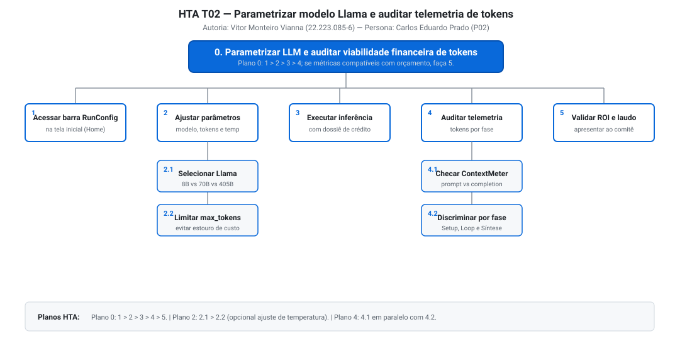
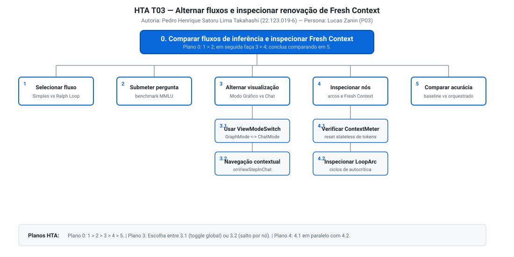
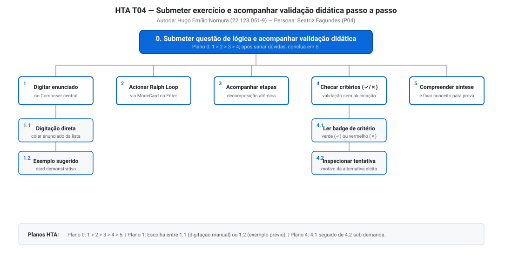
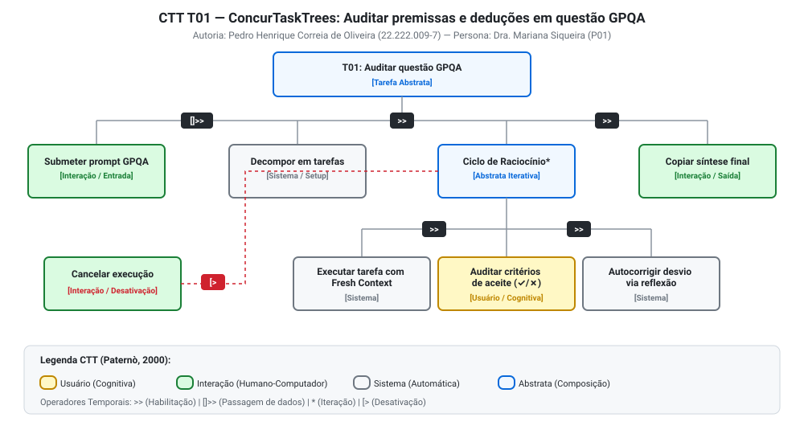
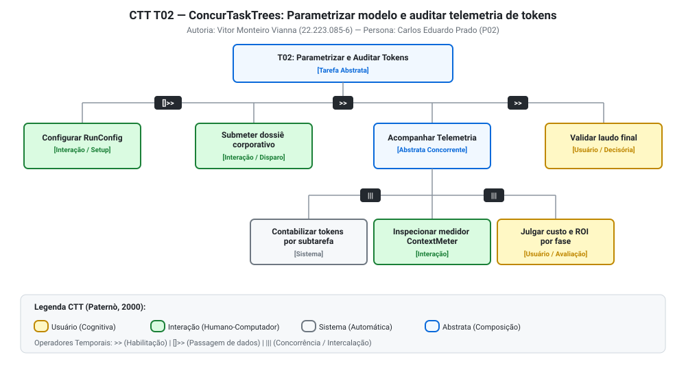
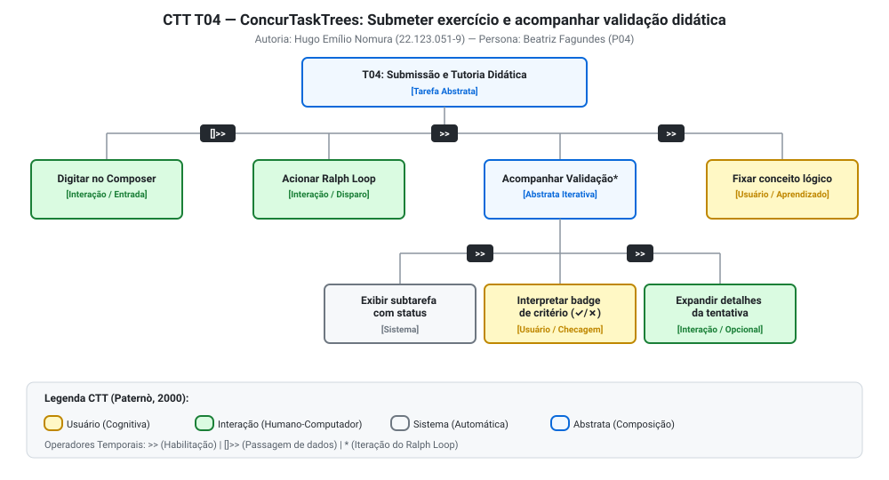

# Entrega 5 — Análise de tarefas: HTA, GOMS e CTT

**Data:** 29/09/2026  
**Status:** 🟩 Concluída  
**Responsabilidade:** Cada integrante modela 1 HTA, 1 GOMS e 1 CTT completos (4 integrantes: Pedro Correia, Vitor Vianna, Pedro Satoru e Hugo Nomura = 12 modelagens formais no total).

---

## Objetivo da atividade

Modelar tarefas humanas centrais sob três perspectivas analíticas complementares:
1. **HTA (*Hierarchical Task Analysis* — Annett & Duncan, 1967; Barbosa & Silva, 2021):** Decomposição hierárquica de objetivos em subobjetivos e operações, regidos por planos lógicos estritos (sequência, escolha, repetição e condição).
2. **GOMS (*Goals, Operators, Methods, and Selection Rules* — Card, Moran & Newell, 1983):** Modelagem cognitiva das metas do usuário, operadores elementares (motores, perceptivos e mentais), métodos alternativos para atingir a mesma meta e regras de seleção formais.
3. **CTT (*ConcurTaskTrees* — Paternò, 1999; 2000):** Engenharia de tarefas concorrentes baseada em categorias canônicas (usuário, sistema, interação e abstrata) e operadores de relacionamento temporal (habilitação `>>`, passagem de informação `[]>>`, escolha `[]`, concorrência `|||`, iteração `*` e desativação `[>`).

---

## Para projetos cujo TCC não previa interface

Em conformidade com as diretrizes da disciplina, as tarefas modeladas a seguir retratam **atividades humanas reais de apropriação e controle da contribuição técnica do TCC** — o harness de orquestração stateless com Ralph Wiggum Loop adaptado para linguagem natural —, e **não os passos internos de código do algoritmo**:

- Nenhuma tarefa modela chamadas internas de biblioteca ou manipulação assíncrona de memória do backend;
- Todas as tarefas descrevem o que a pessoa usuária (pesquisadora, consultor, desenvolvedor ou estudante) percebe, avalia, decide e executa na interface para resolver problemas complexos com rigor e explicabilidade.

---

## Seleção das tarefas

As tarefas foram derivadas diretamente das necessidades identificadas na [Entrega 1](01_conhecendo_o_problema.md), dos aprendizados da [Entrega 2](02_analise_concorrencia.md), das personas modeladas na [Entrega 3](03_personas_contexto_jornada.md) e das rupturas dos cenários da [Entrega 4](04_cenarios_problema.md):

| ID | Tarefa Principal | Persona e Cenário de Origem | Frequência / Criticidade | Autor Responsável |
|---|---|---|---|---|
| **T01** | Submeter questão científica complexa (GPQA) e auditar deduções e critérios intermediários na timeline de Open Thinking | P01 (Dra. Mariana Siqueira) / C01 | Diária / Crítica (risco de alucinação imperceptível em artigo revisado por pares) | Pedro Henrique Correia de Oliveira — 22.222.009-7 |
| **T02** | Parametrizar modelo Llama 3.1 e auditar telemetria de consumo de tokens e custos por fase | P02 (Carlos Eduardo Prado) / C02 | Semanal / Alta (viabilidade econômica de inferência e compliance regulatório) | Vitor Monteiro Vianna — 22.223.085-6 |
| **T03** | Alternar fluxos de inferência (Ralph Loop vs. Direto) e inspecionar renovação de Fresh Context no Modo Gráfico | P03 (Lucas Zanin) / C03 | Diária / Média-Alta (comparação empírica de acurácia e validação de isolamento) | Pedro Henrique Satoru Lima Takahashi — 22.123.019-6 |
| **T04** | Submeter exercício de lógica em linguagem natural simples e acompanhar validação didática passo a passo de critérios de aceite | P04 (Beatriz Fagundes) / C04 | Diária / Crítica (aprendizado conceitual e prevenção de erros em provas) | Hugo Emílio Nomura — 22.123.051-9 |

---

## 1. Análise Hierárquica de Tarefas (HTA)

---

### HTA — T01: Auditar premissas e deduções intermediárias em questão científica GPQA

**Autor(a):** Pedro Henrique Correia de Oliveira — 22.222.009-7  
**Persona:** Dra. Mariana Siqueira (P01) | **Cenário:** C01 | **Necessidade:** R01, R04

#### 1. Descrição da tarefa
* **Objetivo:** Resolver uma questão multidisciplinar de alta complexidade do benchmark GPQA (transdução de sinal em receptores GPCR com mutação alostérica), auditando a decomposição lógica e a validação estrita de cada critério de aceite para garantir rigor científico antes da publicação.
* **Ponto de início:** Mariana acessa a tela principal com seu manuscrito aberto no monitor secundário e a formulação da pergunta pronta no Overleaf.
* **Conclusão esperada:** Mariana verifica que todas as restrições inibitórias foram cumpridas em contexto limpo (*Fresh Context*) e copia a dedução sintetizada em Markdown para seu artigo.
* **Contexto:** Laboratório acadêmico compartilhado; pressão de prazos; forte aversão a alucinações matemáticas camufladas.

#### 2. Diagrama HTA T01

#### 3. Decomposição e planos formais

| ID | Objetivo / Operação | Plano / Ordem | Problema ou Decisão de Design Observada |
|---|---|---|---|
| **0** | **Auditar premissas e deduções lógicas no Ralph Loop** | **Plano 0:** 1 > 2 > 3 > 4; se todas as subtarefas forem validadas com sucesso (✓), faça 5; se ocorrer erro insolúvel, aborte. | Mariana necessita de controle sobre o processo dedutivo, recusando o modelo caixa-preta de chatbots lineares. |
| **1** | Formular pergunta com restrições biológicas e físico-químicas | Sequencial: colar enunciado > conferir constantes cinéticas. | O campo de entrada (`Composer`) deve permitir textos longos com autoexpansão e manter formatação LaTeX. |
| **2** | Disparar execução no modo Ralph Loop | Ação direta: clicar no card "Ralph Loop" ou pressionar `Ctrl+Enter`. | Iniciar a execução deve ser imediato, conectando o canal WebSocket sem latência de transição de rota. |
| **3** | Acompanhar Timeline de Open Thinking | **Plano 3:** Realizar 3.1 e 3.2 em paralelo enquanto o streaming assíncrono envia eventos do backend. | Visibilidade contínua do estado do sistema (1ª Heurística de Nielsen) para mitigar ansiedade de travamento. |
| **3.1** | Observar nós de tarefas atômicas (Setup > Loop > Síntese) | Inspeção visual sequencial dos cards renderizados no grafo. | Os nós devem exibir claramente a fase em execução com animações discretas de progresso (*pulse*). |
| **3.2** | Verificar indicador de *Fresh Context* | Leitura do medidor de contexto em cada card. | O usuário precisa ter certeza visual de que dados residuais da etapa anterior não contaminaram a dedução atual. |
| **4** | Auditar critérios de aceite das subtarefas | **Plano 4:** 4.1; se um critério falhar (✗), aguarde e observe 4.2; repita o ciclo de autocorreção até atingir 4.3; se exceder 3 tentativas, acione intervenção manual. | Resolução central da hipótese `H02`: sinalização explícita de aprovação/reprovação dos critérios de aceite. |
| **4.1** | Identificar falha transitória (✗) em critério de aceite | Percepção de badge vermelho com a justificativa de reprovação. | Comunicação imediata do erro antes que o modelo propague a premissa falsa para as etapas seguintes. |
| **4.2** | Acompanhar ciclo de autocorreção | Inspeção do arco de loop e dos novos aprendizados incorporados. | Transparência no Ralph Loop: o usuário vê a máquina replanejar e corrigir o próprio erro. |
| **4.3** | Confirmar validação e aprovação do critério (✓) | Percepção de badge verde de conformidade lógica. | Alívio cognitivo da pesquisadora ao atestar a coerência do resultado. |
| **5** | Apropriar síntese final e exportar Markdown | Sequencial: ler conclusão > clicar no botão "Copiar Síntese". | Suporte à transferência rápida de conhecimento para LaTeX e cadernos de pesquisa. |

---

### HTA — T02: Parametrizar modelo Llama 3.1 e auditar telemetria de tokens por fase

**Autor(a):** Vitor Monteiro Vianna — 22.223.085-6  
**Persona:** Carlos Eduardo Prado (P02) | **Cenário:** C02 | **Necessidade:** R02, R04

#### 1. Descrição da tarefa
* **Objetivo:** Configurar o motor de inferência (escolhendo entre Llama 3.1 8B, 70B ou 405B, teto de tokens e temperatura), disparar a análise de um dossiê corporativo de crédito empresarial e auditar a telemetria detalhada de consumo de tokens por etapa (Setup, Loop, Síntese) para defender o ROI perante o comitê de compliance.
* **Ponto de início:** Carlos está em uma reunião preparatória e abre a página inicial do harness em seu ThinkPad.
* **Conclusão esperada:** Obtenção de um laudo técnico auditável com a discriminação precisa de tokens de entrada (*prompt*) e raciocínio/saída (*completion*), viabilizando o cálculo do custo unitário por parecer.
* **Contexto:** Governança bancária e auditoria regulatória; tolerância zero a custos ocultos na nuvem.

#### 2. Diagrama HTA T02

#### 3. Decomposição e planos formais

| ID | Objetivo / Operação | Plano / Ordem | Problema ou Decisão de Design Observada |
|---|---|---|---|
| **0** | **Parametrizar LLM e auditar viabilidade financeira de tokens** | **Plano 0:** 1 > 2 > 3 > 4; se o consumo de tokens estiver dentro do orçamento corporativo, faça 5; senão, ajuste parâmetros em 2 e reexecute. | Atende à necessidade de arquitetos corporativos que precisam validar o custo escalável antes de recomendar a solução. |
| **1** | Acessar barra de configuração de execução (`RunConfigBar`) | Foco perceptivo na barra de parâmetros fixada na base da Home. | Os controles não devem ficar escondidos em telas secundárias de configurações globais. |
| **2** | Ajustar parâmetros do motor de inferência | **Plano 2:** Faça 2.1; em seguida execute 2.2; ajuste de temperatura é opcional (padrão 0.3). | Evita que o usuário precise editar variáveis de ambiente ou payloads JSON manuais. |
| **2.1** | Selecionar modelo Llama 3.1 (8B vs. 70B vs. 405B) | Clique no seletor segmentado de modelos. | Permite alternar o compromisso entre velocidade/custo (8B) e capacidade dedutiva profunda (70B/405B). |
| **2.2** | Definir limite de `max_tokens` (teto orçamentário) | Ajuste numérico no campo ou controle deslizante. | Previne estouros de faturamento e chamadas infinitas em nuvem. |
| **3** | Executar inferência corporativa com dossiê anexado | Envio da pergunta e das regras de compliance no modo Ralph. | A chamada deve carregar o contexto de crédito sem exceder a janela de entrada. |
| **4** | Auditar telemetria de consumo de tokens por fase | **Plano 4:** Monitorar 4.1 e 4.2 simultaneamente durante o processamento das fases Setup, Loop e Síntese. | Atende ao requisito F04 da Entrega 1: visibilidade de telemetria granular. |
| **4.1** | Checar medidor de contexto (`ContextMeter`) | Verificação dos chips de prompt tokens e completion tokens. | Carlos precisa comprovar quanto foi gasto digerindo os balanços contábeis e quanto foi gasto raciocinando. |
| **4.2** | Discriminar consumo por subtarefa e fase | Expansão dos detalhes de telemetria nos cards da timeline. | Torna auditável por que chamadas complexas com retentativas consumiram tokens adicionais. |
| **5** | Validar ROI e laudo financeiro consolidado | Confrontar métricas com tabela orçamentária no Excel e arquivar. | Carlos ganha subsídio empírico irrefutável para defender a adoção do modelo perante o CFO. |

---

### HTA — T03: Alternar fluxos de inferência e inspecionar renovação de Fresh Context

**Autor(a):** Pedro Henrique Satoru Lima Takahashi — 22.123.019-6  
**Persona:** Lucas Zanin (P03) | **Cenário:** C03 | **Necessidade:** R02, R03

#### 1. Descrição da tarefa
* **Objetivo:** Comparar experimentalmente a inferência direta (baseline) com o Ralph Wiggum Loop stateless para uma questão do benchmark MMLU, inspecionando o isolamento de memória e a renovação de *Fresh Context* entre as tarefas atômicas no Modo Gráfico.
* **Ponto de início:** Lucas abre a aplicação em seu desktop Linux com dois monitores em Dark Mode.
* **Conclusão esperada:** Comprovação técnica de que cada subtarefa foi executada com a janela de contexto reinicializada (sem contaminação de histórico anterior), confrontando a acurácia de ambas as abordagens.
* **Contexto:** Engenharia de software e pesquisa de sistemas agenticos; aversão a frameworks que ocultam *memory leaks* semânticos.

#### 2. Diagrama HTA T03

#### 3. Decomposição e planos formais

| ID | Objetivo / Operação | Plano / Ordem | Problema ou Decisão de Design Observada |
|---|---|---|---|
| **0** | **Comparar fluxos de inferência e inspecionar Fresh Context** | **Plano 0:** 1 > 2; em seguida realize 3 > 4; finalize comparando os outputs obtidos em 5. | Permite que desenvolvedores comprovem os ganhos de orquestração frente a chamadas simples sem ter que escrever scripts temporários. |
| **1** | Selecionar modo de inferência na HomePage | **Plano 1:** Escolha entre 1.1 (Inferência Simples) ou 1.2 (Ralph Loop) através dos `ModeCard`. | Controle evidente e visual na interface de entrada, sem ambiguidade operacional. |
| **1.1** | Selecionar Inferência Simples (`simple`) | Clique no card com ícone de raio (*lightning*). | Configura chamada única linear direta ao modelo. |
| **1.2** | Selecionar Ralph Loop (`ralph`) | Clique no card com ícone de órbita (*orbit*). | Configura orquestração multi-fase com autocorreção e decomposição. |
| **2** | Submeter questão lógica do benchmark MMLU | Digitação do problema no Composer e disparo. | O sistema transiciona suavemente para a rota correspondente (`/ralph` ou `/simple`). |
| **3** | Alternar modos de visualização na RalphView | **Plano 3:** Escolha entre 3.1 (toggle global) ou 3.2 (navegação contextual direta a partir de um nó). | Implementa a arquitetura de duas visões (`RalphGraphMode` vs. `RalphChatMode`). |
| **3.1** | Acionar `ViewModeSwitch` | Clique no interruptor Gráfico / Chat no topo da tela. | Permite alternar entre a visão estruturada da topologia de tarefas e o fluxo textual tradicional. |
| **3.2** | Navegar contextual via `onViewStepInChat` | Clique no atalho "Ver no Modo Chat" dentro do painel do card. | A tela transiciona para o Modo Chat e rola suavemente (*scroll*) até a mensagem exata daquela etapa. |
| **4** | Inspecionar nós da timeline e renovação de contexto | **Plano 4:** Executar 4.1 em paralelo com 4.2 para auditar o ciclo de vida da execução. | Concretização visual da capacidade técnica central do TCC. |
| **4.1** | Verificar `ContextMeter` e renovação stateless | Inspeção do indicador de tokens em cada nó. | Comprova que o tamanho do contexto não inflou com os parágrafos de tarefas anteriores. |
| **4.2** | Inspecionar arcos de repetição (`LoopArc`) | Análise dos arcos conectores entre nós da timeline. | Visualização topológica clara das iterações de autocrítica e refinamento. |
| **5** | Comparar acurácia e acúmulo de ruído | Confrontar a resposta do Ralph Loop com o baseline linear. | Lucas atesta que o isolamento stateless eliminou o erro lógico causado por *context rot*. |

---

### HTA — T04: Submeter exercício e acompanhar validação didática passo a passo

**Autor(a):** Hugo Emílio Nomura — 22.123.051-9  
**Persona:** Beatriz Fagundes (P04) | **Cenário:** C04 | **Necessidade:** R01, R04

#### 1. Descrição da tarefa
* **Objetivo:** Submeter um exercício capcioso de matemática discreta (conjuntos, paridade e congruência) usando linguagem natural cotidiana e acompanhar a resolução sequencial decomposta em subtarefas didáticas com sinalização inequívoca de critérios de aceite, eliminando dúvidas conceituais para a prova do dia seguinte.
* **Ponto de início:** Beatriz está em seu quarto às 23h30, cansada após o estágio, e abre a aplicação em seu notebook de 14 polegadas.
* **Conclusão esperada:** Beatriz compreende exatamente por que cada condição da questão foi aceita ou rejeitada, fixando a fundamentação teórica correta e confirmando a alternativa certa sem ansiedade.
* **Contexto:** Estudo individual noturno; fadiga física e cognitiva; necessidade de clareza imediata e ausência de jargões herméticos.

#### 2. Diagrama HTA T04

#### 3. Decomposição e planos formais

| ID | Objetivo / Operação | Plano / Ordem | Problema ou Decisão de Design Observada |
|---|---|---|---|
| **0** | **Submeter questão de lógica e acompanhar validação didática** | **Plano 0:** 1 > 2 > 3 > 4; após sanar as dúvidas de cada passo, conclua assimilando a resposta em 5. | Foco didático: a interface funciona como um tutor transparente, quebrando a resolução em passos compreensíveis. |
| **1** | Inserir enunciado da questão de matemática discreta | **Plano 1:** Escolha entre 1.1 (digitação manual do exercício da lista) ou 1.2 (clique em exemplo sugerido). | Redução da barreira de entrada para estudantes que não dominam técnicas complexas de prompting. |
| **1.1** | Digitar enunciado no `Composer` | Colar texto da lista de exercícios e revisar. | Campo com placeholder amigável ("Faça uma pergunta…") e suporte a quebra de linha com `Shift+Enter`. |
| **1.2** | Selecionar card de exemplo demonstrativo | Clique em uma das perguntas prontas recomendadas. | Permite experimentação imediata sem esforço de digitação inicial. |
| **2** | Disparar resolução no Ralph Loop | Pressionar a tecla `Enter` ou clicar no botão de envio. | O sistema fornece feedback imediato de que a questão foi recebida, evitando cliques repetidos. |
| **3** | Acompanhar etapas de decomposição da questão | Leitura dos títulos didáticos das subtarefas na timeline. | Vocabulário acessível: exibir "Etapas de Resolução" em vez de termos obscuros de engenharia de backend. |
| **4** | Checar crachás de status dos critérios de aceite | **Plano 4:** Realizar 4.1; caso queira entender o motivo de uma checagem específica, faça 4.2 sob demanda. | A estudante verifica visualmente se o modelo não "atropelou" nenhuma restrição matemática do enunciado. |
| **4.1** | Interpretar crachás visuais (✓ Aprovado / ✗ Reprovado) | Leitura rápida dos crachás coloridos com alto contraste. | Responde à hipótese `H02`: validação rápida sem exigir leitura de centenas de linhas de autocrítica textual. |
| **4.2** | Expandir detalhes da tentativa de resolução | Clique no card colapsado para visualizar a explicação do passo. | *Divulgação progressiva*: os detalhes ficam disponíveis sob demanda sem sobrecarregar a tela principal. |
| **5** | Compreender síntese final e fixar conceito para a prova | Leitura do bloco destacado com a alternativa eleita e fundamentação. | Resposta final limpa e conclusiva, pronta para revisão antes do descanso para o exame. |

---

## 2. Modelagem Cognitiva GOMS (Goals, Operators, Methods, and Selection Rules)

Conforme a teoria de Card, Moran & Newell (1983), os métodos modelados a seguir representam **sequências alternativas e concorrentes capazes de satisfazer uma meta específica**, e as regras de seleção formalizam a decisão cognitiva do usuário baseada em suas condições operacionais e preferências de contexto.

---

### GOMS — T01: Auditar deduções e critérios intermediários na timeline de Open Thinking

**Autor(a):** Pedro Henrique Correia de Oliveira — 22.222.009-7  
**Persona:** Dra. Mariana Siqueira (P01)

#### 1. Goal
`G0: Auditar deduções lógicas e validação de critérios em questão GPQA`

#### 2. Operators
* **Cognitivos / Perceptivos:**
  * `Perceber(status_nó)`: identificar visualmente se o card da subtarefa está em execução, concluído ou com erro.
  * `Ler(critério_aceite)`: ler o texto e o badge de aprovação (✓/✗) do critério.
  * `Avaliar(coerência_química)`: julgamento interno se a equação termodinâmica deduzida respeita as leis de conservação.
  * `Decidir(aprovar_etapa)`: decisão mental de aceitar a dedução intermediária.
* **Motores:**
  * `Apontar(elemento)`: mover o cursor até um card, botão ou link da interface.
  * `Clicar(elemento)`: acionar o botão do mouse ou trackpad.
  * `Rolar(página)`: mover a barra de rolagem vertical para visualizar cards abaixo do campo de visão.

#### 3. Methods
* **Method M1 (Inspeção visual direta na timeline do Modo Gráfico — padrão de alta velocidade):**
  1. `Perceber(fase_ativa_na_timeline)`
  2. `Localizar(nó_da_subtarefa)`
  3. `Perceber(badge_status_critérios)`
  4. `Ler(badge_✓)`
  5. `Decidir(avançar_para_próxima_tarefa)`
* **Method M2 (Auditoria profunda com expansão de card — quando há suspeita ou falha ✗):**
  1. `Apontar(card_da_subtarefa)`
  2. `Clicar(botão_expandir_detalhes)`
  3. `Ler(aprendizados_acumulados_e_prompt_limpo)`
  4. `Avaliar(coerência_química)`
  5. `Clicar(botão_recolher_card)`
* **Method M3 (Inspeção em fluxo contínuo via Modo Chat — leitura tradicional de artigos):**
  1. `Apontar(link_ver_no_modo_chat)`
  2. `Clicar(link_ver_no_modo_chat)`
  3. `Aguardar(transição_de_modo_e_scroll_automático)`
  4. `Ler(parágrafos_textuais_do_ThinkingStepMessage)`
  5. `Apontar(toggle_retornar_ao_modo_gráfico)`
  6. `Clicar(toggle_retornar_ao_modo_gráfico)`

#### 4. Selection Rules
* **Selection Rule SR1 (Auditoria de subtarefas em execução):**
  * Se todos os badges visíveis estiverem verdes (✓) e os valores de equilíbrio baterem com a intuição prévia: **use Method M1**.
  * Se um badge estiver vermelho (✗) ou a dedução numérica suscitar dúvida metodológica: **use Method M2**.
  * Se Mariana precisar confrontar a redação acadêmica completa de uma dedução diretamente com o parágrafo de um paper aberto no monitor secundário: **use Method M3**.

---

### GOMS — T02: Parametrizar modelo e auditar telemetria de tokens

**Autor(a):** Vitor Monteiro Vianna — 22.223.085-6  
**Persona:** Carlos Eduardo Prado (P02)

#### 1. Goal
`G0: Parametrizar arquitetura de inferência e auditar custos de tokens`

#### 2. Operators
* **Cognitivos / Perceptivos:**
  * `Perceber(seletor_modelo)`: identificar visualmente o modelo ativo (8B, 70B ou 405B).
  * `Calcular(estimativa_orçamentária)`: estimar mentalmente se `max_tokens` atende à complexidade do dossiê sem extrapolar o custo unitário estipulado na proposta comercial.
  * `Decidir(configuração_ótima)`: selecionar o equilíbrio ideal entre porte do modelo e custo de inferência.
* **Motores:**
  * `Apontar(controle)`: mover cursor até o botão do modelo ou campo numérico.
  * `Clicar(opção)`: acionar o botão do modelo desejado na barra.
  * `Digitar(valor)`: inserir o número de tokens limite no teclado.

#### 3. Methods
* **Method M1 (Parametrização rápida via presets recomendados — reunião ágil):**
  1. `Perceber(botões_de_modelo_na_RunConfigBar)`
  2. `Apontar(botão_Llama_70B)`
  3. `Clicar(botão_Llama_70B)`
  4. `Decidir(manter_parâmetros_padrão_temperatura_e_tokens)`
* **Method M2 (Configuração customizada para dossiês bancários de alto risco — governança formal):**
  1. `Apontar(botão_Llama_405B)`
  2. `Clicar(botão_Llama_405B)`
  3. `Apontar(campo_max_tokens)`
  4. `Clicar(campo_max_tokens)`
  5. `Digitar("8000")`
  6. `Apontar(campo_temperatura)`
  7. `Digitar("0.1")`
  8. `Decidir(confirmar_limites_restritivos)`

#### 4. Selection Rules
* **Selection Rule SR1 (Escolha do método de parametrização):**
  * Se a demonstração for preliminar ou voltada para avaliação geral de arquitetura: **use Method M1** (Llama 70B com valores de fábrica).
  * Se a análise envolver concessão de crédito de alto valor (acima de R$ 1 milhão) exigindo determinismo rigoroso e ausência de criatividade: **use Method M2** (Llama 405B com temperatura baixa 0.1 e teto de tokens estendido).

---

### GOMS — T03: Alternar fluxos de inferência e modos de visualização

**Autor(a):** Pedro Henrique Satoru Lima Takahashi — 22.123.019-6  
**Persona:** Lucas Zanin (P03)

#### 1. Goal
`G0: Alternar entre fluxos e modos de visualização para inspecionar Fresh Context`

#### 2. Operators
* **Cognitivos / Perceptivos:**
  * `Perceber(estado_do_toggle)`: identificar se a interface está em Modo Gráfico ou Modo Chat.
  * `Avaliar(isolamento_de_memória)`: conferir se a contagem de tokens do card indica reinicialização limpa (*Fresh Context*).
  * `Decidir(modo_adequado_de_inspeção)`: escolher entre topologia de tarefas ou leitura linear de stream.
* **Motores:**
  * `Apontar(switch_ou_nó)`: posicionar ponteiro sobre o elemento interativo.
  * `Clicar(switch_ou_nó)`: acionar o clique.
  * `Pressionar(tecla_atalho)`: usar atalhos de teclado (ex.: `Tab` + `Espaço`).

#### 3. Methods
* **Method M1 (Alternância global de visualização via interruptor superior `ViewModeSwitch`):**
  1. `Apontar(ViewModeSwitch)`
  2. `Clicar(ViewModeSwitch)`
  3. `Perceber(reorganização_do_layout_da_página)`
  4. `Decidir(leitura_estruturada_vs_textual)`
* **Method M2 (Salto contextual específico a partir de um nó do grafo — navegação por detalhe):**
  1. `Apontar(nó_da_subtarefa_específica_na_timeline)`
  2. `Clicar(nó_da_subtarefa)`
  3. `Apontar(botão_ver_no_modo_chat)`
  4. `Clicar(botão_ver_no_modo_chat)`
  5. `Perceber(scroll_automático_até_o_ThinkingStepMessage_correspondente)`

#### 4. Selection Rules
* **Selection Rule SR1 (Alternância de modo de visualização):**
  * Se Lucas deseja uma visão panorâmica macro da evolução do grafo ou monitorar os arcos de loop: **use Method M1** mantendo o Modo Gráfico ativo.
  * Se Lucas identificou uma anomalia em uma subtarefa específica no grafo e quer ler o dump textual exato do raciocínio intermediário: **use Method M2** para salto direto sem rolagem manual.

---

### GOMS — T04: Submissão de pergunta e acompanhamento didático

**Autor(a):** Hugo Emílio Nomura — 22.123.051-9  
**Persona:** Beatriz Fagundes (P04)

#### 1. Goal
`G0: Submeter exercício de matemática e obter resolução didática confiável`

#### 2. Operators
* **Cognitivos / Perceptivos:**
  * `Ler(enunciado)`: ler a questão de matemática discreta no caderno.
  * `Perceber(crachá_de_critério)`: identificar cor verde (✓) ou vermelha (✗) no card.
  * `Compreender(passo_lógico)`: assimilar mentalmente a regra matemática validada.
* **Motores:**
  * `Digitar(texto)`: escrever os dados do enunciado no campo de texto.
  * `Pressionar(Enter)`: enviar a mensagem via teclado.
  * `Clicar(card_exemplo)`: acionar exemplo pronto com o cursor.

#### 3. Methods
* **Method M1 (Digitação direta no campo de entrada + atalho de envio por teclado):**
  1. `Apontar(área_do_Composer)`
  2. `Clicar(Composer)`
  3. `Digitar(enunciado_com_restrições_de_conjuntos)`
  4. `Pressionar(Enter)`
  5. `Perceber(transição_imediata_para_tela_de_execução)`
* **Method M2 (Seleção a partir de sugestões de exemplo na Home — estudo exploratório):**
  1. `Perceber(cards_de_perguntas_sugeridas)`
  2. `Apontar(card_exemplo_matemática_discreta)`
  3. `Clicar(card_exemplo_matemática_discreta)`
  4. `Perceber(preenchimento_automático_do_Composer)`
  5. `Apontar(botão_Ralph_Loop)`
  6. `Clicar(botão_Ralph_Loop)`

#### 4. Selection Rules
* **Selection Rule SR1 (Forma de submissão do exercício):**
  * Se Beatriz está com uma dúvida específica de sua lista de exercícios impressa: **use Method M1** (digitação / colagem direta e envio via teclado).
  * Se Beatriz está revisando conceitos gerais de exame anterior e deseja um caso demonstrativo imediato para entender o funcionamento da orquestração: **use Method M2** (exemplo pré-configurado).

---

## 3. ConcurTaskTrees (CTT)

A modelagem CTT investiga a dinâmica concorrente da interação, classificando tarefas nas quatro categorias formais de Paternò (1999; 2000):
- **Tarefa de Usuário (`[U]`):** Atividade estritamente cognitiva ou julgamento interno da pessoa (amarelo).
- **Tarefa de Interação (`[I]`):** Ação direta entre o ser humano e os dispositivos de entrada/saída da interface (verde).
- **Tarefa do Sistema (`[S]`):** Processamento automatizado da máquina (cinza).
- **Tarefa Abstrata (`[A]`):** Composição hierárquica agregada de tarefas de naturezas diversas (azul).

---

### CTT — T01: Auditar premissas e deduções intermediárias em questão GPQA

**Autor(a):** Pedro Henrique Correia de Oliveira — 22.222.009-7  
**Persona:** Dra. Mariana Siqueira (P01)

#### 1. Descrição estrutural
A árvore modela o fluxo completo da pesquisadora: o envio da questão com passagem de dados (`[]>>`) para o backend iniciar o Setup; a execução do ciclo de raciocínio iterativo (`*`) com intercalação entre computação stateless (`[S]`) e auditoria humana (`[U]`); e a cópia da síntese final (`[I]`). Uma tarefa opcional de cancelamento imediato (`[I]`) opera com relação de desativação (`[>`), permitindo interromper o processo em caso de formulação errada de premissas.

#### 2. Diagrama CTT T01

#### 3. Relações temporais e categorização de nós

| Tarefa | Categoria | Relação Temporal com Irmãos | Significado no Modelo de IHC |
|---|---|---|---|
| **T01: Auditar questão GPQA** | Abstrata `[A]` | Raiz da hierarquia | Objetivo global de validação científica sem alucinações. |
| **Submeter prompt GPQA** | Interação `[I]` | `[]>>` (Passagem de dados para Decompor) | Mariana formula e envia o enunciado detalhado para o sistema. |
| **Decompor em tarefas** | Sistema `[S]` | `>>` (Habilita Ciclo de Raciocínio) | O backend processa o Setup e gera o grafo inicial de subtarefas. |
| **Ciclo de Raciocínio\*** | Abstrata Iterativa `[A*]` | `>>` (Habilita Síntese Final) | Ciclo iterativo do Ralph Loop executado até satisfazer critérios. |
| **Executar Fresh Context** | Sistema `[S]` | `>>` (Habilita auditoria humana) | Cada subtarefa roda isolada, garantindo memória limpa. |
| **Auditar critério (✓/✗)** | Usuário / Cognitiva `[U]` | `>>` (Habilita autocorreção se ✗) | Julgamento metodológico humano da regra verificada. |
| **Autocorrigir desvio** | Sistema `[S]` | Iteração interna do loop | Geração de aprendizado reflexivo e retentativa stateless. |
| **Cancelar execução** | Interação `[I]` | `[>` (Desativa Ciclo de Raciocínio) | Permite à pesquisadora abortar a execução a qualquer momento. |
| **Copiar síntese final** | Interação `[I]` | Encerramento | Apropriação formal do resultado para inclusão no manuscrito. |

---

### CTT — T02: Parametrizar modelo e auditar telemetria de tokens

**Autor(a):** Vitor Monteiro Vianna — 22.223.085-6  
**Persona:** Carlos Eduardo Prado (P02)

#### 1. Descrição estrutural
A árvore modela a concorrência temporal (`|||`) entre a recepção assíncrona do streaming de tokens pelo sistema (`[S]`), a leitura visual dos medidores de contexto pelo usuário (`[I]`) e o julgamento analítico de custo e conformidade (`[U]`), culminando na aprovação executiva do parecer financeiro.

#### 2. Diagrama CTT T02

#### 3. Relações temporais e categorização de nós

| Tarefa | Categoria | Relação Temporal com Irmãos | Significado no Modelo de IHC |
|---|---|---|---|
| **T02: Parametrizar e Auditar Tokens** | Abstrata `[A]` | Raiz da hierarquia | Garantia de viabilidade econômica e governança de inferência. |
| **Configurar RunConfigBar** | Interação `[I]` | `[]>>` (Passa parâmetros para Envio) | Seleção do modelo Llama e ajuste do teto de tokens. |
| **Submeter dossiê corporativo** | Interação `[I]` | `>>` (Habilita telemetria) | Disparo da análise de crédito empresarial. |
| **Acompanhar Telemetria** | Abstrata Concorrente `[A]` | `>>` (Habilita laudo final) | Composição de monitoramento concorrente por fase. |
| **Contabilizar tokens** | Sistema `[S]` | `|||` (Concorrente com leitura) | O sistema agrega prompt e completion tokens via WebSocket. |
| **Ler ContextMeter** | Interação `[I]` | `|||` (Concorrente com cálculo) | O usuário inspeciona badges visuais de consumo por subtarefa. |
| **Julgar custo por fase** | Usuário / Avaliação `[U]` | `|||` | Carlos avalia se a relação custo/acurácia justifica a orquestração. |
| **Validar laudo financeiro** | Usuário / Decisória `[U]` | Encerramento | Decisão formal de apresentar o parecer ao comitê de compliance. |

---

### CTT — T03: Alternar fluxos e inspecionar Fresh Context

**Autor(a):** Pedro Henrique Satoru Lima Takahashi — 22.123.019-6  
**Persona:** Lucas Zanin (P03)

#### 1. Descrição estrutural
A árvore modela a escolha (`[]`) entre os fluxos de inferência na tela inicial, seguida pelo envio com passagem de parâmetros (`[]>>`) para a tela de execução, onde ocorre a alternância dinâmica entre modos de visualização (Gráfico vs. Chat) através de escolha de métodos de interação (`[]`) e a verificação empírica do isolamento semântico.

#### 2. Diagrama CTT T03

#### 3. Relações temporais e categorização de nós

| Tarefa | Categoria | Relação Temporal com Irmãos | Significado no Modelo de IHC |
|---|---|---|---|
| **T03: Comparar Fluxos e Contexto** | Abstrata `[A]` | Raiz da hierarquia | Investigação técnica da acurácia e isolamento de contexto. |
| **Escolher Modo de Fluxo** | Interação `[I]` | `[]` (Escolha entre Simples e Ralph) | O desenvolvedor escolhe a estratégia arquitetural na Home. |
| **Executar Inferência** | Interação `[I]` | `[]>>` (Passa dados para inspeção) | Submissão da questão de raciocínio dedutivo do MMLU. |
| **Inspecionar Fresh Context** | Abstrata `[A]` | `>>` (Habilita confronto de acurácia) | Auditoria da memória e dos arcos de autocrítica. |
| **Alternar ViewModeSwitch** | Interação `[I]` | `[]` (Alternativa a onViewStepInChat) | Toggle global entre Modo Gráfico e Modo Chat. |
| **Clicar onViewStepInChat** | Interação `[I]` | `[]` (Alternativa ao switch global) | Salto contextual direto de um nó do grafo para o chat. |
| **Verificar isolamento semântico** | Usuário `[U]` | `>>` | Lucas confirma que o prompt da etapa 3 não reteve ruído da etapa 1. |
| **Confrontar Acurácia** | Usuário / Comparação `[U]` | Encerramento | Comparação científica entre o baseline linear e o Ralph Loop. |

---

### CTT — T04: Submeter exercício e acompanhar validação didática

**Autor(a):** Hugo Emílio Nomura — 22.123.051-9  
**Persona:** Beatriz Fagundes (P04)

#### 1. Descrição estrutural
A árvore modela a interação amigável para estudantes: inserção simplificada do enunciado com passagem de dados (`[]>>`), disparo sequencial (`>>`), acompanhamento iterativo da decomposição em subtarefas didáticas (`*`) com interpretação intuitiva dos crachás visuais (✓/✗) e fixação cognitiva dos conceitos aprendidos.

#### 2. Diagrama CTT T04

#### 3. Relações temporais e categorização de nós

| Tarefa | Categoria | Relação Temporal com Irmãos | Significado no Modelo de IHC |
|---|---|---|---|
| **T04: Submissão e Tutoria Didática** | Abstrata `[A]` | Raiz da hierarquia | Apoio de estudo para resolução sem alucinações. |
| **Digitar no Composer** | Interação / Entrada `[I]` | `[]>>` (Passa enunciado para Envio) | Inserção do problema de matemática discreta com linguagem natural. |
| **Acionar Ralph Loop** | Interação / Disparo `[I]` | `>>` (Habilita acompanhamento) | Disparo com feedback imediato via tecla `Enter`. |
| **Acompanhar Validação\*** | Abstrata Iterativa `[A*]` | `>>` (Habilita aprendizado final) | Acompanhamento do progresso das etapas de resolução. |
| **Exibir card com status** | Sistema `[S]` | `>>` | Renderização visual do passo com badges de critérios. |
| **Interpretar badge (✓/✗)** | Usuário / Checagem `[U]` | `>>` | Beatriz constata se as propriedades numéricas foram aceitas. |
| **Expandir tentativa (se ✗)** | Interação / Opcional `[I]` | Opcional | Visualização do raciocínio detalhado em caso de dúvida. |
| **Fixar conceito lógico** | Usuário / Aprendizado `[U]` | Encerramento | Compreensão da matéria e preparação segura para o exame. |

---

## 4. Síntese da equipe e implicações para o projeto de IHC

A realização integrada das 12 modelagens (4 HTAs, 4 GOMS e 4 CTTs) proporcionou descobertas críticas de design que orientarão as próximas etapas de prototipação e avaliação da disciplina:

### 1. Descobertas e Decisões de Design Emergentes
* **Necessidade imperativa de duas representações simultâneas de raciocínio:** A modelagem GOMS e CTT de Lucas (T03) e Mariana (T01) demonstrou que forçar o usuário a ler apenas uma timeline hierárquica ou apenas um chat corrido cria rupturas severas. O `ViewModeSwitch` integrado (alternando entre `RalphGraphMode` e `RalphChatMode`) é uma exigência fundamental de usabilidade, e não um capricho visual.
* **Autonomia na auditoria via *Progressive Disclosure*:** O HTA e GOMS de Mariana (T01) e Carlos (T02) revelaram que os cards da timeline devem exibir crachás resumidos de critérios (✓/✗) e contadores de tokens por padrão, mas devem suportar expansão sob demanda para inspeção detalhada de premissas e *Fresh Context*, evitando sobrecarga cognitiva.
* **Comunicação explícita de cancelamento e resiliência:** O modelo CTT de T01 e T03 destacou a relevância da relação temporal de desativação (`[>`). Quando uma execução no modelo 405B ou 70B consome tempo prolongado, a interface deve exibir um botão "Cancelar Execução" evidente para devolver o controle ao usuário a qualquer momento.

### 2. Mapeamento para as Próximas Entregas
* **Entrega 6 (Prototipação em Papel):** O protótipo de baixa fidelidade modelará prioritariamente a tela inicial com os `ModeCard` (T03/T04) e a tela de execução com a linha do tempo e os badges de critérios de aceite (T01/T04).
* **Entrega 10 (Diagramas MoLIC):** Os diagramas de modelagem da conversação representarão formalmente a comunicação do sistema quando um critério falha (✗) e entra em ciclo de autocorreção, bem como o diálogo de alternância de fluxo.
* **Entrega 14 (Avaliação por Observação com Usuários):** As quatro tarefas mestras modeladas nesta entrega (T01 a T04) constituirão os cenários formais de teste aplicados aos participantes externos (pesquisadores, consultores, desenvolvedores e estudantes).

---

## Checklist da Entrega 5

- [x] Cada integrante produziu ao menos 1 HTA, 1 GOMS e 1 CTT completos (4 integrantes = 12 modelagens no total).
- [x] Cada artefato identifica nominalmente o autor, matrícula, persona e tarefa de origem.
- [x] Diagramas são legíveis, renderizados em SVG vetorial de alta definição e integrados em `assets/05_tarefas/`.
- [x] HTA contém planos formais com lógica sequencial, condicional e cíclica, e não apenas árvore estática de tópicos.
- [x] GOMS distingue rigorosamente Goals, Operators (mentais/motores), Methods (alternativas concorrentes) e Selection Rules.
- [x] CTT usa relações temporais canônicas (`>>`, `[]>>`, `[]`, `|||`, `*`, `[>`) e categorização correta de tarefas (usuário, sistema, interação, abstrata).
- [x] Há fundamentação textual detalhada acompanhando cada diagrama e decomposição.
- [x] Tarefas estão rigorosamente integradas às personas e cenários na Matriz de Rastreabilidade.
- [x] Em conformidade com o TCC técnico, as tarefas descrevem atividades humanas de controle, auditoria e apropriação, sem modelar rotinas internas de código.
- [x] Parâmetros, relatórios, seletores e alternâncias de fluxo foram justificados por objetivos reais das personas.
